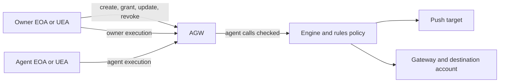

# Agentic wallets on Push Chain

This guide describes AGW v4 in this SDK branch. Donut is the configured deployment. Native Push and EVM destination rules are supported; public Solana destination rules are not enabled yet. Solana-origin signers can already act through their Push UEA.

An AGW holds assets. Its owner grants or revokes rules and can execute unrestricted owner calls. An agent executes through its own Push identity, and each agent call must pass the granted policy. A Push-native key's identity is its EOA; an external key's identity is its Push UEA for that origin chain.



## Connect a Push-native signer

Pass a key from your application's key management. The functions below do not load `.env` files or run automatically. They use `viem` and the SDK's public exports. From the SDK checkout, check all TypeScript blocks together with `node packages/core/scripts/check-agw-docs.js` (or `yarn docs:check:agw` from packages/core).

```ts
import {
  PushChain,
  AgenticError,
  type NativeRule,
  type UniversalRule,
} from '@pushchain/core';
import {
  createWalletClient,
  http,
  parseEther,
  encodeFunctionData,
  erc20Abi,
  type Address,
  type Hex,
} from 'viem';
import { privateKeyToAccount } from 'viem/accounts';

type WalletTransaction = Awaited<ReturnType<PushChain['universal']['sendTransaction']>>;

const NETWORK = PushChain.CONSTANTS.PUSH_NETWORK.TESTNET_DONUT;
const PUSH = PushChain.CONSTANTS.CHAIN.PUSH_TESTNET_DONUT;
const SEPOLIA = PushChain.CONSTANTS.CHAIN.ETHEREUM_SEPOLIA;
const ETH = PushChain.CONSTANTS.MOVEABLE.TOKEN.ETHEREUM_SEPOLIA.ETH;

async function connectPush(key: Hex, wallet?: Address): Promise<PushChain> {
  const walletClient = createWalletClient({
    account: privateKeyToAccount(key),
    transport: http('https://evm.donut.rpc.push.org/'),
  });
  const signer = await PushChain.utils.signer.toUniversalFromKeypair(
    walletClient,
    { chain: PUSH, library: PushChain.CONSTANTS.LIBRARY.ETHEREUM_VIEM },
  );
  return PushChain.initialize(signer, {
    network: NETWORK,
    ...(wallet ? { agenticWallet: wallet } : {}),
  });
}
```

`connectPush(ownerKey)` creates an ordinary owner client for management and funding. `connectPush(key, wallet)` sends from that AGW. The SDK determines the owner or agent door from the connected signer; the caller does not select a door.

## Create a wallet and grant a native rule

This example permits ten value transfers to one recipient before expiry, with explicit per-call and total limits. Explicit limits avoid relying on native omission defaults that are still being finalized.

```ts
async function createNativeWallet(
  owner: PushChain,
  agent: Address,
  recipient: Address,
) {
  const rule: NativeRule = {
    agent,
    target: recipient,
    selector: 'value-only',
    validUntil: Math.floor(Date.now() / 1000) + 3600,
    maxValuePerCall: parseEther('0.001'),
    maxValueTotal: parseEther('0.01'),
    maxCalls: 10,
  };
  const prediction = await owner.agentic.derive();
  const created = await owner.agentic.create('native-transfers', {
    rules: [rule],
  });
  return { prediction, created, rule };
}
```

Create confirms deployment/grant receipts and returns `wallet`, `index`, `rulesIds` and transaction metadata. It does not fund the wallet or agent. A concurrent owner creation can invalidate a predicted index; the index-bound deployment refuses that race instead of granting on another wallet.

## Fund separately, then send as the agent

The wallet pays the transfer value. The agent pays Push transaction gas from its own EOA/UEA. Cross-chain sends also need PC in the wallet for the outbound budget. These are separate balances.

```ts
async function fundAndSendNative(
  owner: PushChain,
  wallet: Address,
  agentKey: Hex,
  recipient: Address,
) {
  await (await owner.universal.sendTransaction({
    to: wallet,
    value: parseEther('0.02'),
  })).wait();
  // Fund the agent's Push identity separately if it needs transaction gas.
  const agent = await connectPush(agentKey, wallet);
  const response = await agent.universal.sendTransaction({
    to: recipient,
    value: parseEther('0.001'),
  });
  return response.wait();
}
```

For an external signer, grant to its derived Push UEA rather than its origin-chain address. Use `PushChain.utils.account.deriveExecutorAccount` with the signer’s actual origin chain. First-use external UEA gas handling uses that origin; changing the origin chain changes the UEA identity.

Native agent arrays use an atomic UEA/EIP-7702 transport that preserves the agent sender. Each action is checked individually. An unavailable atomic transport fails explicitly; the SDK does not submit the agent batch sequentially.

## Read, replace and revoke rules

A management handle is `owner.agentic.wallet(wallet)`. It reads and writes rules but does not switch the owner's transaction execution identity to the wallet.

```ts
async function inspectWallet(owner: PushChain, wallet: Address) {
  const handle = owner.agentic.wallet(wallet);
  const [info, ownerRecord, rules] = await Promise.all([
    handle.info(), handle.owner(), handle.rules.list(),
  ]);
  return { info, owner: ownerRecord.owner, rules: rules.rules };
}

async function replaceNativeRule(
  owner: PushChain,
  wallet: Address,
  rulesId: Hex,
  replacement: NativeRule,
) {
  return owner.agentic.wallet(wallet).rules.update({
    rules: [{ rulesId, rule: replacement }],
  });
}

async function revokeRule(owner: PushChain, wallet: Address, rulesId: Hex) {
  return (await owner.agentic.wallet(wallet).rules.revoke([rulesId])).wait();
}
```

Replacement asserts the old spend, revokes and grants in one owner transaction. Intervening agent spending makes the whole replacement revert. The new rule gets a new ID and fresh counters. A single replacement records five checkpoints. Failed transactions unwind their checkpoints; agent calls do not tick the owner checkpoint count.

`rules.list()` returns enabled rules, including enabled rules whose expiry has passed. Expiry is enforced on execution. Revoked-history reconstruction is outside v1. Rule IDs are wallet-scoped; do not treat an ID alone as a globally unique permission.

## Grant an EVM destination rule

The destination token identifies an asset on that destination chain. The SDK resolves the mapped PRC20 held by the AGW. Limits use the token's smallest units; `maxGasPerCall` uses PC wei. A rule may list several assets, but each outbound request moves one listed token.

The example below bridges at most 0.000001 ETH per call and permits a counter's `increment()` call. The explicit zero-value call leaves the bridged ETH in the wallet's CEA. Use a target that actually implements that selector.

```ts
async function createSepoliaWallet(
  owner: PushChain,
  agent: Address,
  counter: Address,
) {
  const rule: UniversalRule = {
    agent,
    chainNamespace: SEPOLIA,
    assets: [{
      token: ETH,
      maxPerCall: BigInt(10) ** BigInt(12),
      maxTotal: BigInt(10) ** BigInt(13),
    }],
    maxGasPerCall: parseEther('20'),
    validUntil: Math.floor(Date.now() / 1000) + 3600,
    allowedCalls: [{ target: counter, selector: 'increment()', maxValue: BigInt(0) }],
  };
  return owner.agentic.create('sepolia-counter', { rules: [rule] });
}
```

An omitted universal asset total uses uint256 maximum; explicit zero forbids movement. `assets: []` is a call-only rule, represented internally by a zero-cap destination gas token. The SDK derives `expectedCEA` from the wallet, not the agent.

## Fund the PRC20 and set a bounded allowance

The gateway pulls the selected PRC20 from the AGW. Set the allowance through the owner door as a separate, explicit action. Neither owner nor agent outbound sends change allowances automatically.

```ts
async function prepareSepoliaWallet(
  owner: PushChain,
  ownerKey: Hex,
  wallet: Address,
  amount: bigint,
) {
  const prc20 = PushChain.utils.tokens.getPRC20Address(ETH, { network: NETWORK });
  // The ordinary owner account must already hold the mapped PRC20.
  await (await owner.universal.sendTransaction({
    to: wallet, value: parseEther('21'),
  })).wait();
  await (await owner.universal.sendTransaction({
    to: prc20.address,
    data: encodeFunctionData({
      abi: erc20Abi, functionName: 'transfer', args: [wallet, amount],
    }),
  })).wait();
  const ownerDoor = await connectPush(ownerKey, wallet);
  const gateway = '0x00000000000000000000000000000000000000C1' as Address;
  await (await ownerDoor.universal.sendTransaction({
    to: prc20.address,
    data: encodeFunctionData({
      abi: erc20Abi, functionName: 'approve', args: [gateway, amount],
    }),
  })).wait();
}

async function sendToSepolia(agent: PushChain, counter: Address, amount: bigint) {
  return agent.universal.sendTransaction({
    to: { address: counter, chain: SEPOLIA },
    data: [{ to: counter, value: BigInt(0), data: '0xd09de08a' }],
    funds: { amount, token: ETH },
  });
}
```

The 20/21-PC values are example budgets, not fee estimates. Fees and gas are quoted for the current request. Approval safety is the application's responsibility; the SDK validates structure and contract limits rather than deciding whether a grant is appropriate.

## Wait, replay and recover

`from` is the AGW and `origin` is the signer. For EVM outbounds, `to/data/value` describe the first destination call; `agentic.destinationCalls` preserves all destination calls. `agentic.rawTo/rawData` retain the wrapped Push call.

```ts
async function waitForDelivery(response: WalletTransaction) {
  const receipt = await response.wait({ outboundTimeoutMs: 600_000 });
  return {
    pushSucceeded: receipt.status === 1,
    destinationStatus: receipt.externalStatus,
    externalTxHash: receipt.externalTxHash,
  };
}

async function replay(owner: PushChain, hash: string) {
  const response = await owner.universal.trackTransaction(hash);
  return response.wait({ outboundTimeoutMs: 600_000 });
}

function recoveryDetails(error: unknown) {
  if (!(error instanceof AgenticError)) throw error;
  return { code: error.code, hint: error.hint, details: error.details };
}
```

A successful Push receipt does not mean destination success. Check `externalStatus`. A timeout can mean the relay is still processing; track the same hash rather than assuming the transaction failed. Reverted Push roots do not start destination polling. Wrapped outbounds are recognized from their calldata even if the indexer initially reports only the Push leg.

| Result | Application action |
| --- | --- |
| `INDEX_RACE` | This create committed nothing; derive/retry the next slot. |
| `CREATE_PARTIAL` | Inspect `details.walletDeployed`, `grantedRulesIds`, `confirmedHashes` and `pendingHash`. Reconcile unknown/pending outcomes. If deployed, finish missing grants with `rules.add`; do not create a replacement wallet blindly. |
| `NO_RULES_FOR_CHAIN` | Grant a suitable enabled rule before the agent sends. |
| `AMBIGUOUS_RULE` | Inspect candidate IDs in `details.rulesIds`. The SDK does not pick or revoke a rule arbitrarily; the public selection API is still being agreed. |
| `GATEWAY_ALLOWANCE_INSUFFICIENT` | The owner must explicitly establish a sufficient allowance. |
| `CAPABILITY_UNAVAILABLE` / `GENERATION_UNSUPPORTED` | Inspect the capability/deployment details; no compatible operation was submitted. |

Ordinary returned funds do not lower policy spend. `creditRevert` still needs platform executor support. Revoking rules stops agent authorization but does not remove ERC20 allowances; the owner manages those separately.

## Current API boundaries

Grant `ref` and editable `setLabel` are unavailable on this deployed generation. Public Solana destination mapping/dispatch remains gated. Revoked history, public spend records, public generation context and `compileCard` are outside standalone v1. Native omission defaults, raw-offset authoring and multiple-rule send selection remain open; the examples use explicit native limits and one matching rule.

Use `PushChain.CONSTANTS.READ.CHAIN.WEB2` for Web2 reads. Its value is `web2`; the old literal `web2:https` is still accepted and normalizes to the same wire identity. Literal comparisons against the older spelling need updating. Web2 is a read source, not a transaction destination.
