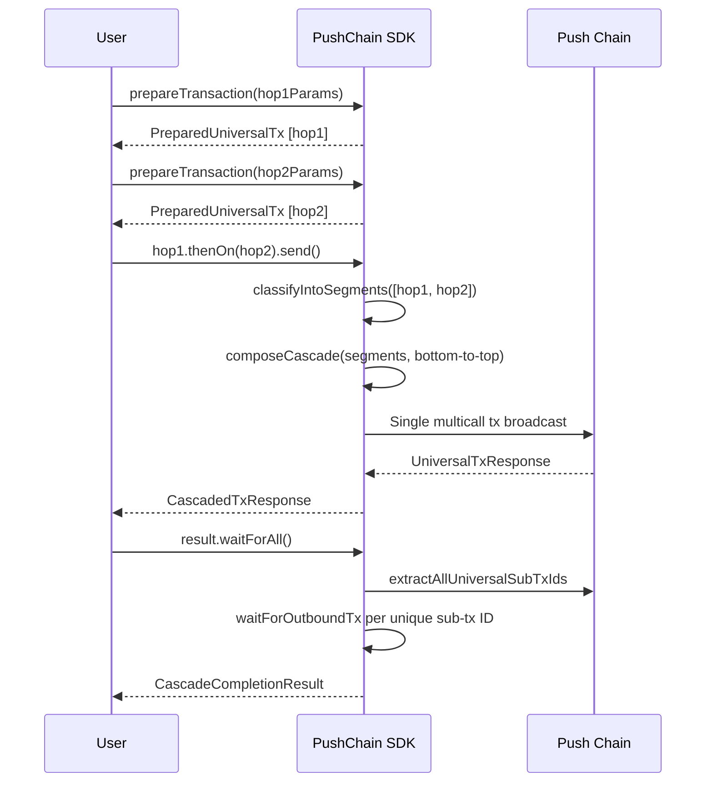
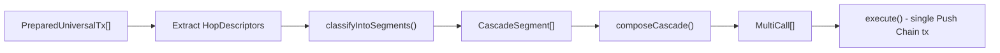
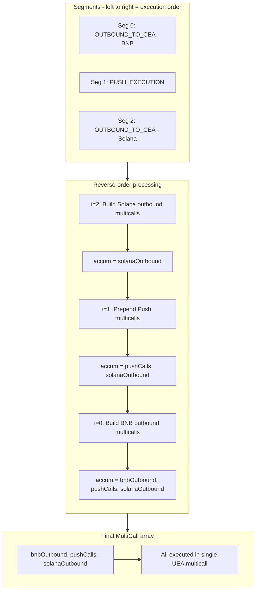
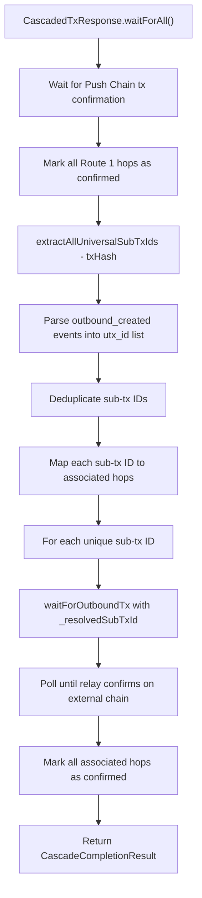
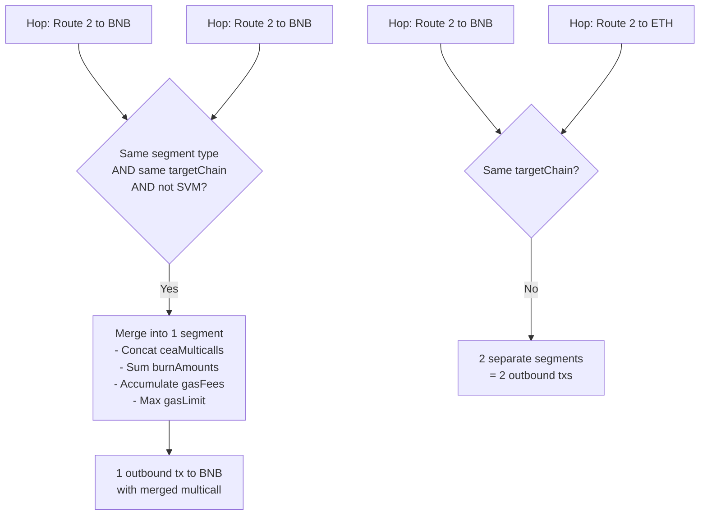

# Advance Hopping Architecture

> Cascaded multi-chain transactions composed into a single Push Chain broadcast.

## 1. Overview

Advance hopping allows users to chain multiple cross-chain transactions into a single Push Chain transaction. Instead of sending N separate transactions, the SDK composes all hops bottom-to-top into one nested multicall payload. The Push Chain relay infrastructure then fans out execution across target chains.

**User-facing API:**

```ts
const tx1 = await client.universal.prepareTransaction({ to: { address, chain: CHAIN.BNB_TESTNET }, ... });
const tx2 = await client.universal.prepareTransaction({ to: '0xAlice', value: 1n });
const tx3 = await client.universal.prepareTransaction({ to: { address, chain: CHAIN.SOLANA_DEVNET }, ... });

const result = await tx1.thenOn(tx2).thenOn(tx3).send();
const completion = await result.waitForAll({ progressHook: console.log });
```

Or equivalently with `executeTransactions`:

```ts
const builder = client.universal.executeTransactions(tx1);
const result = await builder.thenOn(tx2).thenOn(tx3).send();
```

## 2. Core Concepts

### Transaction Routes

| Route | Name | Direction | Segment Type |
|-------|------|-----------|--------------|
| Route 1 | `UOA_TO_PUSH` | User → Push Chain | `PUSH_EXECUTION` |
| Route 2 | `UOA_TO_CEA` | User → External Chain (via CEA) | `OUTBOUND_TO_CEA` |
| Route 3 | `CEA_TO_PUSH` | External Chain → Push Chain | `INBOUND_FROM_CEA` |
| Route 4 | `CEA_TO_CEA` | External Chain → External Chain | — |

### Key Types

- **`PreparedUniversalTx`** — Returned by `prepareTransaction()`. Contains route, payload, gateway request, and an internal `_hop: HopDescriptor`. Exposes `.thenOn()` and `.send()`.
- **`HopDescriptor`** — Internal metadata for a single hop: route, target/source chain, CEA address, multicall arrays, PRC-20 token, burn amount, gas fees, gas limit.
- **`CascadeSegment`** — Groups consecutive same-type hops. Carries merged multicalls, accumulated burn amounts, and max gas limits.
- **`CascadedTxResponse`** — Result of `.send()` on a cascade builder. Exposes `waitForAll()` / `wait()` for cross-chain tracking.

### Bottom-to-Top Composition Model

Hops are processed in **reverse order** (last hop first). Each segment's payload becomes part of the next (earlier) segment's nested payload. This produces a single `MultiCall[]` that the UEA executes atomically on Push Chain, triggering relay-based fan-out to external chains.

## 3. Architecture Flow Diagrams

### User API Flow



### Internal Composition Pipeline



### Cascade Composition Detail (Bottom-to-Top)



### Multi-Hop Tracking Flow



### Segment Merging Rules



## 4. Key Methods Reference

| Method | Location | Description |
|--------|----------|-------------|
| `prepareTransaction()` | `orchestrator.ts:1655` | Builds payload + `HopDescriptor` without sending. Returns `PreparedUniversalTx` with `.thenOn()` and `.send()`. |
| `buildHopDescriptor()` | `orchestrator.ts:1704` | Resolves CEA address, gas fees, PRC-20 tokens, and multicall arrays for each route type. Handles EVM and SVM branches. |
| `classifyIntoSegments()` | `orchestrator.ts:1984` | Groups consecutive same-type hops into `CascadeSegment[]`. Merges same-chain Route 2 hops (EVM only). |
| `composeCascade()` | `orchestrator.ts:2077` | Processes segments in **reverse order**, building nested payloads bottom-to-top into a final `MultiCall[]`. |
| `createCascadedBuilder()` | `orchestrator.ts:2254` | Returns fluent `CascadedTransactionBuilder` with `.thenOn()` / `.send()`. On send: classifies, composes, executes, builds tracking. |
| `extractAllUniversalSubTxIds()` | `orchestrator.ts:4949` | Fetches Cosmos tx events, extracts all `utx_id` from `outbound_created` events for multi-hop tracking. |
| `waitForOutboundTx()` | `orchestrator.ts:5022` | Polls relay API until external chain tx is confirmed. Supports `_resolvedSubTxId` for per-hop tracking. |
| `buildOutboundApprovalAndCall()` | `payload-builders.ts` | Builds PRC-20 approval + gas token approval + gateway outbound call as `MultiCall[]`. |
| `buildCeaMulticallPayload()` | `payload-builders.ts` | ABI-encodes `MultiCall[]` into CEA-executable payload bytes. |
| `buildOutboundRequest()` | `payload-builders.ts` | Constructs `UniversalOutboundTxRequest` struct for gateway contract. |

## 5. Composition Examples

### Example 1: Two Route 2 Hops to Same Chain (Merged)

**Input:** Two ERC-20 approvals on BNB Testnet.

```ts
const tx1 = await prepareTransaction({ to: { address: spender, chain: CHAIN.BNB_TESTNET }, data: approveCalldata1 });
const tx2 = await prepareTransaction({ to: { address: spender, chain: CHAIN.BNB_TESTNET }, data: approveCalldata2 });
const result = await tx1.thenOn(tx2).send();
```

**Internal processing:**

1. `classifyIntoSegments()` → 1 segment: `OUTBOUND_TO_CEA` (BNB, 2 merged hops)
   - `mergedCeaMulticalls = [call1, call2]`
   - `totalBurnAmount = hop1.burn + hop2.burn`
   - `gasLimit = max(hop1.gasLimit, hop2.gasLimit)`
2. `composeCascade()` → builds single outbound with merged CEA payload

**Final MultiCall[]:**
```
[
  { to: PRC20,     data: approve(gateway, totalBurn) },     // PRC-20 approval
  { to: GAS_TOKEN, data: approve(gateway, totalGasFee) },   // Gas token approval
  { to: GATEWAY,   data: sendOutbound(ceaPayload(call1, call2)) }  // Single outbound
]
```

**Result:** 1 outbound transaction to BNB carrying both operations.

---

### Example 2: Route 2 (BNB) + Route 1 (Push) — Mixed 2-Hop

```ts
const hop1 = await prepareTransaction({ to: { address: contract, chain: CHAIN.BNB_TESTNET }, data: '0x...' });
const hop2 = await prepareTransaction({ to: '0xAlice', value: 1000000n });
const result = await hop1.thenOn(hop2).send();
```

**Internal processing:**

1. `classifyIntoSegments()` → 2 segments:
   - Seg 0: `OUTBOUND_TO_CEA` (BNB, 1 hop)
   - Seg 1: `PUSH_EXECUTION` (1 hop)
2. `composeCascade()` processes in reverse:
   - `i=1`: Prepend push multicalls → `accum = [transfer(Alice, 1000000)]`
   - `i=0`: Build BNB outbound, prepend → `accum = [bnbOutbound..., transfer(Alice, 1000000)]`

**Final MultiCall[]:**
```
[
  { to: PRC20,     data: approve(gateway, burn) },
  { to: GAS_TOKEN, data: approve(gateway, gasFee) },
  { to: GATEWAY,   data: sendOutbound(ceaPayload) },    // BNB hop
  { to: ALICE,     value: 1000000, data: '0x' }          // Push hop
]
```

---

### Example 3: Route 2 (BNB) + Route 1 (Push) + Route 2 (Solana) — 3-Leg Cascade

```ts
const hop1 = await prepareTransaction({ to: { address, chain: CHAIN.BNB_TESTNET }, ... });
const hop2 = await prepareTransaction({ to: '0xBob', value: 500n });
const hop3 = await prepareTransaction({ to: { address, chain: CHAIN.SOLANA_DEVNET }, svmExecute: {...} });
const result = await hop1.thenOn(hop2).thenOn(hop3).send();
```

**Internal processing:**

1. `classifyIntoSegments()` → 3 segments:
   - Seg 0: `OUTBOUND_TO_CEA` (BNB)
   - Seg 1: `PUSH_EXECUTION`
   - Seg 2: `OUTBOUND_TO_CEA` (Solana)
2. `composeCascade()` processes in reverse:
   - `i=2`: Build Solana outbound → `accum = [solOutbound...]`
   - `i=1`: Prepend Push calls → `accum = [transfer(Bob), solOutbound...]`
   - `i=0`: Build BNB outbound → `accum = [bnbOutbound..., transfer(Bob), solOutbound...]`

**Final MultiCall[]:**
```
[
  { to: PRC20_BNB, data: approve(gateway, bnbBurn) },
  { to: GAS_TOKEN, data: approve(gateway, bnbGas) },
  { to: GATEWAY,   data: sendOutbound(bnbPayload) },    // BNB hop
  { to: BOB,       value: 500, data: '0x' },             // Push hop
  { to: PRC20_SOL, data: approve(gateway, solBurn) },
  { to: GAS_TOKEN, data: approve(gateway, solGas) },
  { to: GATEWAY,   data: sendOutbound(solPayload) }      // Solana hop
]
```

**Tracking:** `extractAllUniversalSubTxIds` returns 2 sub-tx IDs (one per outbound). Each is tracked independently via `waitForOutboundTx`.

## 6. Test Cases

### Unit Tests — `cascade-composition.spec.ts`

| # | Test | Validates |
|---|------|-----------|
| 1 | Empty hops → empty array | Base case |
| 2 | Single Route 1 → PUSH_EXECUTION segment | Segment type mapping |
| 3 | Consecutive Route 1 hops → merged into single segment | Push multicall merging |
| 4 | Single Route 2 → OUTBOUND_TO_CEA segment | Outbound segment creation |
| 5 | Consecutive Route 2 to same chain → merged | CEA multicall merging, burn accumulation |
| 6 | Route 2 to different chains → NOT merged | Chain boundary enforcement |
| 7 | Route 3 → INBOUND_FROM_CEA segment | Inbound segment creation |
| 8 | Consecutive Route 3 hops → NOT merged | Direction-change boundary |
| 9 | Mixed Route 1 → Route 2 → Route 3 → 3 segments | Heterogeneous pipeline |
| 10 | Merged hops use max gasLimit | Gas limit aggregation |

### E2E Tests — `advance-hopping.spec.ts`

| # | Test | Scenario | Timeout |
|---|------|----------|---------|
| 1 | Prepare Route 1 + inspect HopDescriptor | `route === 'UOA_TO_PUSH'`, _hop fields, thenOn/send exist | — |
| 2 | Send prepared Route 1 | Hash format validation | 180s |
| 3 | Prepare Route 2 + inspect HopDescriptor | `route === 'UOA_TO_CEA'`, ceaAddress, prc20Token, gasFee | 60s |
| 4 | Send prepared Route 2 | Hash validation, `chain === CHAIN.BNB_TESTNET` | 180s |
| 5 | Create cascaded builder from single tx | Builder exposes thenOn/send | — |
| 6 | Chain two prepared transactions | Builder chain works | — |
| 7 | Single-hop cascade (Route 1) | `hopCount === 1`, `status === 'confirmed'` | 180s |
| 8 | Single-hop cascade (Route 2) | `hopCount === 1`, `route === 'UOA_TO_CEA'` | 180s |
| 9 | Prepare two Route 2 txs to same chain | Both `route === 'UOA_TO_CEA'`, builder chain | 60s |
| 10 | Send merged same-chain Route 2 hops | `hopCount >= 1`, waitForAll succeeds | 600s |
| 11 | MH-P-1: Payload BNB + Payload Push | 2-hop, `hopCount === 2`, waitForAll success | 900s |
| 12 | MH-F-1: Funds BNB + Funds Push | 2-hop fund transfers, `hopCount === 2` | 900s |
| 13 | MH-P-2: Payload BNB + Push + Solana | 3-leg cascade, `hopCount === 3` | 1200s |
| 14 | MH-F-2: Funds BNB + Push + Solana | 3-leg fund transfers, `hopCount === 3` | 1200s |
| 15 | waitForAll tracking with progress hooks | Route 1 cascade, progress callback fires, `status === 'confirmed'` | 180s |

## 7. Key Files Reference

| File | Purpose |
|------|---------|
| `packages/core/src/lib/orchestrator/orchestrator.ts` | Core composition logic: `prepareTransaction`, `classifyIntoSegments`, `composeCascade`, `createCascadedBuilder`, tracking |
| `packages/core/src/lib/orchestrator/orchestrator.types.ts` | All type definitions: `HopDescriptor`, `CascadeSegment`, `PreparedUniversalTx`, `CascadedTxResponse`, etc. |
| `packages/core/src/lib/orchestrator/payload-builders.ts` | Multicall encoding: `buildOutboundApprovalAndCall`, `buildCeaMulticallPayload`, `buildOutboundRequest`, SVM encoders |
| `packages/core/src/lib/push-chain/push-chain.ts` | Client API: `universal.prepareTransaction`, `universal.executeTransactions`, `universal.sendTransaction` |
| `packages/core/__e2e__/cross-chain/advance-hopping.spec.ts` | E2E tests (15 scenarios) |
| `packages/core/src/lib/orchestrator/__tests__/cascade-composition.spec.ts` | Unit tests for `classifyIntoSegments` (10 cases) |
