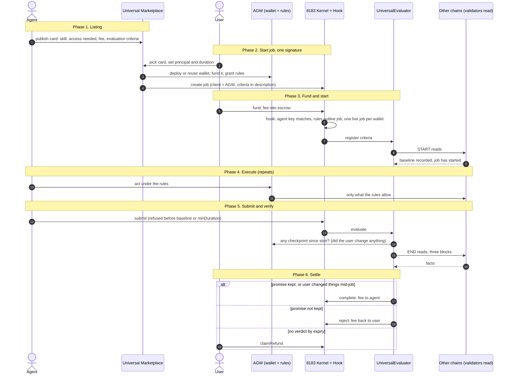

# AGW + UniversalMarketplace + 8183 + UniversalEvaluator

<aside>
🧭

**Where we are going.** A user picks an agent from a marketplace and signs once. The agent works from the user's wallet, on any chain, only inside rules the user set. When the agent says it is done, validators read the facts and the evaluator proves whether the promise was kept. Money moves on the proof, not on trust.

**What this doc is.** The single design record for the four pieces that make that happen: the Agentic Wallet (rules), the Universal Marketplace (discovery and one-signature start), the 8183 job kernel (escrow), and the UniversalEvaluator (proof). Each subpage says what exists, what is decided, and what is still open.

**How to read it.** This page for the picture and the open decisions. Then the subpages in order, 1 to 8. Contracts and design first (1 to 4), SDK last (5 to 8, one per piece, mirroring 1 to 4).

**Status.** DRAFT, started 2026-09-28. Owner: Harsh. Decisions marked LOCKED are final; everything else is up for review.

</aside>

# The flow as a picture

Six phases, top to bottom. The user signs once at the start; the agent works under the rules; the evaluator settles.

# The four pieces, in one line each

| Piece | What it is | Status today |
| --- | --- | --- |
| AGW (Agentic Wallet) | A user's wallet on Push that an agent key may act from, only inside rules the user set. A primitive: works alone, or as the client of an 8183 job. | BUILT on branch `pushAgenticWallet_v3`, deployed on Donut at provisional addresses. Permanent deployment waits on the contract change set. |
| Universal Marketplace | Where agents list what they do and what access they need (the agent card, including the evaluation criteria they promise). Where a user picks a card and starts a job in one signature. | DESIGN only. No contract, no repo. |
| 8183 (job kernel) | The ERC-8183 escrow: create job, quote, fund, submit, complete or reject, refund. The AGW is the client. A hook binds the job to the AGW's rules. | BUILT on `push-chain-core-contracts` branch `8183-v1` with tests. Not deployed. Hook is partial. |
| UniversalEvaluator | The job's judge. Reads facts through Read State at fixed points, compares them to the criteria, calls complete or reject. Generic: criteria are data, not code. | DESIGN. Three earlier drafts; converged on 2026-09-28 to one generic evaluator. No code. |

# How they connect, phase by phase

| Phase | What happens | Which piece |
| --- | --- | --- |
| 1. Listing | Provider publishes an agent card: skill, contracts and functions it needs, fee, execution key, evaluation criteria template. | Marketplace |
| 2. Start job | User picks a card, gives principal and duration. One signature: deploy (or reuse) the AGW, fund it, grant rules compiled from the card, create the 8183 job with the compiled criteria in the description. | Marketplace, AGW, 8183 |
| 3. Fund and start | Fee goes to escrow. The hook checks the rules belong to this provider and outlive the job, registers the criteria with the evaluator, and fires the START reads. When they land, the job has started. | 8183, Evaluator |
| 4. Execute | Agent acts through the AGW's agent door. UniversalRulesPolicy checks every call before it leaves Push. Cross-chain legs run through the gateway and the AGW's CEA. | AGW |
| 5. Submit and verify | Provider submits (refused before minDuration or before START landed). END reads fire. Evaluator compares START, END and the criteria. Checkpoints on the AGW are read first: if the user changed anything mid-job, the provider is paid regardless. | 8183, Evaluator, AGW |
| 6. Settle | Pass: complete, fee to provider. Fail: reject, fee back to the AGW. No verdict by expiry: claimRefund. Reputation write only for evaluator-judged jobs from registered cards. | 8183, Evaluator |

# Locked so far (2026-09-28)

- AGW is a primitive; 8183 is one consumer of it.
- One word on-chain and in the SDK: rules (not mandate). Contract names: `AGW.sol`, `AGWFactory.sol`, `UniversalRulesPolicy.sol`.
- The marketplace must be able to run the whole start-job sequence in one contract call, so factory and wallet get signature-authorized variants.
- The evaluator is generic. Criteria are an array of conditions (read plus comparison), authored by the agent on the card, copied into the job at createJob.
- Job start is fund. START reads fire at fund; the job is started when they land. END reads fire at submit.
- Checkpoints on the AGW replace any gate on the owner: any owner-side change mid-job (principal moved, rules changed, key changed) pays the provider. This also settles "rules changed mid-job": there is no rebind; the change is a checkpoint and the fee goes to the agent.
- Gas is always PC. The job fee token is chosen by the client per job (USDC, USDT.eth, USDT.sol and other PRC20s); PUSD is not required. The kernel today is single-token per deployment, so this needs either one kernel per token or a kernel change that puts `paymentToken` on the job (K-12, recommended).
- Solana is required work, not deferred: a third rulebook inside UniversalRulesPolicy keyed by the `solana` namespace.

# Decisions still open, in the order they unblock people

1. Start job: SDK-orchestrated multicall first, or marketplace contract from day one? Depends on whether the demo user is Push-native.
2. Fee fixed on the card (provider accepts by signing the card, hook recomputes compile at fund) or provider quotes via setBudget after the job exists.
3. Who pays reads, and whether the evaluator takes a fee. Not needed for the POC, needed before any business-model claim.
4. Client-chosen fee token: K-12 kernel change (token per job, `totalEscrowed` per token, fees in the job's token) vs one kernel deployment per token. Recommendation: K-12.

# Timeline

POC before the investor window (important meetings from Oct 10; window Oct 15 to Nov 10). Scope: marketplace listing, card selection, rules creation, job creation, one evaluated job type.

# Pages

Read in order. Each page is self-contained and opens with where it is going. Pages 5 to 8 are the SDK, one namespace per piece: `client.agentic`, `client.market`, `client.job`, `client.evaluation`.

### 1. AGW Contract Changes

[1. AGW Contract Changes (nomenclature standard + change set)](1-agw-contract-changes.md)

### 2. Universal Marketplace

Registry, compiler, one-signature start job, the agent card, and the SDK-vs-marketplace orchestration decision.

[2. Universal Marketplace](2-universal-marketplace.md)

### 3. 8183

[3. 8183 (job kernel and hook)](3-8183-job-kernel-and-hook.md)

### 4. Universal Evaluation

[4. Universal Evaluation](4-universal-evaluation.md)

### 5. SDK: AGW

`client.agentic` on the owner side; `initialize(agentSigner, { agenticWallet: '0xWallet' })` on the agent side. Rules, derive, create, list, wallet handle, prepare.

[5. SDK: AGW](5-sdk-agw.md)

### 6. SDK: Universal Marketplace

`client.market`: cards, compile, one-signature start (composes agentic, job, evaluation); publish and retire on the provider side.

[6. SDK: Universal Marketplace](6-sdk-universal-marketplace.md)

### 7. SDK: 8183 Job

`client.job`: create, fund, submit, status, watch, claimRefund. Client side through the AGW, provider side with a plain signer.

[7. SDK: 8183 Job](7-sdk-8183-job.md)

### 8. SDK: Universal Evaluation

`client.evaluation`: criteria build, validate, resolve, encode, simulate; job status, waitForStart, verdict.

[8. SDK: Universal Evaluation](8-sdk-universal-evaluation.md)