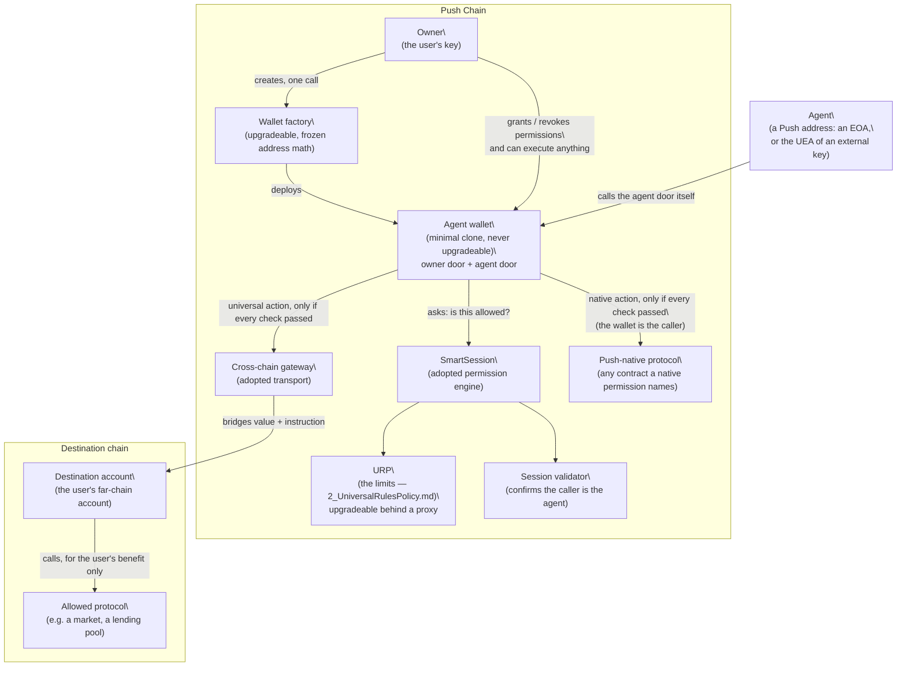
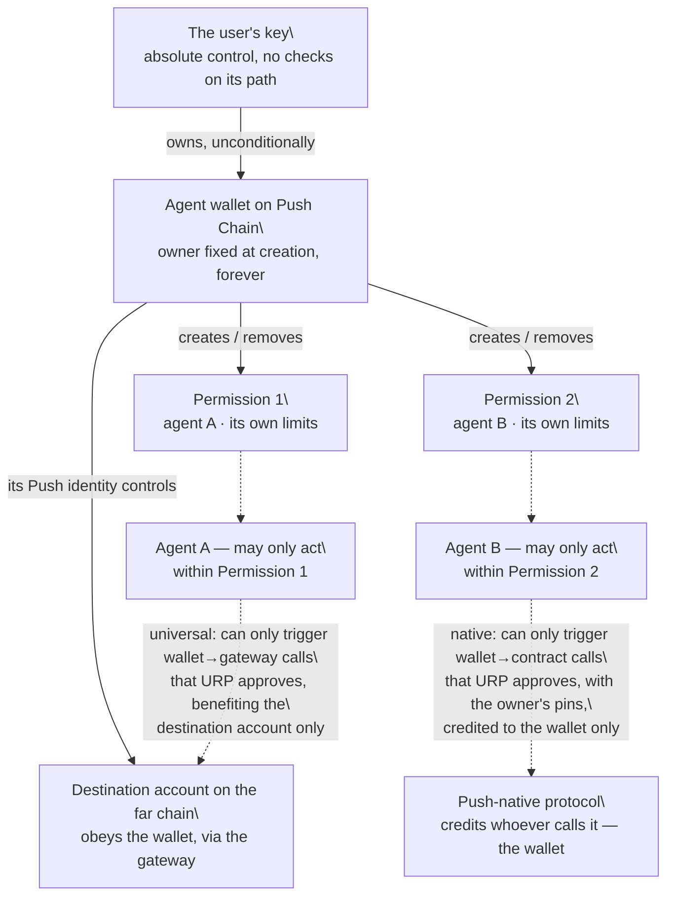

# AGW (Agentic Wallet) — v3 Architecture

# 1 · What this is
## The problem
- A user wants to let an automated agent trade or move funds for them, with the user's money — on another blockchain, or on Push Chain itself — without handing over their account.
- The user needs three things at once:
\t- The agent can act **without asking the user each time**.
\t- The agent can never spend **more than the user allowed**, on anything the user did not allow, for longer than the user allowed.
\t- The user can **shut it off instantly**, and take their money out at any time, no matter what state anything else is in.
- All of this runs on Push Chain, which reaches other blockchains through its own cross-chain gateway. Push Chain has no shared "transaction entry point" contract of the kind other chains use for smart accounts — so our wallet must do that job itself.
## The shape of the answer
- The user gets a **dedicated agent wallet** — a small, cheap contract created just for one purpose. It is not the user's main account. It only ever holds the money the user chooses to put at risk.
- The user grants the wallet a **permission**: a fixed bundle of limits binding one agent. A permission is one of **two kinds**, and the user never states which: they name the **chain** the permission is for, and the kind follows from it — Push Chain itself means native, anywhere else means universal. It is fixed at grant and never changes. A **universal** permission bounds cross-chain actions: which token, which destination protocol and functions, how much per action, how much in total, and until when. The far chain may be an EVM chain or Solana; the chain's namespace decides which, and with it the format in which the far-chain action is written and checked. A **native** permission bounds actions on Push Chain itself: which Push contracts and functions, which arguments are pinned to which values, how much native value, how many calls, and until when.
- Every action the agent takes is checked against that permission **by contracts, at execution time**. The agent's honesty is never assumed and never needed.
- The single most important contract in the system is **URP — the Universal Rules Policy**. It carries three rulebooks: two for universal permissions — one for EVM destination chains, one for Solana, because the far-chain action inside the call is written in that chain's own format — and one for native permissions. For a universal permission, every agent action, whatever it claims to be, is one and the same kind of call on Push Chain — the wallet calling the cross-chain gateway — and only URP looks inside that call to check what the agent is *really* doing on the far chain. For a native permission the target and function are already visible to the engine, and URP checks the three things the engine cannot see: the arguments, the value, and the count. `2_UniversalRulesPolicy.md` is devoted to it.
## What we build, and what we adopt
| Piece                                        | Build or adopt                                | What it is                                                                                                                                                          |
| -------------------------------------------- | --------------------------------------------- | ------------------------------------------------------------------------------------------------------------------------------------------------------------------- |
| **Wallet factory** (AGWFactory)              | Build                                         | Creates agent wallets at predictable addresses                                                                                                                      |
| **Agent wallet** (AGW)           | Build                                         | The account itself: holds funds, admits only the permission's agent, executes                                                                                       |
| **URP**                                      | **Build — the only genuinely novel contract** | The policy that inspects and limits every agent action — cross-chain through its universal rulebooks (EVM chains, Solana), Push-native through its native rulebook |
| **Session validator** (AgentValidator) | Carry forward — stateless sender validator    | Confirms the caller the wallet names is the permission's agent. Verifies no signature                                                                              |
| **SmartSession**                             | Adopt, unmodified                             | An existing open-source permission engine that stores permissions and runs policies                                                                                 |
| **Cross-chain gateway**                      | Adopt (Push Chain's)                          | The contract that carries value and instructions to other chains                                                                                                    |
| **Destination account**                      | Adopt (Push Chain's)                          | The user's account on the far chain, controlled from Push Chain. Universal permissions only                                                                         |
| **Push-native protocol**                     | Adopt (whatever the owner names)              | Any contract on Push Chain a native permission allows the agent to call — a staking pool, a vault, a token. Nothing is built or trusted; the wallet simply calls it |
## What this system deliberately does not have
Read this list before reading anything else. None of these is an oversight.
- **No editing of a granted permission.** A permission is frozen at grant. Any change means revoking it and granting a new one — in one combined step.
- **No upgrade of a deployed wallet.** A wallet's code is fixed forever at creation. A new wallet version means creating a fresh wallet.
- **No guardian, no recovery contact, and no pause on any wallet.** Nobody but the owner can act on a wallet, and nobody at all can freeze one. *(The **factory** has an operational pause that can stop **new wallets being created**. It cannot touch a wallet that exists, its funds, or its rules sets — see chapter 9, item 22.)*
- **No paymaster and no gas sponsorship.** The agent calls the wallet itself and pays its own gas — an EOA agent from its own balance, a UEA agent through its UEA's gas path.
- **No deny-list.** The permission names what is allowed; everything else is refused. There is no list of specially forbidden functions. *(The fixed targets URP refuses even when allow-listed — the loopbacks of gate 14, and on Solana the programs of gate S15 — are not a deny-list of functions: each is a target that would hand the agent the destination account itself.)*
- **No limit on how far in the future a permission may expire.** The user's choice of expiry is respected as given.
- **No mixed permission.** A permission is universal or native, never both. An owner who wants an agent to do both grants two permissions on the same wallet — they coexist, meter independently, and are revoked independently.
## Glossary
| Term                     | Meaning                                                                                                                                                                                  |
| ------------------------ | ---------------------------------------------------------------------------------------------------------------------------------------------------------------------------------------- |
| **Owner**                | The user's own key. Created the wallet, controls it absolutely.                                                                                                                          |
| **Agent**                | An automated service identified by a Push address — its own EOA, or the UEA of an external key. It calls the agent door itself; it never holds the user's funds.                          |
| **Agent wallet**         | The contract this document is about. Holds the budgeted funds on Push Chain.                                                                                                             |
| **Permission**           | One frozen bundle of limits binding one agent, of one **kind** — universal or native. A wallet can hold several, of either kind.                                                         |
| **Universal permission** | A permission whose every action travels through the gateway to a far chain. One token, one destination chain, an allow-list of far-chain calls, one destination account. The far chain is an EVM chain or Solana. |
| **Destination family**   | Which kind of far chain a universal permission targets — EVM or Solana. Derived from the chain's namespace (`eip155:` or `solana:`); any other namespace is refused at grant. It decides which universal rulebook runs.       |
| **Account pin**          | A Solana limit: the account at a fixed position in an instruction's account list must equal a key frozen at grant. The Solana counterpart of the beneficiary check — how a source, a destination or an authority is locked. |
| **Data pin**             | A Solana limit on an instruction's data: a little-endian integer at a fixed offset must equal, stay at or above, stay at or below a frozen value, or stand in a minimum ratio to another field. How a fee, a slippage ceiling or a price floor is locked. |
| **Native permission**    | A permission whose actions are calls to contracts on Push Chain itself. One to eight (contract, function) pairs, each with its own pins, caps and call limit. Nothing leaves Push Chain. |
| **Action**               | One (contract, function) pair the engine recognises as a unit. A universal permission has exactly one — the gateway's send. A native permission has one to eight.                        |
| **Argument pin**         | A native limit: a 32-byte word at a fixed position in a call's data that must equal a value frozen at grant. This is how a beneficiary, a spender or a pool id is locked.                |
| **Policy**               | A contract that checks one aspect of a request. URP is the main one.                                                                                                                     |
| **SmartSession**         | The adopted engine that stores permissions and calls each policy in turn.                                                                                                                |
| **Gateway**              | Push Chain's cross-chain transport. The only thing a **universal** action is ever allowed to call — and the one thing a **native** action never may.                                     |
| **Destination account**  | The user's account on the far chain. Its address is known in advance: on an EVM chain Push Chain computes it; on Solana it is a program-derived address of the gateway program, derived by tooling. |
| **PC**                   | Push Chain's native token, used for gas.                                                                                                                                                 |
---
# 2 · The pieces
Six things make up the system. This chapter says what each one is, what it stores, and where it runs. How they interact comes in chapters 3 to 6.
## 2.1 The wallet factory
- A single contract on Push Chain that creates agent wallets.
- Whoever calls it becomes the owner of the wallet it creates. There is no way to create a wallet owned by someone else — the factory does not accept an owner as input; it uses the caller's address, full stop.
- Wallet addresses are **predictable before creation**. The factory uses deterministic deployment (CREATE2): the address is computed from the owner's address plus a per-owner counter. Creating two wallets in a row gives two different, but individually predictable, addresses.
- The factory itself sits behind an upgradeable proxy, so its logic can be improved — **but the address computation must never change**. If it changed, any address a user had computed in advance (and possibly already sent funds to) would become unreachable. A permanent regression test pins this.
- The factory stores: the wallet implementation address, and each owner's wallet counter.
## 2.2 The agent wallet
- A **minimal clone**: a tiny contract that delegates all logic to one fixed implementation. Cheap to create, and **not upgradeable — ever**. The owner's address is baked into the clone's own bytecode at creation and can never be reassigned.
- It is a modular smart account following an existing standard (ERC-7579), reduced to the minimum: it supports exactly **one kind of module — a validator** (a contract that checks signatures and permissions). Attempts to install any other module kind (executors, hooks, fallbacks) are refused by the wallet itself.
- It has two doors:
\t- **The owner door.** The owner can make the wallet do anything, send anything anywhere, with no checks at all. This is deliberate and is covered in chapter 3.
\t- **The agent door** — a function called `executeAsAgent`. Only the permission's agent may call it, and the call only passes if every check in chapters 5 and 6 passes.
- What the wallet stores: a grant counter used to make every permission unique (chapter 4), replay counters used only by the owner's own relayable signed-intent door, and a checkpoint counter that every owner-side change advances (chapter 4.5). The agent door keeps no state of its own.
- What it holds: the budgeted funds — the tokens the owner has decided to put under agent management, plus a little PC for gas on cross-chain calls.
## 2.3 The permission
- A permission is **not a single record in one place**. It is written across three storage locations in one grant transaction:
\t- **SmartSession's storage** holds: that the permission exists, which agent may act under it — the agent's Push address — and the list of policy contracts to run.
\t- **URP's storage** holds everything about what the agent may actually do, in one of three shapes chosen by the permission's kind and, for a universal permission, its destination family. For a universal permission to an EVM chain: the allowed protocol functions on the far chain, the token, the caps, the counters, and the destination account address. For a universal permission to Solana: the same token, caps and counters, the destination account and the gateway program, the allowed (program, instruction) rules with their account and data pins, and the list of destination-side accounts that hold value. For a native permission, one record **per action**: the Push contract and function, the argument pins, the value and amount caps, the call limit, and the counters. `2_UniversalRulesPolicy.md` lists every field of all three.
\t- **URP also records the kind itself**, in a small mode record written in the same transaction — and, for a universal permission, the destination family beside it. On every later request URP consults that record — not the shape of the data — to choose which rulebook runs.
\t- *(There is no separate time-window policy in v3: the expiry lives inside URP, so URP is the sole action policy — see `2_UniversalRulesPolicy.md` §1.1.)*
- A permission is identified by a unique id computed from its contents plus a salt the wallet supplies from its own grant counter. Granting the same terms twice therefore produces two distinct permissions — they never collide, and revoking one never touches the other.
- A permission is **immutable**. Nothing in the system can modify one after grant. The only operations that exist are: create one, and remove one.
## 2.4 The agent
- An agent is a **Push address**. A Push-native key is its own EOA; any external key — EVM, Solana, anything Push Chain supports — acts through its UEA, the account Push Chain derives for that key, which verifies the key's signature before it ever calls the wallet. The wallet itself verifies no signature: it checks only who the caller is.
- Any address may be an agent, including a smart contract such as a multisig.
- **An agent is attached to one permission, not to the wallet.** A wallet with three permissions can have three different agents, each locked to its own limits. There is no wallet-level "the agent" and no way to swap the agent inside an existing permission — a new agent means a new permission.
- The agent holds no funds of the user's and has no standing power. Its only ability is to call the agent door, naming one of its permissions, and have the wallet check that call.
## 2.5 URP — introduced
- URP is the contract where the user's real intent is enforced: *this protocol, these functions, this token, this much, for me, until then*.
- It exists because of a structural blind spot in the adopted engine, explained fully in `2_UniversalRulesPolicy.md`: from Push Chain's point of view, every agent action looks identical — a call to the gateway. URP is the contract that opens that call up and inspects what is inside — an EVM instruction list for an EVM chain, a single program instruction for Solana.
- For a native permission it does the complementary job: the engine already sees the target and function, so URP checks how the function is called — which arguments are pinned, how much value rides along, how much of a metered amount, and how many times.
- It is the one contract in the system that is **upgradeable** — it sits behind a proxy at a permanent address, so its rules can be corrected or extended without moving any wallet or reissuing any permission. That is a deliberate trade, and it is what limit 27 in chapter 9 is about: the address is fixed forever, the logic behind it is not.
- One paragraph is all it gets here. **`2_UniversalRulesPolicy.md` is its chapter.**
## 2.6 The destination account
- *(Universal permissions only. A native permission has no destination account: its actions never leave Push Chain, and whatever they produce is credited to the wallet itself.)*
- The user's account on the far chain (Ethereum, Solana, or any chain Push supports). Push Chain's existing infrastructure creates it and controls it; we adopt it as-is.
- **On an EVM chain** its address is **computable in advance** on Push Chain, before the account even exists on the far chain (`getCEAForPushAccount` forward, `ceaToPushAccount` reverse).
- **On Solana** it is a program-derived address of the gateway program, seeded by the wallet's own Push address (`["push_identity", wallet]`). A Solidity contract cannot run that derivation, so the tooling derives it — along with the destination account's token accounts for each mint the permission touches — and the owner commits the 32-byte keys at grant. A wrong key fails closed: the pins never match.
- At grant time, the tooling computes this address and freezes it into the permission. From then on, URP requires that everything the agent does on the far chain benefits **that address and no other**. The agent can trade with the user's money; everything it buys lands in the user's own far-chain account — on Solana, in that account's own token accounts.
- **On Solana the destination account is also the signer.** The gateway hands it the bridged funds and then makes one call into the target program with the destination account as the only signer — and that signing authority carries into whatever the target program itself calls. `2_UniversalRulesPolicy.md` §1.4c is how URP narrows what that authority can reach; chapter 9 states what it cannot narrow.
## 2.7 The Push-native protocol
- Any contract on Push Chain that a native permission names: a staking pool, a vault, a token, a registry. Nothing is built, adopted or trusted — it is whatever the owner chose to allow.
- The wallet calls it **directly, as itself**. The protocol sees the wallet as the caller, so whatever the call produces — a staked position, shares, a claim — is the wallet's, never the agent's. This is the native counterpart of the destination account's "for the user only" rule, one hop shorter.
- To the engine it is an (address, function) pair and nothing more. To URP it is that pair plus the pins, caps and counters the owner attached. Neither contract knows what the function *means*; both only know what the owner allowed.
## Diagram — the system map

---
# 3 · Who controls what
## The single chain of authority
There is exactly one chain of control in this system, and it starts and ends with the user.
- **The user's key owns the wallet.** Ownership is fixed at creation, inside the wallet's own bytecode. It cannot be transferred, stolen by code, or reassigned by any function — no function to do so exists.
- **The wallet owns its permissions.** Only the owner, through the wallet, can create or remove a permission. An agent cannot grant itself anything, extend anything, or remove anything.
- **A permission bounds one agent.** The agent can call the agent door within the permission's limits. That is the entirety of its power.
- **The wallet's Push-side identity owns the destination account.** The far-chain account obeys instructions that arrive through Push Chain's gateway from the wallet. The agent never controls the destination account; it can only cause the wallet to send it instructions that URP has already approved.
- **For a native permission the same rule holds one hop shorter.** The wallet calls the Push contract as itself, so the position, the shares, the claim — whatever the call produces — is credited to the wallet. The agent never controls the target contract; it can only cause the wallet to call it in exactly the way URP has already approved, with the arguments the owner pinned.
## The owner door has no checks — on purpose
- The owner can execute anything from the wallet at any time: withdraw every token, send to any address, call any contract, on Push or (via the gateway) beyond.
- **No policy, no cap, no expiry, no destination rule applies to the owner.** All of `2_UniversalRulesPolicy.md` applies to the agent door only.
- Why: every safety mechanism on the owner's own exit is also a way for the owner to be locked out of their own money. The design refuses that trade. The wallet must remain drainable *by its owner* in every degraded state the rest of the system could ever reach — engine misconfigured, policy bricked, permission wedged, bridge down. A standing test executes an owner withdrawal in each of these states and must always pass.
- The cost of this choice is stated plainly: **a stolen owner key drains the wallet completely.** There is no guardian and no delay to stop it. Defence against key theft belongs to the layer that holds keys — the user's identity and key-management setup — not to this wallet. This is the first entry in chapter 9's list of accepted limits.
- **The owner door records, but never asks.** Each call through it advances the wallet's checkpoint counter (chapter 4.5), so a job's evaluator can tell whether the owner touched the wallet during the job. The write consults nothing and cannot revert, so the door stays unblockable.
## What the agent's call is — and is not
- The agent's authority is **being the sender**. The wallet admits a call only from the address the named permission records as its agent, so there is no bearer request: nothing the agent produces can be submitted by anyone else.
- A call grants nothing durable. Each one spends from the permission's remaining budget once, as the transaction it is; replay is prevented by the sender's own nonce (chapter 5).
- The agent never touches custody. At no point in any flow do funds sit in an account the agent controls. Universally, they move from the wallet, through the gateway, to the user's own destination account, and anything bought lands in that same account. Natively, they move from the wallet straight into a Push contract as the wallet's own position, and come back to the wallet.
## Diagram — the chain of ownership

---
# 4 · The life of a permission
## 4.1 Birth — the grant
- The owner (or the tooling acting for the owner, with the owner signing) composes the terms. **The first term is the chain** — a CAIP-2 identifier such as `eip155:11155111` or `solana:EtWTRABZaYq6iMfeYKouRu166VU2xqa1` — and it decides the kind and, for a universal permission, the destination family, which together decide the shape of everything after it. Common to both kinds:
\t- the agent's Push address — its own EOA, or the UEA of its external key;
\t- the expiry — one value, held inside URP.
- **For a universal permission to an EVM chain:**
\t- the far-chain protocol: each allowed contract address and function, and — for each function — where in its arguments the *beneficiary* sits, so URP can later check that the beneficiary is the user's destination account. These argument positions are **generated from the protocol's interface by tooling, never typed by hand** (a promise the contracts cannot check — chapter 10);
\t- one token, and with it one destination chain — a permission never spans tokens or chains;
\t- the caps: a per-action maximum, a lifetime maximum, and a maximum of native PC per action;
\t- the destination account's computed address.
- **For a universal permission to Solana:**
\t- the same token, the same three caps, and the expiry — these terms do not depend on the far chain;
\t- the destination account and the **gateway program** on the declared cluster — both 32-byte keys, both supplied by tooling: the destination account derived from the wallet's address, the gateway program taken from the chain registry, never from user input;
\t- one to thirty-two **program rules**, each a far-chain program and one instruction on it, identified by its leading bytes — eight for an Anchor program, one for an SPL-style program — or marked as an instruction that carries no data. A rule may also fix the instruction's exact account count;
\t- up to sixteen **account pins**: for a given rule, the account at a given position in the instruction's account list must be a given key. This is how the destination account is locked in as the authority, its token account as the source, and its token accounts as every destination. Every rule must carry at least one;
\t- up to eight **data pins** on the instruction data: a little-endian integer at a fixed offset — from the start, or from the end, because Borsh puts variable-length fields first — compared for equality, a floor, a ceiling, or a minimum ratio against a second field. This is how a fee is locked at zero, slippage is capped, and a swap's output is held to a floor *relative to its input*;
\t- up to eight **destination-side accounts that hold value** — the destination account itself, which must be on the list, and its token accounts. At validation, any of these that appears in a request's account list must sit exactly where the matched rule pins it;
\t- **all of it is generated from the program's published interface by tooling, never typed by hand** (chapter 10). A wrong pin fails closed; a missing pin guards nothing.
- **For a native permission:**
\t- one to **eight** actions — eight is a fixed wallet constant, a sanity bound rather than a gas bound — each a Push contract and one function on it. A function may be *value-only*: a bare transfer of native PC with empty call data;
\t- per action, the **argument pins**: up to eight positions in the call data, each frozen to the exact 32-byte word that must appear there. This is how a beneficiary is locked to the wallet, a spender to one contract, a pool to one id. **Positions are generated from the contract's interface by tooling, never typed by hand** (chapter 10) — a wrong position fails closed, but a *missing* pin guards nothing;
\t- per action, the native-value caps: a per-call maximum and a lifetime maximum;
\t- per action, optionally, a **metered amount**: one argument position read as a number, with its own per-call and lifetime maximum — the native counterpart of the bridged-amount cap;
\t- per action, a **call limit**: how many times the action may run, where zero means unlimited;
\t- and nothing else. There is no token, no destination chain, and no destination account: a native permission has no far side.
- The owner sends one transaction through the wallet. The wallet supplies a salt from its internal grant counter — this is what makes every permission unique — and calls the engine's standard enable function. In the same transaction, URP's configuration — including the permission's expiry — is written: one record for a universal permission, one record **per action** for a native one, and beside them the record of which kind this is.
- **Before anything reaches the engine, the wallet derives the kind from the chain and asserts it against the actions.** Every action must name the same chain, or the grant is refused naming the action that differs — which is what makes a mixed permission unrepresentable rather than merely forbidden. A universal permission must name exactly one action, and it must be the gateway's outbound send — whatever its destination family; the wallet never tells an EVM permission from a Solana one, and does not need to. A native permission may name anything on Push Chain **except** the gateway — and except seven addresses that would turn the agent into the owner: the zero address, the engine's wildcard marker, the wallet itself, the engine, URP, the validator, and the factory. It may not name the engine's two wildcard function markers, and it may not name the same (contract, function) pair twice. Every one of these refusals carries its own named error, and the two that matter most — the wallet and the engine as targets — are pinned by permanent tests.
- The wallet exposes exactly **two** permission operations to the owner: *enable* and *remove*. The engine underneath offers more; the wallet deliberately does not surface them. *Enable* takes the session and nothing else; it records the **derived** kind and the chain in the grant event, so an indexer can tell a native permission from a universal one, and which chain it is for, without opening the session.
- A failed grant does not undo a wallet. A wallet with zero permissions is a valid, safe object: with no permission there is no agent authority of any kind, and every agent request fails before any policy even runs.
## 4.2 Life — what the counters mean
- **The lifetime cap counts what is bridged, not what is deployed.** When the agent moves 40 of an allowed 100 to the far chain, the counter reads 40. If it then trades those 40 into 80 and back again on the far chain, the counter still reads 40 — redeployment at the destination is not new spending from the wallet. The cap bounds the user's exposure *from the wallet*; the expiry bounds how long the agent can keep working with what is already across.
- **An unlimited cap is allowed and is expressed as the largest representable number.** There is no special "unlimited" flag; the comparison simply never trips. The product must display this honestly — "unlimited", never a huge number (chapter 10). The one exception is a native action's **call limit, where zero means unlimited** — a call limit of zero calls would be a permission that authorises nothing.
- **A native action keeps three counters, not one:** native value sent, the metered amount (if the action has one), and calls made. **Every successful call counts as a call, even one that sends no value and meters no amount.** A call limit that zero-value calls could slip past would be advisory, so the counter always moves — this is the one place the native rulebook deliberately differs from the universal one, whose counter does not move on a zero-amount request.
- *(Universal only.)* **If a cross-chain action fails on the far side, the spent amount is credited back** — the wallet's funds return and the counter should not stay inflated. This credit is issued by Push Chain's own executor module calling URP. It is **designed but not yet functional**: it needs a change on the Push core side that has not landed. Until it lands, a failed far-side action leaves the counter inflated, and the remedy is to revoke and regrant. Both halves of this are stated again in chapters 9 and 11.
## 4.3 Change — there is no change
- **A permission is never edited. Every "change" is: revoke the old one, grant a new one, in one atomic owner transaction.** If any part fails, the whole transaction fails, and the old permission remains exactly as it was. There is no window where the wallet is half-configured.
- One race is guarded explicitly. Between the owner composing the change and the transaction landing, the agent may spend. The owner's change transaction therefore begins with an **assertion of the expected spent amount**: "I am replacing this permission believing it has consumed X." If the agent moved money in the gap, the assertion fails, the whole change reverts, and the owner re-reads and retries with current numbers. Stale beliefs never silently become new budgets. For a native action the assertion names **all three counters** — value, amount, calls — and every one must match exactly; and it refuses to run against a permission of the other kind, or against one that does not exist, so a stale belief can never pass by reading zeros from the wrong place.
- **Counters restart from zero on the new permission.** This is a real, accepted sharp edge: replacing a 100-cap permission that had 80 spent with a "tighter" 50-cap permission yields 50 of *fresh* authority — more than the 20 that remained. The contracts do not compensate for prior spend, and the product is obliged to show the owner what the old permission had consumed before the new cap is chosen (chapter 10).
- Because no permission can ever be widened in place, an entire class of problems disappears structurally: there is no "widening inside the expiry window" to delay, timelock, or guard. The mechanism that would have needed guarding does not exist.
## 4.4 Death — revocation and expiry
- **Revocation is one owner call, effective immediately on Push Chain.** The permission's storage is removed; the very next agent request against it fails. Nothing the agent does can delay or contest this. Removal performs pure storage deletion — it calls out to nothing, so no external contract can make revocation fail (`SmartSessionBase.sol:329-355`, `ConfigLib.sol:274-284`).
- **One honest limit:** revocation stops new instructions. An instruction that already left through the gateway — already in flight across the bridge — still completes on the far chain. The window is bridge latency. The revoke screen must say this (chapter 10).
- **Expiry needs no transaction.** Past the expiry, URP's expiry gate — the second gate of every rulebook (2, N2, S2) — fails every request. The permission's storage still exists until removed, but it is inert.
- Removing a permission also ends its agent's power under it: removal clears the agent the permission named, so the very next call under that id is refused before any policy runs. A regrant produces a new id — the wallet's grant counter salts it — so a request built for the old id fails against the new permission too. A permanent test pins this.
## 4.5 Checkpoints — what the owner side did, for whoever needs to know
- The wallet keeps one **checkpoint counter**, read through `checkpointCount()`, with the block of the latest checkpoint beside it (`lastCheckpointBlock()`). A job records the count when it is funded; its evaluator compares later. Same number: the result is the agent's alone. Different number: the owner side touched the wallet.
- **What advances it:** every call made through an owner door — `execute` or `executeWithSig`, one tick per call, a batch of five ticks five times — every grant, and every revoked permission (once per id). **What never does:** the agent door and everything it dispatches, module install and uninstall, factory set-up, and any call that reverts.
- **One tick per call, taken before the call.** A job is funded from inside an owner-door call — the wallet itself calls the job contract — and the job's hook reads the counter during that call. Ticking before each call means a clean funding batch ends exactly at the hook's snapshot, while a withdrawal batched after the funding call moves the counter past it. A tick once per batch would either make every job look tampered with or hide that withdrawal.
- **Compare counts, not blocks.** Several checkpoints can share a block — including the funding call's own — so "anything after block N" misses them; a changed count never does.
- **It cannot block anything.** A tick is one write to the wallet's own storage and one event: no external call, no condition that can fail. The owner door and revocation stay unblockable.
- One counter for every kind of change. The event (`Checkpointed`) also carries the kind — `OWNER_ACTION`, `RULES_GRANTED` or `RULES_REVOKED` — and a reference (the call's hash, or the permission's id) for indexers.
## Diagram — the permission lifecycle
```mermaid
stateDiagram-v2
  [*] --> Composed: owner + tooling assemble terms
  Composed --> Active: one grant transaction\
(engine + URP + expiry written together)
  Active --> Active: agent request passes\
counters advance
  Active --> Active: far-side failure\
credit back (designed — not yet functional)
  Active --> Expired: expiry passes\
no transaction needed
  Active --> Removed: owner revokes\
immediate, unconditional
  Active --> Replaced: CHANGE = revoke + regrant\
one atomic transaction,\
gated by the spent-amount assertion
  Replaced --> [*]: old id dead — requests for it die with it\
new permission starts at zero
  Expired --> Removed: cleanup, optional
  Removed --> [*]
```
---
# 5 · One action, end to end
This chapter walks a single agent action from the agent's call to funds moving. It is the spine of the whole system; `2_UniversalRulesPolicy.md` then zooms into the deepest step.
## 5.1 Why the wallet does so much itself
- On chains that follow the account-abstraction standard, a shared system contract (the "EntryPoint") receives signed account operations, checks replay protection, and dispatches them. **Push Chain has no such contract.** So our wallet performs those jobs itself, inside one function — the agent door, `executeAsAgent`.
- The wallet keeps the standard's *packaging* (the operation format), because the adopted permission engine speaks it. But the packaging is just a shape; there is no shared dispatcher behind it. The wallet is its own dispatcher and never leaves the call stack — which has one important consequence used later: **when the wallet finally calls the gateway, the gateway sees the wallet itself as the caller**, not the agent.
## 5.2 The request the agent sends
What the agent sends depends on the permission's kind — but only in the innermost part. The call around it is identical for both.
**A universal request has nested layers.** The agent composes the action innermost first:
- **Innermost — the far-chain call.** The actual thing the user wanted: for example, *buy these shares, for this much of the token, with the user's destination account as beneficiary*.
- **Around it — the instruction list.** The far-chain calls are packed as an instruction list for the destination account, between one and **ten** entries — ten is a fixed contract constant. Each entry is: a target address, a native-value amount, and call data.
- **Around that — the gateway request.** The message to Push Chain's gateway: which token and how much to bridge, the instruction list as payload, and two routing fields URP will pin (`2_UniversalRulesPolicy.md`): the bridged-funds recipient field, and the refund destination.
- **Outermost — the execution payload.** The gateway request as the single call the wallet will make: the gateway as target, the PC for far-side gas as value.
**A universal request to Solana has the same layers, with a different middle.** There is no instruction list: the gateway makes exactly one call into one program per request, so the payload is a **single Solana instruction** — the account list (each a key and a writable flag), the instruction data, and the target program — in the byte format Push Chain's validators decode, not ABI. The gateway request's recipient field, which must be empty for an EVM chain, carries the **target program** here, and must equal the program named inside the payload. A flow that needs two instructions is two requests, the later ones bridging nothing.
**A native request has one layer.** There is no far-chain call, no instruction list and no gateway request. The agent names a Push contract, a native-value amount, and the call data — and that flat call *is* the execution payload. Three nested envelopes become one call; nothing else changes.
Then the agent calls the agent door itself with three things: **the permission's id, the execution mode, and the execution payload.** There is no signature to attach — the agent's authority is being the sender.
## 5.3 Who may call — the sender check
- The wallet looks up the agent the named permission records — the address stored in it at grant — and compares it with the caller. Anyone else is refused, by name, before the engine is ever called: the owner, a stranger, another permission's agent. An id that is unknown, revoked, or names a session validator other than the canonical one records no agent, so a call under it is refused the same way.
- **An external key acts through its UEA.** The UEA verifies the key — secp256k1, Ed25519 or whatever that chain uses — and then calls the wallet; the UEA is the agent the permission names. The external key calling the wallet directly is just another stranger.
- The wallet then writes the caller's address into the operation it hands the engine, in the field the engine treats as the signature. Nobody outside the wallet can supply that field: the engine accepts an operation only from the account it is for, so only the wallet can obtain a verdict for the wallet. At the end of validation the session validator compares that address with the agent stored in the permission — a second, independent check behind the first.
## 5.4 Replay protection — the sender's own
- Each agent action is a transaction of the agent's own. An EOA agent's transaction carries its nonce; a UEA agent's action is a UEA payload with its own nonce and deadline. A transaction that has been mined cannot be mined again, so no request runs twice — and the wallet keeps no replay state for agents at all.
- The same call submitted twice is two actions: each is checked against the permission and each is metered.
- If execution reverts, the whole transaction unwinds — every counter, everything — leaving no half-spent state. A failed action costs the agent gas and changes nothing else.
- Expiry is the permission's own, checked inside URP. There is no separate per-request deadline at the wallet; a UEA payload carries one, an EOA transaction does not.
- One honest note: an EOA agent has a single sequential nonce, so a stuck transaction blocks that agent's next one until it is mined or replaced. Accepted, and an agent-side problem only.
## 5.5 The walk, in order
What happens when the agent calls, step by step. Every step is on Push Chain, inside one transaction, until the bridge.
1. **The agent calls the agent door**, naming the permission. **The wallet's first acts are to confirm the engine is still installed — the owner switches the agent door off entirely by revoking everything and uninstalling it — and that the caller is the agent the permission names.** Both are checked before anything else costs gas; a wrong caller is refused by name.
2. **The wallet builds the operation**: the execution as an `execute` call, and in the signature field the use-mode marker, the permission's id and the caller's address — written by the wallet, never supplied from outside.
3. **The wallet asks the permission engine to validate.** SmartSession looks up the permission by its id: does it exist on this wallet? Which policies are attached?
4. **The engine runs every attached policy, in order, on the raw request.** First it identifies the action by the call's target and function; a native request naming any pair the permission did not grant dies here, at the engine, before any policy runs. Then, for this system, exactly one policy: **URP — the whole of `2_UniversalRulesPolicy.md`**, which reads the permission's kind and runs the matching rulebook, and which carries the expiry check itself. Every policy must pass; any failure ends everything with nothing spent. Two engine facts matter here:
\t- **Action policies have a minimum count of one, but the engine's other policy class (checks on the outer operation) has a minimum of zero** (`SmartSession.sol:237-247, 285-299`). Rule for this system: **no mandatory guarantee may live only in that zero-minimum class**, because a configuration with none of them is legal. Everything mandatory lives in URP.
\t- **Policies run before the session validator is consulted** — an engine ordering we adopt, not choose (`SmartSession.sol:340-352`). The wallet has already checked the caller at step 1, but the rule stands for every policy: it must be safe to run on arbitrary calldata the engine has not yet authenticated. URP holds no state that validation mutates, so a bad request can waste gas and nothing else.
5. **The session validator is consulted last.** It compares the address the wallet wrote into the signature field with the agent stored in the permission. Wrong address, no execution.
6. **The wallet enforces the verdict explicitly.** Because there is no EntryPoint to do it, the wallet itself unpacks the engine's answer and enforces both the pass/fail result and the validity window it returns.
7. **The wallet refuses two targets whatever the engine said.** After validation and before dispatch, if the approved call targets the wallet itself or the engine, the wallet reverts. Neither can ever be granted (chapter 4.1), so on a permission the wallet created this never fires — it exists for a permission the owner enabled on the engine *directly*, bypassing the wallet's grant check, which the owner door permits. It is the last of four independent refusals of a self-call, it runs deliberately **after** validation and not before (chapter 11), and two permanent tests pin it — one of them reaching the engine as a target through the engine's own wildcard.
8. **The wallet makes the approved call, with the exact validated bytes.** For a universal permission that is **the gateway**: it sees the wallet as the caller, pulls the bridged token amount from the wallet's balance, takes the PC provided for far-side gas, and emits the cross-chain message. For a native permission it is **the named Push contract**, called by the wallet as itself, carrying the approved value and call data: the contract sees the wallet as the caller, and whatever the call produces is the wallet's. **A native action is complete here** — one Push transaction, no bridge, nothing in flight. The two steps below are universal only.
9. **On the far chain**, the destination account receives the message and runs the instruction list, entry by entry, each call made *by the user's own account* — which is why anything bought lands as the user's. **On Solana** the gateway moves the bridged funds to the destination account and makes the one approved call into the target program, with the destination account as signer; whatever the instruction produces lands in the token accounts the pins named.
10. **If the far side fails**, the funds return through Push Chain's infrastructure, and the credit path of chapter 4.2 applies (designed — not yet functional). Gas is never refunded: it was genuinely consumed. **A refund credit must not move any gas counter** — a permanent rule.
## Diagram — one agent action
```mermaid
sequenceDiagram
  participant AG as Agent (EOA, or UEA of an external key)
  participant W as Agent wallet
  participant SS as SmartSession (engine)
  participant U as URP
  participant V as Session validator
  participant GW as Gateway
  participant DA as Destination account (far chain)
  participant NP as Push-native protocol

  AG->>AG: universal (EVM): build nested layers:<br/>far-chain call → instruction list (≤10) → gateway request → payload<br/>universal (Solana): one program instruction → gateway request → payload<br/>native: one flat call (contract, value, data) = payload
  AG->>W: executeAsAgent(permission id, mode, payload) — the agent is the sender
  W->>W: 1. engine still installed? caller == the permission's agent?<br/>(refused by name otherwise, before the engine runs)
  W->>W: 2. build the operation; write USE ‖ id ‖ caller into the signature field
  W->>SS: 3. validate against the named permission
  SS->>SS: identify the action by (target, function);<br/>an ungranted pair dies here
  SS->>U: 4. the whole of 2_UniversalRulesPolicy.md —<br/>read the kind, run its rulebook, check every limit
  U-->>SS: pass / fail (nothing spent on fail)
  SS->>V: 5. LAST: is the address in the signature field the permission's agent?
  V-->>SS: agent confirmed / rejected
  SS-->>W: verdict
  W->>W: 6. enforce the verdict and its validity window itself
  W->>W: 7. refuse the wallet or the engine as target, whatever the verdict
  alt universal permission
    W->>GW: 8. call with the exact approved payload<br/>(gateway sees the WALLET as caller)
    GW->>DA: bridge token + instruction list
    DA->>DA: EVM: run each instruction as the user's own account<br/>Solana: one call into the target program, the user's account signing
    Note over U,DA: far-side failure → funds return, spend credited back<br/>(designed — not yet functional) · gas never refunded
  else native permission
    W->>NP: 8. call the named Push contract with the exact approved bytes<br/>(the WALLET is the caller)
    NP-->>W: whatever the call produced is the wallet's — done, one transaction
  end
```
---
# 6 · The rules policy
URP — the Universal Rules Policy (`UniversalRulesPolicy`) — has its own document: [`2_UniversalRulesPolicy.md`](2_UniversalRulesPolicy.md). It covers why the contract exists, what it stores for each kind of rules set, what it opens, every gate of the universal EVM, Solana and native rulebooks, what it counts, what it deliberately does not do, and how a rules set's kind is fixed — with the flow diagrams.
---
# 7 · What we adopted, and what that costs
Four external systems are load-bearing. For each: what we rely on it for, and the exact exposure that reliance creates. Nothing here is hidden as a footnote.
## 7.1 The permission engine (SmartSession)
- **Relied on for:** storing permissions and each one's agent, deriving their ids, running every policy, and consulting the session validator — the whole of chapter 5, steps 3–5.
- **What we get for free:** battle-tested storage and lifecycle code; removal that is pure storage deletion and cannot be blocked by any external call (`SmartSessionBase.sol:329-355`, `ConfigLib.sol:274-284`).
- **The costs, each one carried knowingly:**
\t- **Policies run before authentication** (`SmartSession.sol:340-352`). Every policy we ever attach must be safe on arbitrary calldata from anyone. This is a standing constraint on all future policy work, not just on URP. The wallet authenticates the sender before the engine runs, but the engine's own ordering is unchanged.
\t- **One policy class may legally be empty** (`SmartSession.sol:237-247`) — hence the wiring rule that nothing mandatory lives there.
\t- **The engine ships an owner-only function that resets a policy's counters in place.** v3 tooling never calls it, and the agent structurally cannot (it is owner-path only) — a named test proves the agent cannot reach it. But it survives upstream, and a future tool that called it would silently refill a budget.
\t- **At grant, the engine refuses only two targets: the zero address and itself** (`ConfigLib.sol:139-143`). It does **not** refuse its own wildcard marker at grant — only at validation. The wallet is therefore the only grant-time layer keeping that marker, and the two wildcard function markers, out of a native permission. The wallet refuses all three by name; a constant-mirror test pins each value against the vendored engine so a fork bump cannot silently move them.
\t- **The engine identifies an action by (contract, function) alone**, so two entries naming the same pair collapse to one configuration, and the second initialisation would be refused by URP with an error naming an opaque id. The wallet refuses duplicates first, naming the pair.
\t- **The engine truncates a policy's revert data to 32 bytes** before re-wrapping it — a selector and 28 bytes of the first argument. Every native-rulebook error is therefore ordered with its diagnostic value first (`2_UniversalRulesPolicy.md` §1.4b). Wallet errors do not pass through the engine and are not truncated.
## 7.2 The cross-chain gateway
- **Relied on for:** carrying value and instructions to the far chain, and being the *only* thing a universal agent action can touch (gate 3) — and the one thing a native action never may (gate N3, and the wallet's grant check).
- **The costs:**
\t- We inherit the gateway's availability and its bridge latency — the revocation window of chapter 4.4 is exactly this latency.
\t- The gateway's refund behaviour for our outbound direction is documented for the *inbound* direction only (`Revert_Handling.md:14` covers inbound; outbound is handled by Push core's own modules). Our exposure analysis of refund edge-cases is complete except for this one gap, recorded as an open question (chapter 11). It blocks nothing we build.
\t- **On Solana the far side is Push Chain's gateway program**, whose id differs per cluster. URP has no registry for it, so it is committed by the owner at grant from the chain registry (chapter 10). A wrong value weakens only that owner's permission, and fails closed on the pins.
\t- **On Solana the gateway makes one call per outbound.** A flow that needs two instructions — create a token account, then swap — is two outbounds, the later ones bridging nothing. A limit of the gateway, not of URP.
\t- **On Solana URP must parse exactly what Push Chain's validators parse.** The payload grammar of `2_UniversalRulesPolicy.md` §1.3 is theirs; a change to it on their side is a change URP must follow, and until it does every Solana request fails closed at S12.
## 7.3 The destination-account system
- **Relied on for:** the user's far-chain account — its creation, its address computation in both directions, and its obedience to gateway messages.
- **The costs, inherited not owned:**
\t- **Its factory is upgradeable by Push governance,** and the account templates can be rotated. Our guarantee that "the committed destination address is the user's account" is therefore inherited from Push's own governance discipline. We accept this on admin trust — Push's governance is our platform, not our adversary. One operational duty watches it (chapter 10): monitoring compares each permission's committed destination address against the current prediction, so a rotation that changes derivations is *detected* even though nothing on-chain prevents it.
\t- **A paused destination-account factory blocks a first outbound to a chain where the user's account does not yet exist.** Availability only; no funds at risk.
\t- **The account's own instruction loop is unbounded** in Push's code — our ten-entry bound (gate 13) is enforced on our side, and a note is open with Push core about theirs (chapter 11).
\t- **On Solana the destination account is a signer, not a caller.** Whatever program it is handed may act with its signature on every account in the list, including through that program's own inner calls. This is the one way the Solana rulebook is structurally weaker than the EVM one; `2_UniversalRulesPolicy.md` §1.4c's S17 and S18 narrow it, and chapter 9 states the remainder.
\t- **On Solana only the bridged token's account is created for the user automatically.** The gateway creates the destination account's token account for the bridged mint on first use; any other token account — a swap's output, say — must exist beforehand (chapter 10).
## 7.4 Push Chain's executor module
- **Relied on for:** the credit-back path — it is the one caller URP will believe about far-side failure.
- **The costs:**
\t- The whole credit-back feature is **gated on Push core work that has not landed** — the module does not yet call URP on failure. Until it does, the feature is inert and the counter-inflation limit of chapter 9 applies.
\t- Its on-chain address is written in Push's platform code (`UniversalCore.sol:50`) but **unconfirmed against a live deployment** — one of the two facts that must be confirmed before URP hardcodes anything (chapter 11).
\t- URP cannot verify the amounts it reports — trusted, with damage bounded by once-per-id and never-below-zero.
---
# 8 · Guarantees
Every promise the system makes, with the mechanism behind it and the test that proves it. A promise with no mechanism is marketing; each of these names its enforcement.
| The promise                                                                                    | The mechanism                                                                                                                                   | Proven by                                                                                                                              |
| ---------------------------------------------------------------------------------------------- | ----------------------------------------------------------------------------------------------------------------------------------------------- | -------------------------------------------------------------------------------------------------------------------------------------- |
| Nobody but you can ever own your wallet                                                        | Owner = creator, baked into the clone's bytecode; no function to change it                                                                      | No code path accepts another owner — deployment attempts prove it                                                                      |
| The agent can never spend a token you did not name                                             | Gate 5: the one-token pin                                                                                                                       | A request naming any other token reverts                                                                                               |
| …never more per action than you set                                                            | Gate 6                                                                                                                                          | An over-cap request reverts                                                                                                            |
| …never more in total than you set                                                              | Gate 7 + spend recorded before dispatch                                                                                                         | Requests summing past the cap revert at the crossing point                                                                             |
| …never for anyone's benefit but yours                                                          | Gate 15's beneficiary pin; on Solana, gate S17's account pins                                                                                   | A request naming any other beneficiary — on Solana, any other destination token account — reverts                                      |
| …never touching any protocol you did not allow                                                 | Gate 15: the allow-list — on Solana, gate S16's exact (program, instruction) match                                                              | A request to an unlisted target or function — on Solana, an unlisted program or instruction — reverts                                  |
| …never after the end date                                                                      | Gate 2 — the expiry inside URP (N2 native, S2 on Solana)                                                                                        | A request after expiry reverts with no state change                                                                                    |
| …never instructing your far-chain account directly                                             | Gate 14, including the destination account, checked before the allow-list; on Solana, gate S15, which adds the token, system, stake, loader and lookup-table programs and the gateway program | **Must revert even when that address is in the allow-list** — permanent tests, at grant and at validation on Solana                    |
| *Solana:* …never handing your account's other balances to the program                          | Gate S18: every value-holding account appears only where the matched rule pins it; the list always contains the destination account            | A value-holding account at an unpinned position reverts — permanent test; a list without the destination account is refused at grant — permanent test |
| *Solana:* …never swapping below the floor you set                                              | Gate S17's data pins — a floor relative to the input, a slippage ceiling, a zero fee                                                           | A swap whose output falls short of the ratio reverts, including one that raises the input to beat a static floor — permanent test      |
| *Solana:* …never more per action than Solana can carry                                         | Gate S6b                                                                                                                                        | An amount above 64 bits reverts                                                                                                        |
| A "failed" action can never deliver funds to the agent                                         | Gate 10 (refunds come home) + gate 11 (no side recipient); on Solana, S10 + S11 and S14 (the recipient is the target program, nothing else)     | A request with any of these fields wrong reverts                                                                                       |
| Only the permission's agent can act under it                                                   | The wallet checks the caller against the agent the permission names before the engine runs; the session validator checks the address the wallet wrote, last | Every other caller — the owner included — is refused by name                                                                           |
| No request runs twice                                                                          | Each agent action is the agent's own transaction — an EOA's nonce, or the UEA payload's nonce; the wallet keeps no agent replay state           | A mined transaction cannot be mined again; the same call sent twice is two actions, each checked and metered                           |
| A request dies with its permission                                                             | Removal clears the permission's agent; a regrant gets a new id from the wallet's grant counter                                                  | **A request for the old id fails after revoke-and-regrant** — permanent test                                                           |
| One permission's request can never be charged to another                                       | The call names its permission, whose agent must be the caller; URP keys every counter on that id                                                | An agent acting under another agent's permission reverts                                                                               |
| Revocation is immediate and unblockable                                                        | One owner call; removal is pure storage deletion, no external calls                                                                             | Revocation succeeds with a hostile policy installed; next request fails                                                                |
| A change never mixes old and new states                                                        | Atomic revoke + regrant; spent-amount assertion gates it                                                                                        | The change reverts when the agent spent in the composition window                                                                      |
| A failed action costs gas and nothing else                                                     | Whole-transaction revert unwinds every counter                                                                                                  | Counters identical before and after a failed action                                                                                    |
| You can always withdraw everything                                                             | The owner door has no checks                                                                                                                    | Owner withdrawal succeeds in every degraded state we can construct                                                                     |
| A module can never block its own removal                                                       | The uninstall callback runs defensively with a fixed 100,000-gas stipend; on revert or burn-out an event is emitted and removal proceeds anyway | A callback that reverts and one that burns all its gas are both still removed                                                          |
| The agent can never refill its own budget                                                      | The engine's reset is owner-path only; v3 tooling never invokes it                                                                              | **The agent-cannot-reset negative test** — permanent                                                                                   |
| Your wallet address, once computed, stays valid                                                | Address math frozen across factory upgrades                                                                                                     | **The address-stability regression test** — permanent                                                                                  |
| *Native:* the agent can never call a Push contract or function you did not name                | The engine's action identity, plus gates N4 and N5 asserting URP's own copies                                                                   | A request to an ungranted pair dies at the engine; a mismatched copy reverts at URP                                                    |
| *Native:* …never with a pinned argument set to anything else                                   | Gate N7 — full 32-byte equality at the frozen position                                                                                          | A request with any pinned word different reverts, including a correct address with dirty padding                                       |
| *Native:* …never more native value, per call or in total                                       | Gate N6                                                                                                                                         | An over-cap call reverts; calls summing past the lifetime cap revert at the crossing point                                             |
| *Native:* …never more of a metered amount, per call or in total                                | Gate N8                                                                                                                                         | The same, on the metered argument                                                                                                      |
| *Native:* …never more calls than you allowed                                                   | Gate N9, with every successful call counted                                                                                                     | The (n+1)th call reverts; a zero-value call still consumes one                                                                         |
| The agent can never make your wallet call itself or its engine                                 | Refused at grant — never grantable — and refused again at dispatch, after validation, whatever the engine said                                  | **Two permanent tests**, one of which reaches the engine as a target through the engine's own wildcard, enabled through the owner door |
| A native permission can never reach the gateway; a universal one can never reach anything else | The kind is derived from the chain and asserted against every target at grant; gate 3 and gate N3 mirror it at validation                        | A gateway target under this chain, and a non-gateway target under a foreign chain, both revert at grant — **permanent tests**          |
| Two permissions of different kinds on one wallet never touch each other's counters             | Separate storage per kind, keyed by action id                                                                                                   | A native call moves no universal counter — asserted on the raw storage slot, not through a getter                                      |
| A permission for a chain URP cannot check is never granted                                     | The destination family is derived from the chain's namespace at grant; any namespace but `eip155:` and `solana:` is refused                     | A grant naming any other namespace reverts at initialisation                                                                           |
| An 8183 evaluator can tell whether the owner touched the wallet during a job                   | Checkpoint counter: every owner-door call, grant and revoke advances it, before the call; agent actions never do                               | The checkpoint suite, including three permanent tests                                                                                  |
## The permanent tests
Thirty-one tests across the build documents and suites are marked permanent — **never to be deleted or weakened**. The four below are the ones this table's universal promises rest on directly. The other twenty-seven pin promises made elsewhere in this document: the owner path surviving every degraded state; the two routing pins; the session validator calling nothing — both of its entry points are pure, so no external call can reach the agent check; the agent door never touching the owner's replay lanes; the owner door touching only the checkpoint slot; the checkpoint taken before each owner call; a withdrawal batched after a snapshot made visible; agent actions never moving the checkpoint; the enable-mode-is-dead test; the request-body length constant; the seven native-permission tests (the wallet and the engine refused as targets at grant, the wallet and the engine refused at dispatch, a gateway target refused as native, a non-gateway target refused as universal, the wildcard markers refused, and gate N3 proven live); URP's exact external-function set; the refusal to re-initialise a universal configuration that has no mode record; and the eight Solana-rulebook tests (forbidden programs refused at grant, and again at validation; the value-holding list must contain the destination account; vacuous or impossible data-pin values refused; a redirected destination token account refused; the price floor relative to the input; a value-holding account at an unpinned position refused; and the forbidden program ids pinned against their published base58 forms). Each is the only thing pinning a promise that some future refactor will be tempted to break:
1. **Address stability** — the factory's address math never changes. Breaking it strands counterfactually funded addresses, with no migration remedy in existence.
2. **The forbidden destination-account rule beats the allow-list** — remove this and one owner mistake (allow-listing their own far-chain account) hands the agent everything that account holds. On Solana the same rule covers the forbidden programs of gate S15.
3. **A request for a revoked permission fails after regrant** — remove this and a revoke-and-regrant could leave the old id usable against the new budget.
4. **The agent cannot reset counters** — remove this and the lifetime cap is advisory.
---
# 9 · What this system does not protect against
Thirty-four accepted limits. Each is a deliberate choice, stated without softening. A builder who "fixes" one of these is reverting a decision, not fixing a bug. Where an open question could change one, it is named in plain words.
## Keys and people
1. **A stolen owner key drains the wallet completely.** Deliberate: any brake on the owner is also a lock-out of the owner. Defence belongs to the user's key-management and identity layer — and what that layer actually guarantees is itself still an open question (chapter 11).
2. **Nobody can act while the owner is unreachable.** No guardian, no emergency contact. Deliberate. The open question "should an emergency contact return?" would change this.
3. ~~Whoever holds a signed request may submit it.~~ **CLOSED.** The agent door admits only the permission's agent as the caller; there is no signed request for anyone else to hold.
## Timing
4. **Revocation cannot recall an instruction already in flight.** The window is bridge latency. Deliberate — physics of bridging. The revoke screen must disclose it.
5. **There is no ceiling on how far ahead a permission may expire.** The user's choice is respected as given. The residual is the agent acting late within the authorised window — never theft, never an amount or target the user did not allow. Deliberate.
## Budgets
6. **Replacing a permission starts its counters at zero — tightening a cap can increase remaining authority.** Deliberate: silent compensation was judged worse than an honest reset. The product must show prior consumption before a new cap is set.
7. **The lifetime cap bounds bridging, not redeployment.** Money already across can be redeployed endlessly until expiry. Deliberate — the cap is exposure-from-the-wallet; the expiry is the time bound.
8. **The adopted engine contains an owner-only counter reset that survives upstream.** Our tooling never calls it; the agent structurally cannot. Deliberate adoption cost, held by a permanent test.
9. **There is no deny-list, so an owner may allow-list a token-approval function** — which hands the agent spending power outside every cap. Deliberate: the model is allow-list-only, and the owner's list is the owner's responsibility. The open question "should the contract refuse approval-granting functions?" would change this.
10. **Until Push core's failure-reporting lands, a failed far-side action leaves the spent counter inflated.** Deliberate and *temporary*. Remedy meanwhile: revoke and regrant.
11. **A refund credit's amount cannot be verified by URP.** Trusted from Push core; damage bounded by once-per-id and never-below-zero.
12. **Gas is never credited back on failure.** The gas was genuinely consumed. Deliberate, with a rule that no credit path may ever touch a gas counter.
## Mechanics
13. **An EOA agent has one sequential nonce and no per-request expiry.** A stuck transaction blocks that agent's next one, and a broadcast transaction stays valid until it is mined or replaced. Bounded by the permission's own expiry and by revocation; a UEA agent's payloads carry the UEA's own nonce and a deadline. Deliberate: replay protection is the sender's own, and the wallet keeps none for agents.
14. ~~Two relayers racing the same request: the loser wastes its gas.~~ **CLOSED.** There are no relayers on the agent door: only the agent submits its own call.
15. **Policies run before the engine consults the session validator** — an adopted-engine ordering. The wallet has already checked the caller, but the standing constraint holds: every policy, forever, must be safe on arbitrary calldata from any caller.
## Platform inheritance
16. **The destination-account templates can be rotated by Push governance.** Accepted on admin trust; monitoring detects derivation changes; nothing on-chain prevents them.
17. **The destination-account factory is upgradeable — our address-verifiability guarantee is inherited, not owned.** Accepted: Push governance is our platform.
18. **A paused destination-account factory blocks a first outbound to a new chain.** Availability only; funds are never at risk.
## Permanence
19. **If the wallet's creation bytecode ever drifted, every pre-computed and pre-funded address would be stranded, with no remedy.** That is why the address-stability test is permanent and the address math is frozen forever.
20. **Deployed v3 wallets can never be migrated.** No upgrade path exists by construction. The open question "when does that stop being acceptable?" records the revisit trigger — nothing more.
21. **Adding any wallet-wide guard later means every user moves to a fresh wallet.** The direct consequence of shipping a validator-only wallet. The product obligation to walk users through far-chain balances exists for exactly this future.

## Operations

22. **The factory can be paused, which temporarily blocks new wallet creation.** A user who computed and funded a wallet address in advance cannot deploy it while the pause is on, so those funds are unreachable until it is lifted. **Availability only** — nothing is lost, no existing wallet is affected, and no deployed wallet can be frozen by anyone. Deliberate: it is the system's only incident lever, and its blast radius is limited to signups.

23. **A misbehaving agent can burn the wallet's native gas balance in fees, within its caps.** Every action costs the wallet native gas up to the per-action ceiling, and a redeploy-only rules set lets an agent act repeatedly without ever moving the spend counter. Bounded by exactly two things: **the gas balance the owner funded, and the expiry.** Deliberate — the alternative is a second counter on a second asset, and the wallet's own funding is already the honest limit. Obligation 15 makes the number visible before the user commits.

## The limits contract itself

27. **URP is upgradeable, so whoever holds its proxy admin can rewrite every limit in this document.** This is the most powerful role in the system, and it is stated here rather than left to be discovered. What that role *can* do: replace URP's logic, and with it every gate, cap and pin described in `2_UniversalRulesPolicy.md`. What it *cannot* do: reach into a permission's stored configuration or its counters directly, or touch a wallet's funds — an existing permission keeps its caps until new logic says otherwise, and the owner door never consults URP at all. The trust anchors URP was initialised with (the gateway, the credit-back caller, the engine) have no setter; the only route to changing them is a full implementation swap. **Deliberate, and a genuine trade:** URP previously held those anchors in bytecode and needed no admin trust at all, but a policy that cannot be corrected is a policy whose first mistake is permanent — and its storage layout is frozen and append-only precisely so that a correction cannot silently reinterpret permissions already granted. The mitigation is procedural, not structural: the admin should be a multisig behind a timelock, so a change is visible before it lands. Until it is, this item reads exactly as written.

## Native permissions

24. **An unpinned argument guards nothing.** The native rulebook locks the words the owner pinned and nothing else; an argument the owner did not pin is the agent's to choose. Allow-listing a token approval without pinning the spender hands the agent that approval — the native form of the no-deny-list rule (item 9). Deliberate: the contract compares words, it does not understand functions. Obligation 16 makes the SDK refuse to emit the unpinned form.
25. ~~The kind the wallet was told and the kind URP recorded can disagree.~~ **CLOSED.** The premise was that the wallet never decodes URP's initialisation data. It now decodes exactly one field of it — the chain — and both contracts derive the kind from that same value, so there is nothing for them to disagree about and the grant event reports a derived fact rather than a claim. The narrow exception this required is bounded and stated in `2_UniversalRulesPolicy.md` §1.7: one field, read only after the policy has been proven to be URP's, used only to choose which shape rules apply. The terms themselves remain URP's sole business.
26. **A native call limit counts calls, not effects.** An action with a call limit of ten lets the agent spend those ten on calls that move nothing. Deliberate — the alternative, not counting a zero-value call, makes the limit bypassable by exactly such calls. Obligation 18 says so on the grant screen.

## Solana permissions

28. **An account pin bounds where value is delivered, not what an allow-listed program may take.** On Solana the destination account signs the whole call, and that authority carries into every call the target program makes on the accounts it is handed. The forbidden set guards the top-level target only. S18, the data pins and a fixed account count narrow what the program is handed; obligation 20 narrows which programs are allowed at all. The remainder is trust in the allow-listed program's code — and Solana programs are commonly upgradeable, the same class of trust as an EVM proxy.
29. **The loss ceiling on Solana is not the lifetime cap.** The caps meter what is bridged per request. Swap outputs, leftovers, and anything anyone sends to the destination account or its token accounts are reachable by any allow-listed program handed those accounts. The honest ceiling is the wallet's balance plus everything the destination account holds. Accounts the owner did not list as value-holding are not judged by S18 at all — deliberately: the list is the owner's statement of what is worth protecting.
30. **A price floor is policy without an oracle.** A ratio floor set at grant goes stale as the market moves — refusing honest trades in one direction, permitting worse ones in the other. Deliberate: URP holds no price feed and makes no external call at validation. The remedy is a regrant, and obligation 21 makes the cadence part of the grant.
31. **Rent is a leak.** A program that creates accounts with the destination account as payer spends its SOL. Not preventable by pins; bounded only by which programs the owner allows.
32. **Swap outputs stay on Solana until the owner brings them home.** Gate S5 pins the outbound token to the permission's listed assets, so the agent can repatriate only a listed asset, never what it bought. The owner door can repatriate anything. Deliberate. Whether listing the output token as a second asset is a safe remedy is open — see `docs/multi-asset-review.md`.

## Checkpoints

33. **The checkpoint counter is coarse.** Any owner-door call advances it, harmless or not; the wallet cannot tell whether an arbitrary call moved value. Deliberate.
34. **The checkpoint counter is blind to what needs no wallet call.** An allowance the wallet granted before a job's snapshot can be pulled without the owner touching the wallet, and plain transfers in never tick. The evaluator decides how to treat balances. Deliberate.
---
# 10 · What the product must do that the contracts cannot
Twenty-three obligations. The contracts cannot check any of them; each names what goes wrong if it is skipped. **Twenty-one of the twenty-three currently have no test anywhere — this is the largest untested surface in the design, and it is the surface users actually experience.**
## The grant and change screens
1. **Argument positions for beneficiary checks are generated from each protocol's interface by tooling — never typed by hand.** A wrong position makes gate 15's beneficiary pin check the wrong bytes: the beneficiary pin silently guards nothing.
2. **Every newly supported protocol ships a rejection test** — a wrong beneficiary and an oversized amount must be shown to revert before that protocol is offered to users. This obligation is itself the test for the previous one.
3. **The destination account address is derived by tooling, never pasted, and the grant screen shows it — and whether it is deployed yet.** A pasted address puts the beneficiary pin under a typo's control.
4. **The grant screen gives the expiry the same prominence as the cap.** Users who see "100" but not "90 days" are authorising more time than they know.
5. **The grant screen shows the destination account's current idle balance.** The agent's instructions can use whatever sits there — the user should see the real exposure, not just the new budget.
6. **An unlimited cap is displayed unmistakably as unlimited — never as a huge number.** A number that means "no limit" printed as digits is a deception.
7. **On a change, show what the old permission consumed before the owner picks the new cap.** Without it, the counters-reset edge (chapter 9, item 6) catches owners silently. The change flow's stale-state assertion forces the tooling to read the old value anyway — showing it costs nothing.
8. **The change flow must never silently shrink the owner's chosen new cap to compensate for prior spend.** The reset is honest; a hidden adjustment would be a lie in the other direction.
9. **The revoke screen states that an already-dispatched instruction still completes.** Otherwise revocation reads as a guarantee it is not (chapter 9, item 4).
## Partners and operations
10. **Launch partners are told, before integration, that rotating an agent's key means a new agent address — revoking and regranting every permission naming the old one, counters resetting with it.** A partner who rotates keys casually will burn its users' budgets.
11. **The agent funds its own gas** — an EOA agent holds PC, a UEA agent's gas path is funded — separate from any wallet balance. If it runs dry, every user's agent stops at once: an outage, not a security event, but an outage the product owns.
12. **A user moving to a new wallet version is told their far-chain balances do not move automatically, and is walked through each one.** No tooling for this exists yet; until it does, this is a support-ticket generator (and chapter 9, item 21, is why it will happen).
13. **Monitoring compares each permission's committed destination address against the current derivation.** This is the detection half of the admin-trust acceptances (chapter 9, items 16–17): drift is caught by operations, or not at all.

## Wallet creation

14. **At wallet creation, the interface shows the destination-chain account address this wallet will have on each supported chain.** Every new wallet the user creates means a new account on every chain they may reach. If that cost is not shown before they commit, they discover it later — usually when they find balances stranded on a wallet they stopped using.

## Gas funding

15. **The grant screen states how much native gas token the wallet holds, and how many actions that funds at the chosen per-action gas ceiling.** The wallet spends its own gas balance on every cross-chain action — **including actions that bridge nothing**, which is the redeployment path. So the gas balance is a second, independent budget that no cap in the rules set bounds. A user who funds a wallet generously with gas and grants a long expiry has authorised more agent activity than the token caps alone suggest.

## Native permissions

16. **Argument pins are generated from the Push contract's interface by tooling — never typed by hand — and an approval-granting function is refused unless its spender argument is pinned.** A wrong pin position fails closed: the word will not match and every call reverts. A *missing* pin fails open: the argument is unchecked (chapter 9, item 24). The SDK is the layer that knows what a function means; the contract only knows what was pinned.
17. **The chain is stated once, and the tooling states it exactly as the asset reports it.** The kind is no longer a variable tooling can carry two copies of — it is derived, by both contracts, from the one chain string in the policy blob (`2_UniversalRulesPolicy.md` §1.7). What remains is a *transcription* obligation: for a universal permission the string must be byte-exact what the asset's own chain view returns, or the grant is refused at initialisation; for a native one it is this chain's own identifier. A near-miss such as a different letter case is not corrected — it derives the other kind and is refused against the targets.
18. **The native grant screen shows, per action, the contract, the function, every pinned argument in human terms, the value and amount caps, and the call limit — and states that a call limit is consumed by any successful call, including one that moves nothing.** Eight actions with eight pins each is the ceiling on what a user may be asked to approve at once; the ceiling exists so that this screen stays readable, not for gas.

## Solana permissions

19. **Program rules, account pins and data pins are compiled from the program's interface, fetched at grant — never typed by hand — and the interface's hash is recorded on the grant.** Rules are exact to one instruction and never share a data-pin set with a sibling instruction: two instructions with fields of the same widths at the same offsets can mean opposite things. Every value-carrying account — the authority, the source, every destination, every fee account — is pinned, and every fixed-layout instruction has its exact account count set. An instruction whose value-carrying accounts, input amount or minimum output cannot be identified from the interface, or whose scalar fields sit between two variable-length fields, is refused rather than approximated. A program upgrade that shifts an instruction's layout silently moves every pin measured from the end; the pins are re-verified after any upgrade of an allow-listed program. A missing pin fails open (chapter 9, item 28); URP's "every rule has a pin" check is hygiene, not completeness.
20. **An aggregator is allowed only through its shared-accounts instruction**, so that the inner legs run under the aggregator's own authority and the destination account is never handed to a downstream exchange as signer. The variants that put the user's intermediate token accounts in the account list are never allowed. Each aggregator card is gated on a fork test showing the aggregator refuses a substituted downstream program.
21. **Every swap rule carries a price floor relative to its input, a slippage ceiling, and a zero fee** — a ratio floor (or an exact input plus a floor), an at-most pin on slippage, an equal-zero pin on every fee field. A static floor on the output alone is beaten by raising the input. The grant screen states the floor as a price and the regrant cadence it implies (chapter 9, item 30).
22. **The destination account and its token accounts are derived by tooling from the wallet's address and the gateway program, and the gateway program is taken from the chain registry — never from user input.** The value-holding list is the destination account plus its token account for the asset and for every output token the permission allows. A pasted key puts every pin under a typo's control.
23. **Output token accounts exist before the agent needs them.** The gateway creates only the bridged token's account. Others are created off-band, or by allowing the associated-token program's idempotent create instruction in one exact shape — fixed account count, the owner position pinned to the destination account and the mint position pinned to one allowed output token, one rule per token. Never as an instruction-less rule, which would match the program's other instructions too.
---
# 11 · Open questions, and what must not be "fixed"
## 11.1 The two items that gate implementation
These are facts to confirm, not decisions to make. Nothing else in this chapter blocks code — only the executor module's address still gates implementation.
- **RESOLVED — the Ed25519 precompile is no longer used by this system.** A Solana-keyed agent acts through its UEA, which verifies the key itself; the wallet verifies no signature.
- **The executor module's address.** Written in Push's platform code but unconfirmed against a live deployment. Confirm before URP hardcodes its one trusted caller.
## 11.2 Design questions for the team — none blocks v3
- **Should the contract refuse approval-granting functions outright?** Would close chapter 9, items 9 and 24 — for a native permission, the unpinned-spender form. Today: allow-list-only, owner's responsibility, with the SDK refusing the unpinned form (obligation 16).
- **Should an emergency contact return to the design?** Would close chapter 9, item 2.
- **Should the destination and refund locks also exist at the gateway layer?** Our layer locks both regardless; a second lock would be belt-and-braces.
- **When does "no wallet migration, ever" stop being acceptable?** The recorded revisit trigger for chapter 9, item 20.
## 11.3 With Push core
- **The executor module must call URP on outbound failure.** The one piece of Push-core work the credit-back feature waits on. Not agentic-wallet work.
- **The destination account's own instruction loop is unbounded** in Push's code. Ours is bounded at ten; theirs should be bounded too.
- **The gateway's refund behaviour for the outbound direction** is undocumented in the public revert-handling notes (inbound only). Completeness of our exposure analysis, nothing more.
- **Two admin-only paths can pay an agent-chosen refund destination for funds coming back from a destination account.** Push Chain never issues an automatic refund for an inbound that originates at a destination account, so on every automatic path the agent's choice of refund destination is never used. But the stuck-inbound revert and the rescue path, both of which need an admin action, pay that destination without checking where the inbound came from. The agent cannot trigger either alone. The fix is node-side — for such inbounds, refund to the destination account of the originating Push account, or refuse — and is not URP work.
## 11.4 Conventions and text
- **A UEA agent's payload deadline: 15 minutes recommended.** A convention of the agent's own tooling, not a wallet rule — the wallet sees only the sender.
- **The identity layer's recovery guarantees are not yet enumerated.** They are the only defence against chapter 9, item 1. Not this system's work, but this system's users' exposure.
- **One sentence in the internal rules document still overclaims** that no counter reset exists anywhere; it must be narrowed to "no agent-reachable reset" (chapter 7.1 has the truth).
## 11.5 Do not "fix" these
Sixteen things in this design look like mistakes to a fresh reader. Each is a decision. Every implementation task touching one of these must carry this list.
1. **Gas is never credited back on a failed action** — and no refund path may touch a gas counter. The asymmetry is correct: the gas was consumed.
2. **There is no paymaster and none is planned.** Agents submit their own calls and pay their own gas. Do not add sponsorship.
3. **The empty-recipient pin (gate 11) guards a path the current far-side code does not even read.** It is defence in depth against that code changing. Do not remove it as "dead". On Solana the same field is required and is the target program (S11, S14) — the opposite rule for the same field is correct for each family.
4. **The forbidden-target rule compares against the destination account, and it beats the allow-list.** Not a bug that it overrides the owner's own list — the permanent test demands exactly that.
5. **Widening and narrowing a permission share one path: revoke and regrant.** There is no separate, "safer" narrow-only edit. Do not add one.
6. **The configured destination chain is stored but never compared at validation.** The chain is pinned transitively by the token. The unused field is known and documented (`2_UniversalRulesPolicy.md` §1.6), not forgotten.
7. **The wallet's refusal of itself and the engine as dispatch targets runs after validation, not before.** Placed earlier it would pre-empt the engine's own refusals and change which error surfaces, and the engine-as-target case is only reachable at all through the engine's wildcard, which validation has to resolve first. Two permanent tests pin its position; do not move it.
8. **A native call limit is consumed by a call that sends no value and meters nothing.** Not a metering bug. The universal counter ignores a zero-amount request because it counts bridging; the native call counter counts calls, and a limit zero-value calls could slip past would be advisory.
9. **A value-only native action accepts empty call data and nothing else.** The engine buckets one to three bytes under the same action id; URP refuses them by name. That is what value-only means, not overreach.
10. **URP's kind-specific getters revert on a record of the other kind, and return zeros on an empty slot.** Both halves are deliberate: an empty slot is a state, a wrong-kind read is a caller bug. The mode getter never reverts and is the first call for anything that does not already know the kind.
11. **Eight actions, eight pins, thirty-two allow-list entries are sanity bounds, not gas bounds** — and so are a Solana permission's thirty-two program rules, sixteen account pins, eight data pins and eight value-holding accounts. They cap what a human is asked to approve and audit at once. Raising any of them is a design change, not a tuning.
12. **The gateway program is a forbidden Solana target, although calling it is not a drain.** It returns the permission's asset to the owner's own wallet, and the agent's refund destination is never paid on that path. It stays forbidden because under a one-asset permission it can bring home only leftover input — never what the agent bought — while spending the owner's gas and inbound capacity for nothing. Outputs come home through the owner door. A permanent test refuses it at grant and at validation.
13. **URP refuses a Solana rule with no account pin, though a single pin proves nothing.** One authority pin always passes. The check is hygiene; completeness is the tooling's job (obligation 19). A test deliberately grants a rule with one useless pin and shows URP accepts it, so nobody reads the check as a guarantee.
14. **A Solana permission's value-holding list must contain the destination account.** That is what keeps gate S18 always on. Do not relax it to allow an empty list "for simple permissions" — an empty list switches the defence off silently. Permanent test.
15. **Two Solana rules that could match the same instruction are refused at grant, though first-match would simply pick one.** It would pick the first, and the second rule's pins would never run — an owner would believe they had granted limits that do not exist.
16. **The owner door writes one storage slot — the checkpoint.** That is the only exception to "the owner door touches nothing"; it consults nothing and cannot revert, and a permanent test pins that it touches slot 0 and nothing else.
---
*End of the architecture document. The decision register holds the checkable form of every ruling above; the phase planning document holds the reasoning. Changes to this document follow the same rule as the system it describes: nothing is edited silently — a change names the ruling it implements.*
