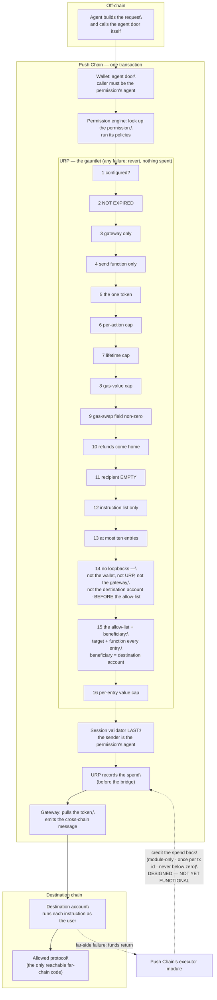
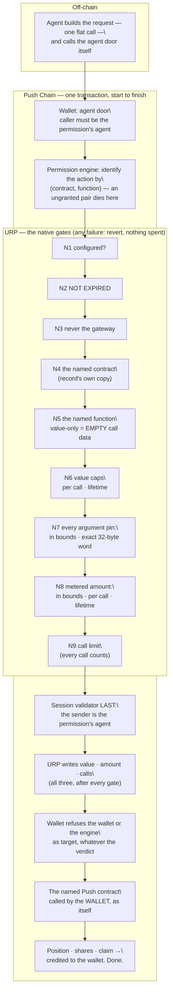
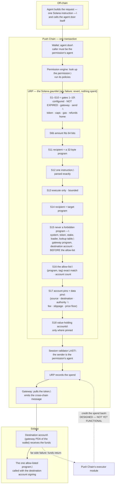
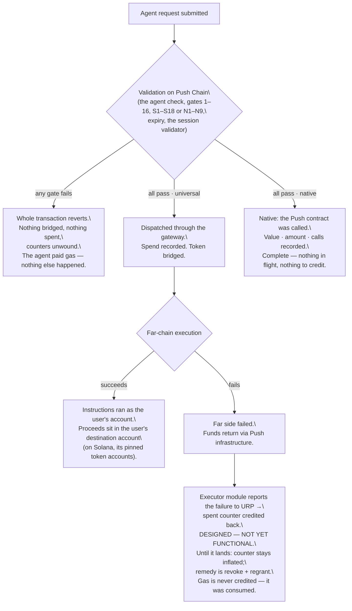

# UniversalRulesPolicy (URP)

*The rules-policy chapter of the AGW architecture, kept as its own document. References to other chapters point to [`1_AGW.md`](1_AGW.md).*

# 1 · URP — where the limits live
*URP — the Universal Rules Policy. One contract, three rulebooks: the **universal EVM** rulebook (§1.2–§1.4) descends from a v2 contract that has since been removed from the repository; the line references in those sections point into that removed file and are kept only as provenance for the reviewed logic URP reproduces. The **native** rulebook (§1.2b, §1.4b) and the **universal Solana** rulebook (§1.2c, §1.4c) are referenced by function name into `src/policies/UniversalRulesPolicy.sol`. **The authoritative specification is the contract itself, `src/policies/UniversalRulesPolicy.sol`, together with its test suite.** Every v3 extension to the universal rulebook is marked below.*
## 1.1 Why this contract exists
- The adopted permission engine identifies "what action is this?" by hashing **the target contract and the function being called on Push Chain**.
- But every agent action in this system is the *same* Push-side call: the wallet calling the gateway's send function. A market trade, a lending deposit, a transfer to a thief's address — **identical**, from the engine's point of view.
- The things the user actually cares about — which protocol, which function, whose benefit, how much — live *inside the call's data*, nested two layers deep, where the engine never looks.
- **URP is the contract that looks.** It is registered as the action policy for the one action that exists, and it unwraps the call data and checks everything inside — in the far chain's own format: an EVM instruction list for an EVM chain, a Solana instruction for Solana. Remove URP and the user's real limits are not enforced anywhere. That is why the engine's own floor — **at least one action policy per action** (`SmartSession.sol:285-299`) — combined with URP being that one policy, means the system fails closed: strip URP from a permission and the permission validates nothing at all, so every request dies.
- **For a native permission the blind spot is different, and smaller.** Here the engine's identity — the Push contract and the function — is exactly what the user cares about, so the engine itself already refuses a call to any contract or function the permission did not name. What the engine still cannot see is *how* the function is called: the arguments, the value attached, and how many times. URP's native rulebook checks those three. It is registered as the action policy on **each** of the permission's one to eight actions, and the fail-closed property is identical and per action: strip URP from any action and that action validates nothing.
- **URP decides which rulebook to run from a record it wrote at grant, not from the request.** §1.7 explains how that record is set, and why a request can never reach the wrong rulebook.
- Two wiring rules protect the fail-closed property. **Both are enforced in code, by the wallet's grant-shape check — a grant violating either one reverts:**
\t- **Never configure a fallback action policy** on an agent wallet. The engine supports a wildcard policy that catches unmatched actions; installing one would absorb requests that should die. For a universal permission this follows from the one-action shape; for a native permission the wallet refuses the engine's wildcard target and its two wildcard function markers **by name**, because the engine itself does not refuse the wildcard target at grant time (`1_AGW.md` chapter 7.1).
\t- **Never rely on the engine's other policy class** (checks on the outer operation) for anything mandatory — that class is allowed to be empty (`SmartSession.sol:237-247`). Everything mandatory lives in URP.
## 1.2 What URP stores — a universal permission's configuration (EVM chains)
Frozen at grant, per permission, written at initialisation:
| Field                           | Meaning                                                                                                                                                                                     |
| ------------------------------- | ------------------------------------------------------------------------------------------------------------------------------------------------------------------------------------------- |
| the tokens                      | One to eight PRC20s on Push (`assets`, at most `MAX_ASSETS`), each with its own caps and its own spent counter. No token twice. Every request must name one of them, **even at zero amount**: the token is what pins the destination chain — see §1.5. A permission with no token is refused at grant, on every grant path; a permission that should move nothing lists one token (the chain's gas token) with both limits at zero |
| per-action cap, per token       | The most that one request may bridge in that token. Zero is legal: the token may route a request but never moves (the move-nothing permission) |
| lifetime cap, per token         | The most that all requests together may bridge in that token. The largest representable number means unlimited; zero means nothing may move |
| PC-per-action cap               | `maxGasPerCall`: the most native PC one request may carry — it pays the protocol fee and the gas swap, despite the name |
| the spent counters              | One per token: the running total bridged in that token. Starts at zero. Money coming back to the wallet never lowers it |
| the expiry                      | The permission's end. Held **inside URP** so this one contract carries the complete mandatory set — no other policy needs to exist for the user to be safe                                  |
| the destination account address | Computed and committed at grant. Everything must benefit this address                                                                                                                       |
| the allowed-calls list          | Per entry: a far-chain contract address, a function on it, where that function's beneficiary argument sits, whether it has one, and a per-entry native-value cap. One to thirty-two entries |
## 1.2b What URP stores — a native permission's configuration, per action
A native permission holds one of these records **per action** — a permission with eight actions holds eight, each under its own action id. Frozen at grant, written at initialisation:
| Field                    | Meaning                                                                                                                                                                                                                                                                                                                                                        |
| ------------------------ | -------------------------------------------------------------------------------------------------------------------------------------------------------------------------------------------------------------------------------------------------------------------------------------------------------------------------------------------------------------- |
| the target               | A defensive copy of the action's Push contract. The engine already routes by it; URP asserts it again at N4 so a mis-wired engine entry cannot pair one contract's rules with another's call                                                                                                                                                                   |
| the function             | A defensive copy of the action's function selector, asserted at N5. The value `0xFFFFFFFF` means **value-only**: a bare transfer of PC with **empty** call data — a function that merely takes no arguments is a normal four-byte selector, not value-only                                                                                                     |
| the argument pins        | Zero to eight. Each is a byte position in the call data — counted from byte zero, selector included, so 4 is the first argument — and the exact 32-byte word that must sit there. **Full-word equality**, so an address argument with anything in its upper twelve bytes is a mismatch, deliberately: the pin proves the padding is clean as well as the value |
| per-call value cap       | The most native PC one call may carry                                                                                                                                                                                                                                                                                                                          |
| lifetime value cap       | The most all calls together may carry. Largest number means unlimited                                                                                                                                                                                                                                                                                          |
| the value-spent counter  | Running total of native PC sent. Starts at zero                                                                                                                                                                                                                                                                                                                |
| the metered amount       | Optional: on/off, a position in the call data read as a number, a per-call cap and a lifetime cap. Off is a flag, not "position zero" — position zero is a legal position, inside the selector                                                                                                                                                                 |
| the amount-spent counter | Running total of the metered amount. Starts at zero                                                                                                                                                                                                                                                                                                            |
| the call limit           | How many successful calls the action permits. **Zero means unlimited** — the one cap in the system where zero is not "nothing"                                                                                                                                                                                                                                 |
| the calls-used counter   | Successful calls so far. **Moves on every successful call**, including one that sends no value and meters nothing                                                                                                                                                                                                                                              |
| the expiry               | The permission's end, held inside URP for the same reason as in the universal rulebook                                                                                                                                                                                                                                                                         |
Two refusals happen at grant, not at validation: a native record may never name the gateway as its target, and a value-only record may carry neither pins nor a metered amount — such a record could never authorise anything, so it is a misconfiguration the owner believes they granted, not a valid strict one.
## 1.2c What URP stores — a universal permission's configuration (Solana)
Frozen at grant, per permission, written at initialisation. The first five fields mean exactly what they mean in §1.2; everything after them replaces §1.2's destination account and allowed-calls list:
| Field                          | Meaning                                                                                                                                                                                                                                                                                       |
| ------------------------------ | --------------------------------------------------------------------------------------------------------------------------------------------------------------------------------------------------------------------------------------------------------------------------------------------- |
| the tokens                     | One to eight, with per-token caps and counters, exactly as in §1.2. Each pins the destination chain |
| per-action and lifetime caps   | In the token's base units — on Solana, lamports or the SPL token's base units                                                                                                                                                                                                                 |
| PC-per-action cap              | The most native gas value one request may carry                                                                                                                                                                                                                                               |
| the spent counters             | One per token, as in §1.2 |
| the expiry                     | The permission's end, held inside URP                                                                                                                                                                                                                                                         |
| the destination account        | The 32-byte key of the wallet's Solana account, derived by tooling and committed by the owner. Never a valid target                                                                                                                                                                          |
| the gateway program            | The 32-byte id of the gateway program on the declared cluster, from the chain registry. Never a valid target                                                                                                                                                                                 |
| the program rules              | One to thirty-two. Per rule: a program, an instruction tag (its leading one to eight bytes) or the marker that the instruction carries no data, and optionally the exact account count the instruction must have                                                                              |
| the account pins               | Up to sixteen. Per pin: which rule, which position in the account list, and the key that must sit there. Every rule must carry at least one, and a position may be pinned only once per rule                                                                                                  |
| the data pins                  | Up to eight. Per pin: which rule, an offset — from the start or from the end of the instruction data — a width of one to eight bytes (up to thirty-two for equality), and a comparison: equal, at least, at most, or a minimum ratio to a second field at its own offset                       |
| the value-holding accounts     | Up to sixteen destination-side accounts the owner declares worth protecting: the destination account itself, which must be present, one token account per listed token and up to seven swap-output accounts. Each may appear in a request only where the matched rule pins it; a listed account no rule pins can never be passed. URP cannot check that every listed token's account is here (it cannot derive Solana token accounts), so tooling must list them. Gas grows with the number listed: about 6,000 per extra account on a ten-account request |
Refusals at grant, each with its own named error: no program rule may name a program the rulebook forbids as a target (§1.4c, gate S15); two rules on one program may not both be able to match the same instruction — an instruction-less rule against another instruction-less rule, or one tag a prefix of the other — so the first-match lookup is always exact; a fixed account count may not exceed the request bound, and no pin may sit beyond it; a data pin may not sit on an instruction-less rule, and its comparison value must be one the field can actually fail — a ceiling above the field's range, a ratio with a zero numerator, or an equality value encoded in the wrong alignment is refused; and the value-holding list may not contain the zero key, a duplicate, or an allow-listed program, and must contain the destination account.

**One input per instruction.** Because two rules may not match the same instruction, each (program, instruction) has exactly one rule, and each position one pinned key. If a swap rule pins its input to the USDC account, USDT can never be that instruction's input. Using several listed tokens through one instruction means leaving the input position unpinned and those token accounts off the value-holding list, so only the output and price pins protect them. Several tokens in one Solana permission work best when different tokens are used by different instructions.
**And, beside any of the three configurations, the mode record**: whether this permission's URP record exists at all, which kind it is, and — for a universal permission — which destination family. §1.7.
## 1.3 What URP opens
Each validation performs a **two-level unwrap**:
- **Level one — the gateway request.** URP decodes the wallet's call to the gateway: the token, the amount, the native value, the routing fields, and the payload.
- **Level two — the instruction list.** Inside the payload sits the destination account's instruction list: up to **ten** entries of *(target, value, data)*. URP walks **every** entry. One bad entry — even the last — kills the whole request.
- **For Solana, level two is one instruction, not a list.** URP parses the payload in exactly the byte grammar Push Chain's validators decode — a four-byte account count, that many 33-byte account entries, a four-byte data length, the instruction data, an instruction id and the target program — and requires it to be **consumed exactly**: a short field or a trailing byte is refused, so URP and the validators can never read the same bytes two ways. Every length is checked before the read it guards; the parse is bounded at sixty-four accounts and 1,024 bytes of instruction data. Writable flags are read past, never judged — a wrong flag fails on Solana, not here.
- **A native validation opens nothing.** The call is already flat. URP reads 32-byte words out of the call data at the positions the permission froze, and never decodes it as a structure — it does not know, and does not need to know, what the function's arguments mean. Every read is bounds-checked in 256-bit arithmetic, so a crafted position can neither wrap nor read past the end.
## 1.4 The universal gauntlet — every gate, in order (EVM chains)
Run for a universal permission whose destination family is EVM (`_checkUniversal`). Each gate: what it demands, and what it stops. Any failure reverts the whole request with nothing spent.
| #   | Gate                                      | Demands                                                                                                                                                                                                  | Stops                                                                                                                                                                                                                                                                                      |
| --- | ----------------------------------------- | -------------------------------------------------------------------------------------------------------------------------------------------------------------------------------------------------------- | ------------------------------------------------------------------------------------------------------------------------------------------------------------------------------------------------------------------------------------------------------------------------------------------ |
| 1   | **Configured**                            | This permission's configuration exists and is initialised (`:141`)                                                                                                                                       | Requests against ghosts — ids never granted on this wallet                                                                                                                                                                                                                                 |
| 2   | **Not expired**                           | The permission's own end date has not passed — **the expiry lives here, in URP**                                                                                                                         | Everything, after the deadline the user set. This is why URP alone is the complete mandatory set                                                                                                                                                                                           |
| 3   | **Gateway only**                          | The Push-side call target is the gateway, nothing else (`:143`)                                                                                                                                          | The agent calling any Push contract directly — a token, the wallet, anything. The entire far-chain rulebook below is only sound because *everything* must pass through the gateway                                                                                                         |
| 4   | **Send function only**                    | The gateway function is the outbound send, nothing else (`:145-147`)                                                                                                                                     | Reaching any other gateway capability                                                                                                                                                                                                                                                      |
| 5   | **A listed token**                        | The bridged token is one of the permission's tokens — on **every** request, zero amount included | Spending any asset the user did not budget, and — because the gateway routes by the token — sending the permission's calls to a chain the user never approved |
| 6   | **Per-action cap**                        | Amount within **that token's** per-action cap | One oversized request |
| 7   | **Lifetime cap**                          | Amount plus everything already spent **in that token** within that token's lifetime cap | Death by a thousand cuts — many small requests. One token running out never limits another |
| 8   | **Gas-value cap**                         | Native PC attached within its cap (`:177`)                                                                                                                                                               | Draining the wallet's gas balance through the value field                                                                                                                                                                                                                                  |
| 9   | **No uncapped gas swap**                  | The request's own gas-swap ceiling is non-zero *(v3 addition)*                                                                                                                                           | An agent authoring the field's "no cap" value. The **owner** may set unlimited caps in the rules set; an **agent** may not author an unlimited request field                                                                                                                                 |
| 10  | **Refunds come home**                     | The refund destination is the wallet itself (`:178-180`)                                                                                                                                                 | A "failed" transfer whose refund lands at the agent's address — failure as an exfiltration route                                                                                                                                                                                           |
| 11  | **No side recipient**                     | The bridged-funds recipient field is empty — funds may only travel with the instruction payload *(v3 addition)*                                                                                          | Any use of the gateway's direct-transfer mode. Defence in depth: the current far-side code ignores this field on the payload path, but URP does not lean on that staying true                                                                                                              |
| 12  | **Instruction list only**                 | The payload is exactly a destination-account instruction list                                                                                                                                            | Smuggling any other payload shape past the gates below                                                                                                                                                                                                                                     |
| 13  | **At most ten**                           | Between one and ten instructions *(v3 constant)*                                                                                                                                                         | Unbounded lists that could exhaust validation gas                                                                                                                                                                                                                                          |
| 14  | **No loopbacks**                          | No instruction may target the wallet, URP itself, the gateway — **or the destination account** (`:253-255`; the last is a v3 addition). **Checked before gate 15**                                       | Self-calls and re-entry tricks; and — the v3 addition — the agent instructing the user's own account directly, which would hand it arbitrary control of everything that account holds. **This gate wins even if the owner allow-listed that address** — a permanent test pins exactly that |
| 15  | **The allow-list, and for the user only** | Every instruction's far-chain target *and* function appear in the allowed-calls list; and where the matched rule names a beneficiary argument, that argument equals the destination account (`:264-265`) | Everything. This is the only place in the entire system that checks the far-chain destination — and the beneficiary pin is what stops the agent trading honestly but making *itself* the beneficiary                                                                                       |
| 16  | **Per-entry value cap**                   | Each instruction's native value within its own cap                                                                                                                                                       | Value-draining through individual entries                                                                                                                                                                                                                                                  |

> **There is no zero-amount gate.** v2 rejected a bridged amount of zero; v3 permits it, because that is the *redeployment* path — instructions travelling to capital already at the destination, with nothing new bridged. The counter correctly does not move. Without it an agent could buy but never sell.

After every gate passes, URP **records the spend before the bridge is called** — effects first, so no ordering trick can spend twice against a stale counter.
## 1.4b The native gates — every gate, in order
Run only for a native permission (`_checkNative`). The same discipline as the universal gauntlet, for the same reason: this runs before the engine consults the session validator, on call data the engine has not yet authenticated. The wallet has already checked that the caller is the permission's agent, but URP does not rely on that. No external calls; every counter written last; any failure reverts the whole request with nothing spent.
| #   | Gate                   | Demands                                                                                                                                                                                                                                 | Stops                                                                                                                                                                                                                                                                                   |
| --- | ---------------------- | --------------------------------------------------------------------------------------------------------------------------------------------------------------------------------------------------------------------------------------- | --------------------------------------------------------------------------------------------------------------------------------------------------------------------------------------------------------------------------------------------------------------------------------------- |
| N1  | **Configured**         | This action's native record exists and is initialised                                                                                                                                                                                   | Requests against ghosts — action ids never granted on this wallet                                                                                                                                                                                                                       |
| N2  | **Not expired**        | The permission's end date has not passed — the expiry lives here, as in the universal rulebook                                                                                                                                          | Everything, after the deadline the user set                                                                                                                                                                                                                                             |
| N3  | **Never the gateway**  | The call's target is not the gateway                                                                                                                                                                                                    | The mirror of gate 3. A native permission cannot be written against the gateway (§1.2b), so on a permission the wallet created this cannot fire — it is defence in depth against a mis-wired grant, and a named test manufactures the state the wallet forbids to prove the gate is live |
| N4  | **The named contract** | The call's target equals the record's own copy of the target                                                                                                                                                                            | A record reached through any action id but its own                                                                                                                                                                                                                                      |
| N5  | **The named function** | The call's function equals the record's copy. Call data under four bytes counts as value-only — matching how the engine itself buckets short calls — and **a value-only call must carry empty call data, not one to three stray bytes** | Reaching any function but the one granted; and smuggling bytes under a value-only action                                                                                                                                                                                                |
| N6  | **Value caps**         | Native PC attached within the per-call cap; attached plus everything already sent within the lifetime cap                                                                                                                               | Draining the wallet's PC through one large or many small calls                                                                                                                                                                                                                          |
| N7  | **The argument pins**  | For every pin: the call data is long enough to hold the word at that position, and the word there equals the frozen value exactly                                                                                                       | A beneficiary that is not the wallet; a spender that is not the intended contract; a pool id the owner did not choose; a correct address with dirty padding. **This is the only place a native call's arguments are checked**, and a missing pin is an unchecked argument (`1_AGW.md` chapter 9)   |
| N8  | **The metered amount** | If the action meters an amount: the call data reaches it, the amount is within the per-call cap, and amount plus everything already metered is within the lifetime cap                                                                  | Staking, approving, transferring or depositing more than the user allowed, per call or over the permission's life                                                                                                                                                                       |
| N9  | **The call limit**     | If the action has a limit: calls used so far are below it                                                                                                                                                                               | The (n+1)th call — including a zero-value one, because every successful call counts                                                                                                                                                                                                     |
After every gate passes, URP writes all three counters — value, amount, calls — **and only then**, so a request that fails at N9 has moved nothing at N6 or N8. It emits a metering event on every success, even when both value and amount are zero, because the call counter still moved.
**Every native error puts the value you debug with first.** The engine truncates a policy's revert data to 32 bytes — a selector plus 28 bytes of the first argument (`1_AGW.md` chapter 7.1). A native error therefore leads with the offending value (the word that did not match, the amount that was too large) rather than an index or a length, which would surface as zeros and tell nobody anything. The universal rulebook's errors predate this ordering and keep their reviewed shape; wallet errors are not truncated at all and do not follow it.
## 1.4c The Solana gauntlet — every gate, in order
Run for a universal permission whose destination family is Solana (`_checkSvm`). The same discipline as the other two: no external calls, the spend written last, any failure reverts the whole request with nothing spent. **Gates S1–S10 are gates 1–10 of §1.4, unchanged in meaning** — configured, not expired, gateway only, send function only, a listed token, the per-action cap, the lifetime cap, the gas-value cap, no uncapped gas swap, refunds come home — run against the Solana configuration. They do not depend on the far chain. From S11 on, the gates replace §1.4's 11–16:
| #   | Gate                                     | Demands                                                                                                                                                                                                                         | Stops                                                                                                                                                                                                                                                                                                               |
| --- | ---------------------------------------- | ------------------------------------------------------------------------------------------------------------------------------------------------------------------------------------------------------------------------------- | ------------------------------------------------------------------------------------------------------------------------------------------------------------------------------------------------------------------------------------------------------------------------------------------------------------------- |
| S6b | **Fits Solana's amount**                 | The bridged amount fits in 64 bits — Solana's amount type                                                                                                                                                                       | An amount the far side would truncate. Runs beside S6                                                                                                                                                                                                                                                               |
| S11 | **Recipient is a program**               | The recipient field is exactly 32 bytes and not zero                                                                                                                                                                            | The inverse of gate 11: on Solana the recipient is required, and is the program to call. An address in any other form — including a base58 string — fails closed                                                                                                                                                   |
| S12 | **One well-formed instruction**          | The payload is non-empty and parses exactly in the validators' grammar (§1.3) — no short field, no trailing byte                                                                                                                | A funds-only outbound, and any payload URP and the validators could read differently                                                                                                                                                                                                                               |
| S13 | **Execute only, within bounds**          | The instruction id is *execute*; at most sixty-four accounts and 1,024 bytes of instruction data                                                                                                                                 | The *withdraw* form, which no rule below can inspect — the Solana counterpart of gate 12 — and unbounded parsing                                                                                                                                                                                                    |
| S14 | **Recipient and target agree**           | The program named in the payload equals the recipient field                                                                                                                                                                     | An ambiguity in the far-side path: the validators sign over one and build the transaction from the other. Two different values fail on Solana at the owner's gas cost; URP refuses the shape instead                                                                                                               |
| S15 | **Never a forbidden program**            | The target is not the System program, SPL Token, Token-2022, Stake, the upgradeable BPF loader, the address lookup table program, **the gateway program, or the destination account**. **Checked before S16**                    | Direct drains: each of these, called with the destination account as signer, can move or burn what it holds. The gateway program routes funds back to Push and is refused for the reason in 11.5. **This gate wins even if the owner allow-listed the program** — grant refuses it too, and a permanent test pins both |
| S16 | **The allow-list — exact match**         | The (program, instruction tag) matches a rule; an instruction-less rule matches only empty instruction data; and if the rule fixes an account count, the request has exactly that many                                       | Every program and instruction the owner did not name. Because grant forbids two rules that could match the same instruction, the first match is the only match — a rule can never be reached by an instruction its pins were not written for                                                                    |
| S17 | **Account pins and data pins**           | Every account pin of the matched rule: the position exists and holds the frozen key. Every data pin: the instruction data reaches the field, and the field equals, meets the floor, stays under the ceiling, or meets the ratio | A destination that is not the user's token account, an authority that is not the destination account; a non-zero fee, an over-wide slippage, a price floor not met. **The ratio form is what a swap needs**: a static floor on the output is beaten by raising the input to the whole balance                      |
| S18 | **Value-holding accounts only where pinned** | Any account on the permission's value-holding list that appears anywhere in the account list sits at a position the matched rule pins                                                                                       | Handing the program the destination account's *other* balances as extra accounts. On Solana the destination account signs the whole call, so an account passed is an account the program may spend from. The list must contain the destination account, so this gate is never off                               |
> **There is no zero-amount gate here either.** A zero-amount request is the Solana counterpart of the redeployment path — one instruction acting on capital already at the destination — and the counter does not move.

After every gate passes, URP **records the spend** — the same counter discipline as §1.4.
## 1.5 What URP counts
- **The spent counters** — one per listed token — advance by the bridged amount, before dispatch, and only count bridging — `1_AGW.md` chapter 4.2's "bridged, not deployed" rule lives here. **They count what was sent out, never what came back**: URP cannot see money arriving at the wallet, and could not tell an agent's return from the owner's top-up, so a limit of 1000 with 600 sent and 300 returned leaves 400. Everything in this section applies to EVM and Solana alike.
- **The credit-back** *(v3 addition — designed, not yet functional)*: when a far-side execution fails and Push Chain's executor module reports it, URP reduces the named token's spent counter by the failed amount (the module passes the token; a credit can never touch another token's counter). Three properties bound this path:
\t- **module-only** — a single fixed caller, Push Chain's own executor module, may invoke it; the agent cannot fabricate a failure;
\t- **idempotent** — each failed cross-chain transaction id credits at most once; a second credit for the same id reverts (a named test);
\t- **saturating** — the counter never goes below zero.
\t- One honest limit: URP cannot verify the *amount* the module hands it; it trusts Push core. Idempotency and saturation bound the damage of a wrong amount. This is an accepted limit (`1_AGW.md` chapter 9).
- **Gas is never credited.** A failed action's gas was genuinely consumed. **A refund credit must not move any gas counter** — a permanent rule with its own test.
- **A native action counts three things**, all written after every gate passes: native value sent, the metered amount if the action has one, and calls. There is no credit-back and nothing to credit: a native call either succeeds or reverts inside one Push transaction, and a revert unwinds every counter with it. The credit-back path refuses to run against a native record.
## 1.6 What URP deliberately does not do
- **No expiry-distance ceiling.** It rejects the expired; it never rejects the distant-future. The user's chosen horizon is respected as given.
- **No deny-list.** Nothing rejects a function by name. If an owner allow-lists a token-approval function, that is permitted — and hands the agent spending power outside every cap. The product must warn; the contract will not refuse. Gate S15's forbidden programs are the Solana form of gate 14's loopbacks, not an exception: on Solana the token programs *are* the destination account's balances, so calling them directly with its signature is instructing that account directly. (An open question records whether this should change — `1_AGW.md` chapter 11.)
- **No direct destination-chain check.** The configured chain is stored but not compared at validation. The chain is pinned *transitively*: the one allowed token is a Push-side mirror specific to one origin chain, so fixing the token fixes the chain. A builder who notices the stored-but-unchecked field has found a known fact, not a bug.
- **No opinion about the owner.** URP runs only on the agent door. The owner's door never meets it.
- **No verification of Solana keys.** The destination account, its token accounts and the gateway program are 32-byte keys the owner commits; URP cannot run Solana's address derivation and does not try. A wrong key fails closed — the pins never match.
- **No bound on what an allow-listed Solana program does inside its own call.** Account pins bound *where value is delivered*; they cannot bound what a program the owner allow-listed takes from the accounts it is handed, because the destination account's signature carries into every call that program makes. The forbidden set guards the top-level target only. S18, the data pins and the fixed account count narrow this; the rest is trust in the allow-listed program's code — the same trust an EVM allow-list already expresses (`1_AGW.md` chapter 9).
- **No reading of Solana writable flags.** A pinned account passed read-only fails on Solana, not here.
- **No understanding of native calls.** The native rulebook compares words at positions; it does not know what a function does. A pinned argument is locked; an unpinned one is the agent's to choose. So allow-listing a token approval without pinning its spender hands the agent that approval — the native form of the no-deny-list rule. The SDK refuses to emit an unpinned approval (`1_AGW.md` chapter 10); the contract will not.
## 1.7 Which rulebook — how the kind is fixed, and locked three ways
- **The chain travels inside URP's initialisation data, and the kind is derived from it.** The engine passes each policy an opaque blob at grant; URP's blob is a chain identifier followed by the configuration body. URP hashes the chain, compares it to this chain's own identifier — computed from the chain id, never configured — and derives the kind exactly as the wallet did, from the same bytes. An empty chain produces a named error; a blob in any other shape reverts rather than mis-decoding.
- **For a universal permission URP derives one more thing: the destination family.** It reads the chain's namespace — the first seven bytes, `eip155:` or `solana:` — and chooses the EVM or the Solana configuration body and rulebook accordingly. Any other namespace is refused at grant with a named error, so a permission for a chain URP has no rulebook for can never be granted and then fail every request. The kind still comes from the full chain hash; the family is a second, narrower classification inside the universal kind, and URP never asks it of a native chain. The wallet does not derive the family at all: both universal families look identical to it — one action, the gateway's send.
- **URP writes a mode record beside the configuration** — initialised, which kind, and for a universal permission which destination family — and consults that record on every validation. It does not infer the kind from the data's shape, and it does not trust the request. Universal is the record's zero value, so an *empty* record cannot be told from a universal one by its kind field alone; the initialised flag is what is authoritative, and the mode field is meaningless without it. EVM is likewise the family's zero value, so a universal record whose family was never written is an EVM one — which is what every such record is.
- **A permission initialised as one kind can never be re-initialised as the other, or as itself.** The re-initialisation refusal reads the mode record and, beneath it, the universal configuration — so a universal configuration written before its mode record existed is still recognised, and is still protected. URP is upgradeable behind a proxy and its storage is append-only: the universal configuration, the credit-back set, the mode record, the native configuration and the Solana configuration each hold their own slot, and a later implementation may add state only after them.
- **The wallet and URP cannot disagree about the kind, because neither one authors it.** Both derive it from the same chain string in the same blob, with the same rule. The wallet reads that one field — and only that field, only after it has proven the policy is URP's — to choose which shape rules to apply; it still never inspects the terms, which remain URP's sole business. There is therefore no second author for the two to disagree with, and the grant event now reports a derived fact rather than a claim.
- **Three further layers remain, as defence in depth.** Gate 3 requires a universal request to target the gateway. Gate N3 refuses a native request that does. Native initialisation refuses a gateway target outright. Between them there is no shape in which a gateway call reaches a native record, and none in which a native call reaches a universal one.
- **And for a universal permission the chain is checked against the money** — identically for both families, which is what makes a Solana permission over an EVM chain's asset impossible to grant. At initialisation URP asks the asset which chain it came from — the same view the gateway reads on every outbound to decide where to route — and refuses the grant if it disagrees with the declared chain, or if the asset cannot answer. Because every request then pins that same asset, one check at grant makes the declared chain true for the permission's whole life, with no external call at validation time.
- **The mode is readable.** A getter returns the mode record — kind, family and chain — and never reverts; it is the documented first call for anything that does not already know a permission's kind. The universal EVM, universal Solana and native getters each revert, with the actual kind or family named, when asked about a record of another shape — a wrong-kind read is a caller bug — and each returns an all-zero record for an empty slot, which is a state, not an error.
## Diagram — the full agentic flow, Push Chain to an EVM chain, every gate

## Diagram — the native flow, every gate

## Diagram — the Solana flow, every gate

## Diagram — when things fail

