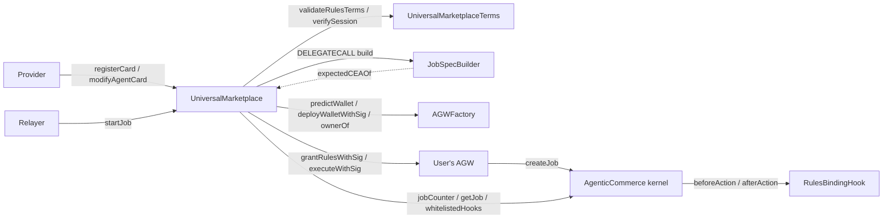
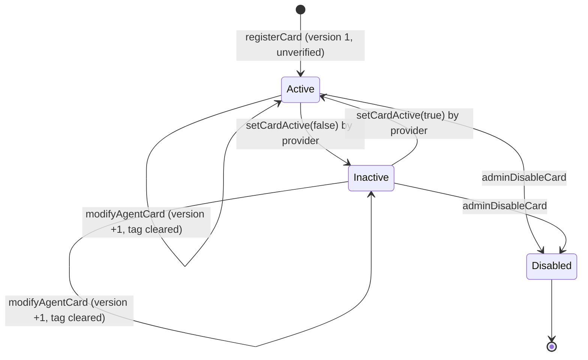

# Universal Marketplace

How the Universal Marketplace contracts work, end to end. Written for a reviewer: every guarantee is tied to the
code that enforces it, and every assumption the code makes about something else is stated.

| Doc | Contents |
|---|---|
| **This file** | What the marketplace is, its parts, the card lifecycle, `startJob` step by step, the rules check, the criteria, admin powers, upgradeability, trust model, limitations, tests, reviewer checklist |
| [`reference.md`](./reference.md) | Every function, event, error and storage slot, one by one |
| [`criteria.md`](./criteria.md) | The criteria template format, how a job's `JobSpec` is built from it, and a worked example |

Code as of commit `cb69e0b` (branch `universalMarketplace_v1`).

---

## Contract locations

| Contract | Path | Kind |
|---|---|---|
| **UniversalMarketplace** | [`src/agentic-commerce-8183/UniversalMarketplace.sol`](../../src/agentic-commerce-8183/UniversalMarketplace.sol) | Upgradeable (TransparentUpgradeableProxy), stateful. The only contract users and providers call. |
| **UniversalMarketplaceTerms** | [`src/agentic-commerce-8183/UniversalMarketplaceTerms.sol`](../../src/agentic-commerce-8183/UniversalMarketplaceTerms.sol) | Stateless, `pure`, not upgradeable. The rules-side checks. |
| **JobSpecBuilder** | [`src/agentic-commerce-8183/libraries/JobSpecBuilder.sol`](../../src/agentic-commerce-8183/libraries/JobSpecBuilder.sol) | External library, linked into the marketplace and called by `DELEGATECALL`. Builds each job's criteria. |
| Types | [`src/agentic-commerce-8183/libraries/Types.sol`](../../src/agentic-commerce-8183/libraries/Types.sol) | Every struct and enum of the package (file-level). |
| Errors | [`src/agentic-commerce-8183/libraries/Errors.sol`](../../src/agentic-commerce-8183/libraries/Errors.sol) | `UniversalMarketplaceErrors` (37 errors), `RulesBindingHookErrors`, `ERC8183HookErrors`. |
| JobSpecTypes | [`src/agentic-commerce-8183/libraries/JobSpecTypes.sol`](../../src/agentic-commerce-8183/libraries/JobSpecTypes.sol) | The built criteria (`JobSpec`): the wire format shared with the future UniversalHook and UniversalEvaluator. |
| IUniversalMarketplace | [`src/agentic-commerce-8183/interfaces/IUniversalMarketplace.sol`](../../src/agentic-commerce-8183/interfaces/IUniversalMarketplace.sol) | The marketplace's events and functions. |
| IUniversalMarketplaceTerms | [`src/agentic-commerce-8183/interfaces/IUniversalMarketplaceTerms.sol`](../../src/agentic-commerce-8183/interfaces/IUniversalMarketplaceTerms.sol) | The Terms helper's two functions. |
| AGW mirrors | [`interfaces/external/IAGW.sol`](../../src/agentic-commerce-8183/interfaces/external/IAGW.sol), [`IAGWFactory.sol`](../../src/agentic-commerce-8183/interfaces/external/IAGWFactory.sol), [`ISmartSession.sol`](../../src/agentic-commerce-8183/interfaces/external/ISmartSession.sol) | Byte-exact mirrors of the Push Agentic Wallet (AGW) types and functions the package calls. |

Contracts the marketplace works with, but which are **not** part of it:

| Contract | Where | Role |
|---|---|---|
| **AgenticCommerce** (the "kernel") | [`src/agentic-commerce-8183/AgenticCommerce.sol`](../../src/agentic-commerce-8183/AgenticCommerce.sol) | The ERC-8183 job kernel: jobs, budgets, escrow, payout. The marketplace only creates jobs on it (through the user's wallet). |
| **RulesBindingHook** | [`src/agentic-commerce-8183/hooks/RulesBindingHook.sol`](../../src/agentic-commerce-8183/hooks/RulesBindingHook.sol) | The interim 8183 hook every marketplace job is created with. At `fund` it binds the job to the wallet's live rules set and allows one live job per wallet. |
| **AGW + AGWFactory** | `push-agentic-wallet` repo | The user's agentic wallet (an ERC-7579 account with SmartSession) and its factory. Verifies the owner's signature. |
| **UniversalRulesPolicy (URP)** | `push-agentic-wallet` repo | The SmartSession policy that enforces the agent's rules when the agent sends outbound calls through the gateway. |
| **CEAFactory** | destination chain (`src/cea/CEAFactory.sol` here) | Deploys each user's Chain Executor Account (CEA) on the destination chain. The marketplace only predicts CEA addresses. |
| UniversalHook, UniversalEvaluator (V2) | not built yet | The intended long-term hook and evaluator. Until they ship, jobs use RulesBindingHook and a Push-controlled evaluator address. |

---

## 1 · What the marketplace is

The Universal Marketplace is a registry of **agent cards** plus one entry point, **`startJob`**.

- **An agent card** is a standing offer from one provider (an AI agent's address). It covers one job type on one
  EVM execution chain. It says who the agent is, what it does, what it needs permission to do there (the
  **rules**), and how "done" is judged (the **criteria template**).
- **`startJob`** is one relayed call. On a single signature from the user, it:
  1. deploys the user's agentic wallet (AGW) if needed;
  2. grants the AGW the card's rules, so the agent can act from it; and
  3. creates an ERC-8183 job on the kernel, with the AGW as client, the card's provider as provider, the
     marketplace's configured evaluator and hook, and **criteria built on-chain from the card**.

What the marketplace deliberately does **not** do:

| Not done | Where it happens instead |
|---|---|
| Move any funds | The user funds the AGW in a separate transaction. The provider prices the job with `setBudget`; the AGW funds it with `fund`. Both are kernel calls. |
| Execute the card's token approvals | The owner executes them in the funding transaction the SDK builds. The card only declares them (`Approval[]`). |
| Judge whether the criteria make sense | Nobody, on-chain. The admin's **verified tag** is the review. |
| Evaluate the job | The job's evaluator (the UniversalEvaluator, once shipped). |
| Enforce the agent's rules at execution | The AGW's SmartSession engine and URP. |

The marketplace never holds tokens or native PC. Tests `test_MS02_movesNoFunds` and the invariants
`MI02_marketplaceHoldsNothing` and `MI05_userBalanceNeverMovedByStartJob` check this.

---

## 2 · Glossary

| Term | Meaning |
|---|---|
| **Provider / agent** | One address. It registers the card, is the 8183 job's `provider` (and fee recipient), and is the agent the rules authorise (`sessionValidatorInitData == abi.encode(provider)`). |
| **User / owner** | The person starting a job. Signs one `OwnerIntent`; owns the AGW. |
| **AGW** | Agentic Wallet: the user's smart account, deployed by the AGW factory at an address derived from `(owner, index)`. The job's client. |
| **CEA** | Chain Executor Account: the AGW's account on the destination chain, at an address derived from the AGW. It is where the agent's outbound calls execute and where the criteria read balances. |
| **Rules** | The SmartSession `Session` granted to the agent on the AGW. Its one action carries the URP policy with `UniversalTerms` (asset, caps, allowed calls, expected CEA, expiry). `rulesId` is the engine's `permissionId`. |
| **OwnerIntent** | The single owner-signed message (AGW type). One signature authorises the wallet deploy, the rules grant and the `createJob` execution. |
| **Criteria template** | `EvaluationTemplate`: the V2 `JobSpec` with holes. Stored on the card. |
| **JobSpec** | The built criteria for one job: reads on the execution chain, checks against targets, and an AND/OR tree. `abi.encode(JobSpec)` is the 8183 job's `description`. |
| **Card version** | 1 at registration, +1 per modification. Bound into every job's criteria, so an intent signed against one version can't start a job on another. |
| **Verified tag** | An admin label: "this card, at this version, was reviewed". A tag, not a gate. |
| **chainHash** | `keccak256` of a CAIP-2 string such as `"eip155:11155111"`. The key for chain configuration. |
| **pushChainHash** | `keccak256("eip155:" ‖ block.chainid)`: Push Chain itself. No card may name it. |

---

## 3 · The parts and how they fit



- **The marketplace** holds the cards and runs `startJob`. It is the `executor` named in the user's intent: the
  factory and the wallet accept that intent only from it.
- **The Terms helper** is pure logic, split out for the EIP-170 size limit. It validates a card's rules at
  registration and checks the user's session against the card at `startJob`.
- **JobSpecBuilder** is an external library. It turns the card's template plus the job's inputs into the job's
  `JobSpec`. It runs in the marketplace's context, so it reads CEAs from the marketplace's own `expectedCEAOf`.
- **The AGW** does the work that needs the owner's authority: it verifies the owner's signature, grants the rules,
  and calls `createJob` itself, so the kernel records the AGW as the client.

---

## 4 · The agent card

### 4.1 What a card holds

A card is three things stored on-chain together:

1. **`AgentCard`**, the listing. Who: `provider`. What: `jobType`, `metadataURI` and `metadataHash` (off-chain
   JSON with the name, summary, ABIs, criteria in words and param units). Where: `chainNamespace`, a full CAIP-2
   string `"eip155:<id>"`. Commercials and windows: `fee` (reference price), `principalMin` / `principalMax`,
   `minDuration` / `maxDuration`, `minExecuteWindow`, `settleWindow`. And an `active` switch.
2. **Rules terms**, `abi.encode(RulesCardTerms)`: the rules `asset` (a PRC20 of the card's chain), `maxPCPerCall`,
   the `allowedCalls` the agent may make, and the `approvals` the owner must make first.
3. **Criteria template**, `abi.encode(EvaluationTemplate)`: see [`criteria.md`](./criteria.md).

`getCard(cardId)` returns all three, the version and both tags in one call (`CardView`).

### 4.2 What registration checks

`registerCard` (and `modifyAgentCard`) run `_validateCard`, in this order. The first failure reverts.

| # | Check | Error |
|---|---|---|
| 1 | `jobType != 0` | `InvalidCard("job type zero")` |
| 2 | `metadataURI` not empty | `InvalidCard("metadata uri empty")` |
| 3 | `metadataHash != 0` | `InvalidCard("metadata hash zero")` |
| 4 | `chainNamespace` starts with `"eip155:"` and is longer than 7 bytes | `InvalidCard("chain namespace")` |
| 5 | the chain is not Push, and has a CEA deployment (`setCEADeployment`) | `ChainNotSupported(chainHash)` |
| 6 | the caller is not the marketplace's evaluator | `InvalidCard("provider is evaluator")` |
| 7 | `principalMax != 0` and `principalMin ≤ principalMax` | `InvalidCard("principal range")` |
| 8 | `1 hour ≤ minDuration ≤ maxDuration` | `InvalidCard("duration range")` |
| 9 | `settleWindow != 0` | `InvalidCard("settle window")` |
| 10 | `minExecuteWindow + settleWindow ≤ maxDuration` | `InvalidCard("execute window")` |
| 11 | the rules terms pass `Terms.validateRulesTerms` (§6.1) | `InvalidCard(...)` from Terms |
| 12 | the rules asset's `SOURCE_CHAIN_NAMESPACE()` is a well-formed string equal to the card's chain | `InvalidCard("asset")` / `InvalidCard("asset chain")` |

**The criteria template is stored as given; it is not checked.** Whether the evaluator can run it is the
provider's responsibility. A malformed template fails only when a job is built from it (§7.3).

Check 12 uses a raw `staticcall` plus an ABI-shape check, not `try/catch`: a `try` clause cannot catch the
decoding of its own return data, so a non-string answer would otherwise revert with an opaque error. A codeless
asset answers empty and fails the length check.

### 4.3 Lifecycle



| Action | Who | Effect |
|---|---|---|
| `registerCard` | anyone (becomes the provider) | Stores the card, version 1, active, unverified. The contract writes `provider = msg.sender` and `active = true`, ignoring the caller's values. |
| `modifyAgentCard` | the provider | Replaces every field except `provider`, `chainNamespace` and `active`, and both blobs. Version +1, verified tag cleared. **The chain cannot change** (`CardIdentityImmutable`): another chain is another card. Refused for an admin-disabled card. |
| `setCardActive` | the provider | Switches the card on or off. An admin-disabled card cannot be switched back on. |
| `verifyAgentCard(cardId, version)` | admin | Sets the verified tag. `version` must be the current version (`CardVersionMismatch`), so a provider who modifies after review makes it revert. Refused for an admin-disabled card; allowed for an inactive one. |
| `revokeAgentCardVerification` | admin | Clears the tag. Idempotent: emits only if there was a tag. |
| `adminDisableCard` | admin | Permanent kill switch: disabled, inactive, tag cleared. The provider cannot undo it. |

**Modification and signed intents.** The card version is hashed into every job's `origin`, which is inside the
`createJob` calldata the owner signs. After a modification, an intent signed against the old version fails at
`CardVersionMismatch` (stale `p.cardVersion`) or at `IntentExecMismatch` (current version, old intent). A provider
therefore cannot swap the card under a user's signature. Jobs already started are untouched.

**The verified tag is a tag, not a gate.** `startJob` treats verified and unverified cards alike. The SDK shows it.

---

## 5 · End-to-end flow

```mermaid
sequenceDiagram
    autonumber
    actor P as Provider (agent)
    actor U as User (owner)
    participant SDK
    participant M as UniversalMarketplace
    participant F as AGWFactory
    participant W as User's AGW
    participant K as Kernel (AgenticCommerce)
    participant H as RulesBindingHook

    P->>M: registerCard(card, rulesTerms, template)
    U->>SDK: pick a card, principal, times, params
    SDK->>M: previewIntent(request, session)
    M-->>SDK: OwnerIntent (calldata hash binds the built criteria)
    U->>SDK: sign the OwnerIntent once
    SDK->>M: startJob(params) via a relayer
    M->>F: deployWalletWithSig(intent, sig) [if new]
    M->>W: grantRulesWithSig(session, intent, sig)
    M->>W: executeWithSig(createJob calldata, intent, sig)
    W->>K: createJob(provider, evaluator, expiredAt, JobSpec, hook)
    Note over M,K: job is Open, budget 0. Nothing has moved.
    U->>W: funding tx (SDK-built): principal, PC, fee, approvals
    P->>K: setBudget(jobId, card.fee)
    W->>K: fund(jobId, card.fee, abi.encode(rulesId))
    K->>H: beforeAction(fund): bind job to the live rules set
    P->>W: act within the rules (URP-enforced outbound calls)
    P->>K: submit; evaluator completes or rejects
```

1. **The provider registers a card** (§4).
2. **The user starts a job.** The SDK calls `previewIntent`, the user signs the returned `OwnerIntent` once, and a
   relayer calls `startJob`. The AGW is deployed (if new), granted the rules, and creates the job in **Open**
   with budget 0.
3. **The user funds**, in one transaction from their account, built by the SDK. It moves the principal (in the
   rules asset), PC for gas and the fee into the AGW, and runs the card's approvals as the owner.
4. **The provider prices** the job: `kernel.setBudget(jobId, card.fee)`.
5. **The AGW funds** the job: `kernel.fund(jobId, card.fee, abi.encode(rulesId))`. The kernel calls the hook, which
   checks the AGW is a factory wallet, the rules set is live, and the AGW has no other live job. A provider who
   prices above the card's fee cannot be funded, because the owner's `expectedBudget` is the card fee
   (`BudgetMismatch`); `test_MS17_8183Continuation_feeEnforcedAtFund` covers this.
6. **The agent executes** within the rules, submits, and the evaluator completes or rejects (kernel).

Steps 3–6 are outside the marketplace. They are shown because the marketplace's design depends on them.

---

## 6 · The rules: card ⊆ session

The owner signs a SmartSession `Session` the SDK builds, which they cannot read. The marketplace proves it is
exactly the card's rules, for the card's agent, bound to this job. Both checks live in the Terms helper.

### 6.1 At registration: `validateRulesTerms`

| Check | Error |
|---|---|
| `asset != 0` | `InvalidCard("asset zero")` |
| 1 to 32 allowed calls (URP's bound) | `InvalidCard("allow-list size")` |
| no duplicate `(target, selector)` | `InvalidCard("duplicate call")` |
| no `approve` or `increaseAllowance` in the allow-list (approvals are the owner's, never agent authority) | `InvalidCard("erc20 approval")` |
| `transfer` must pin its recipient at offset 4 | `InvalidCard("erc20 transfer recipient")` |
| `transferFrom` must pin its recipient at offset 36 | `InvalidCard("erc20 transferFrom recipient")` |
| at most 8 approvals | `InvalidCard("approval count")` |
| each approval names a token and a spender | `InvalidCard("approval token")` / `("approval spender")` |
| `capIsPrincipal` ⇒ `cap == 0`; otherwise `cap > 0` | `InvalidCard("approval cap")` |
| no duplicate `(token, spender)` | `InvalidCard("duplicate approval")` |

The function returns the asset, which the marketplace then checks against the card's chain (§4.2, check 12).

### 6.2 At `startJob`: `verifySession`

In order; the first mismatch reverts.

| # | The session must… | Error |
|---|---|---|
| 1 | name the card's provider as its agent: `sessionValidatorInitData == abi.encode(provider)` | `AgentMismatch()` |
| 2 | have exactly one action | `ActionCount()` |
| 3 | with exactly one policy | `PolicyShape(0)` |
| 4 | whose envelope `abi.decode(initData, (string chainNamespace, bytes body))` names the card's chain | `ChainMismatch(0)` |
| 5 | carry `UniversalTerms` with the card's `asset` | `AssetMismatch()` |
| 6 | and the card's `maxPCPerCall` | `PCCapMismatch()` |
| 7 | and the card's `allowedCalls`, byte-equal (same calls, same order, same caps) | `ActionsMismatch()` |
| 8 | with `maxAmountTotal == principal` and `maxAmountPerCall ≤ principal` | `CapMismatch()` |
| 9 | expiring with the job: `validUntil == expiredAt` | `ExpiryMismatch()` |
| 10 | paying only the AGW's own CEA on that chain: `expectedCEA == expectedCEAOf(agw, chainHash)` | `ExpectedCEAMismatch(expected, actual)` |

The card's `approvals` are not compared: they are the owner's actions, never agent authority. A session that adds
an approval to the agent's allow-list fails check 7 (`test_MB05_approvalsNotInSession`).

What check 10 protects: URP pins every beneficiary-pinned call to `expectedCEA`, so funds the agent moves can only
land in the user's own CEA. The marketplace derives the CEA itself (§9); the SDK derives it independently from the
destination `CEAFactory`. A disagreement fails closed before anything happens.

Fields the marketplace does **not** check are listed in §13.2.

---

## 7 · The criteria: card ⊆ job

### 7.1 Why they are built on-chain

If the SDK or relayer supplied the job's criteria, nothing would guarantee they are the card's: a relayer could
swap in easier ones. Instead, `startJob` builds the criteria from the card's **stored** template and the job's
inputs. The result goes into the `createJob` calldata, which the owner's intent hashes (`execCalldataHash`). So
the owner's single signature covers the exact criteria, and the marketplace re-derives them before executing.

### 7.2 What building does

`JobSpecBuilder.build(template, ctx)` fills the template's holes:

| Hole | Filled with |
|---|---|
| a `Fill` with source `CEA` in a read's args | the AGW's CEA **on that read's chain** |
| a `Fill` with source `PARAM` | one of the job's `params` (two's complement for negatives) |
| a check target `FIXED` | the template's value |
| a check target `PRINCIPAL_BPS` | `principal × bps / 10 000`, rounded down |
| a check target `PARAM` | one of the job's `params` |
| a check target `CEA` | the AGW's CEA on the check's read chain |
| `executeBy` | the job's `executeBy` |
| `failFinalAt` | `executeBy + card.settleWindow` |
| `origin` | `keccak256(abi.encode(marketplace, cardId, cardVersion, principal))` |

`nodes` (the AND/OR tree) and every other read field are copied verbatim. The full format and a worked example
are in [`criteria.md`](./criteria.md).

### 7.3 What building checks, and what it doesn't

The template is **not judged**. Building checks only what building needs:

| Check | Error |
|---|---|
| one param per template param | `ParamCountMismatch(expected, actual)` |
| each param inside its inclusive bounds | `ParamOutOfRange(index, value)` |
| each fill writes inside its read's args | `FillOutOfBounds(read, fill)` |
| `principal × bps` fits in uint256 | `TargetOverflow(check)` |
| a CEA is asked only for a chain with a CEA deployment | `ChainNotSupported(chainHash)` |

Anything else malformed reverts on its own when a job is built (an index out of range panics, undecodable bytes
fail in `abi.decode`). A template the evaluator could not run, such as a read no check uses or an unreachable
node, **builds without complaint** (`test_JB08_doesNotJudgeTheTemplate`). The verified tag is the review.

---

## 8 · `startJob`, step by step

`startJob(StartJobParams p)` is `whenNotPaused` and `nonReentrant`. **Every check runs before the first state
change**, so a refusal leaves no wallet, no grant and no job (`test_MS13_intentSessionMismatch_noStateOnFailure`).

| Step | What | Code | Error on failure |
|---|---|---|---|
| 1 | Card exists and is active; its chain is not paused | `_checkCardAndJob` | `CardInactive()` · `ChainPaused(chainHash)` |
| 2 | `p.cardVersion` is the card's current version | `_checkCardAndJob` | `CardVersionMismatch(provided, current)` |
| 3 | `principalMin ≤ principal ≤ principalMax` | `_checkJobWindows` | `PrincipalOutOfRange()` |
| 4 | `now + minDuration ≤ expiredAt ≤ now + maxDuration` | `_checkJobWindows` | `ExpiryOutOfRange()` |
| 5 | `executeBy ≥ now + minExecuteWindow` and `executeBy + settleWindow ≤ expiredAt` | `_checkJobWindows` | `ExecuteByOutOfRange()` |
| 6 | the card's provider is not the current evaluator (it may have changed since registration) | `_checkCardAndJob` | `ProviderIsEvaluator()` |
| 7 | `agw = AGW_FACTORY.predictWallet(intent.owner, intent.index)`; the intent names that wallet and this marketplace as executor | `_resolveWallet` | `IntentWalletMismatch(expected, provided)` · `ExecutorMismatch(expected, actual)` |
| 8 | the AGW has no live job started here | `isAGWFree` | `AGWBusy(agw, lastJobId)` |
| 9 | build the job's criteria from the card's template | `_buildCreateJob` → `JobSpecBuilder.build` | §7.3 errors |
| 10 | encode `createJob(provider, evaluator, expiredAt, description, hook)` as an ERC-7579 single execution: `abi.encodePacked(kernel, 0, call)` | `_buildCreateJob` | — |
| 11 | the intent's `mode`, `execCalldataHash` and `nonceKey` (the startJob owner lane) are exactly this execution, and its `sessionHash` is this session | `_bindIntent` | `IntentExecMismatch(expectedHash)` · `IntentSessionMismatch(expectedHash)` |
| 12 | the session is the card's rules (§6.2) | `_verifyRules` → `TERMS.verifySession` | §6.2 errors |
| — | *first state change* | | |
| 13 | deploy the predicted wallet (`deployWalletWithSig`) and require it landed at the prediction; or, for an existing wallet, require the factory's `ownerOf` is the intent's owner | `_deployOrCheckOwner` | `AGWMismatch(expected, actual)` · `WalletOwnerMismatch(expected, actual)` |
| 14 | `rulesId = AGW.grantRulesWithSig(session, intent, sig)` | `startJob` | the AGW's own errors |
| 15 | `AGW.executeWithSig(mode, calldata, intent, sig)`; exactly one new kernel job; its client is the AGW and its provider, hook and evaluator are the expected ones | `_createJob` | `UnexpectedJobCount(before, after)` · `JobMismatch()` |
| 16 | record `lastJobOf`, `cardOfJob`, `agwOfJob`, `rulesOfJob`; emit `JobStarted` | `startJob` | — |

**What one signature binds.** The owner signs one `OwnerIntent`. Through it:

| Bound value | How |
|---|---|
| principal, `executeBy`, params, card version, the wallet (through its CEA) | inside the built `JobSpec`, inside the `createJob` calldata → `execCalldataHash` |
| `expiredAt`, provider, evaluator, hook | `createJob` arguments → `execCalldataHash` |
| the rules (asset, caps, calls, CEA, expiry) | the `Session` → `sessionHash` |
| which wallet, which executor | `wallet`, `executor` fields |
| replay | `nonceKey` / `nonceSeq` (the owner lane) and `grantNonce`, checked by the AGW |

`test_MS12_intentExecMismatch_everyBoundInput` changes each bound input in turn and expects `IntentExecMismatch`.

**Who checks the signature.** Not the marketplace. The factory and the wallet verify the owner's signature
themselves and accept the intent only from its `executor` (this contract). The marketplace's own checks
(steps 7 and 11) mirror the wallet's, so a mismatch fails early with a named error before any state change.

**Previewing.** `previewIntent(request, session)` returns the exact `OwnerIntent` to sign: it predicts the wallet,
builds the same calldata `startJob` will, hashes it, and reads the wallet's live nonces (0 for a wallet not yet
deployed). `buildCreateJobCalldata` returns the execution itself. Both revert `CardInactive` for an unknown card,
and both revert exactly as step 9 would on a bad template. `test_MV04_buildCreateJobCalldata` asserts that what
`startJob` executes equals this view's answer.

**Front-running.** `startJob` can be called by anyone holding the signed parameters; the relayer has no power. A
third party who submits them first starts exactly the job the owner signed. The AGW's nonces make it one-shot.

---

## 9 · Chains and CEAs

A card's chain must be configured before any card can name it:

- **`setCEADeployment(chainHash, ceaFactory, ceaProxyImpl)`** (admin) records the destination chain's CEA factory
  and proxy implementation. A chain without one cannot carry cards (`ChainNotSupported`), and the builder cannot
  ask for a CEA on it.
- **`expectedCEAOf(agw, chainHash)`** mirrors `CEAFactory._computeCEAInternal`: an OZ minimal proxy of
  `ceaProxyImpl`, salt `keccak256(abi.encode(agw))`, deployed by the CEA factory
  (`test_MV02_expectedCEAOf` checks it against the real `CEAFactory`).
- **Push itself is never a card chain** (`pushChainHash`, set at `initialize` from `block.chainid`).

**CEA implementation rotation.** If the destination rotates its CEA proxy implementation, `expectedCEAOf` goes
stale. An honest SDK then signs the new CEA, and `startJob` refuses it with `ExpectedCEAMismatch` until the admin
updates the deployment (`test_MV03_ceaRotation_staleCaught`). Runbook:

1. `setUniversalPaused(chainHash, true)` stops `startJob` for that chain's cards (`ChainPaused`).
2. Rotate the implementation on the destination chain.
3. `setCEADeployment(chainHash, factory, newImpl)`.
4. `setUniversalPaused(chainHash, false)`.

The CEA value is security-relevant: it is the beneficiary pin of every rules grant on that chain (§6.2 check 10).
A wrong entry still cannot silently redirect funds, because the SDK derives the CEA independently and the two
must agree.

---

## 10 · One live job per wallet

Two rules, at two moments:

| Rule | Where | Busy when |
|---|---|---|
| `isAGWFree(agw)` | marketplace, `startJob` step 8 | the last job **started here** for the AGW is Funded, Submitted, or Open and not yet expired |
| `AGWHasLiveJob` | RulesBindingHook, at `fund` | the AGW's last job **bound by the hook** is Funded or Submitted |

The marketplace's rule is stronger: an Open, unexpired job also blocks, so a user cannot stack unfunded jobs on
one wallet. An Open job frees the wallet once it expires or is rejected; a Funded or Submitted job frees it once
it is completed, rejected or refunded (`test_MS14_oneLiveJob`).

Jobs created directly on the kernel, not through the marketplace, are invisible to `isAGWFree`. The hook's rule
still covers any job that names the hook.

---

## 11 · Admin powers

Roles (OpenZeppelin AccessControl): `DEFAULT_ADMIN_ROLE` manages roles; `ADMIN_ROLE` runs every admin function.
Both go to `InitParams.admin`. Upgrades are separate: they belong to the ProxyAdmin owner.

| Function | Effect | Limits |
|---|---|---|
| `setHook(hook)` | hook of every **new** job | must be non-zero and whitelisted on the kernel; existing jobs keep theirs |
| `setEvaluator(evaluator)` | evaluator of every **new** job | non-zero; a card whose provider is the new evaluator can't start jobs (`ProviderIsEvaluator`) |
| `setCEADeployment(chainHash, factory, impl)` | enables a chain, sets its CEA derivation | both non-zero |
| `setUniversalPaused(chainHash, bool)` | stops or resumes `startJob` for one chain | — |
| `pause()` / `unpause()` | stops or resumes `registerCard`, `modifyAgentCard`, `startJob` | admin functions, `setCardActive` and views stay live |
| `adminDisableCard(cardId)` | permanently disables a card | cannot re-enable |
| `verifyAgentCard(cardId, version)` / `revokeAgentCardVerification(cardId)` | the verified tag | version-bound |

The admin cannot move funds (the marketplace holds none), cannot change a started job (the kernel fixed its
provider, evaluator, hook and description at creation), and cannot re-enable a disabled card.

The admin **can** influence future jobs: the evaluator decides completion, and the hook gates funding. Both are
trust points of the deployment.

---

## 12 · Deployment, upgradeability and build

### 12.1 Wiring

1. Deploy `UniversalMarketplaceTerms` (no constructor arguments).
2. Deploy the `JobSpecBuilder` library and link it into `UniversalMarketplace`. Foundry links it automatically in
   tests and scripts.
3. Deploy the `UniversalMarketplace` implementation; its constructor disables initializers.
4. Deploy a `TransparentUpgradeableProxy` calling `initialize(InitParams{agwFactory, kernel, hook, evaluator,
   terms, admin})`. Every field must be non-zero, and the hook must be whitelisted on the kernel.
5. `setCEADeployment` for each supported destination chain.

Interim configuration (until the V2 UniversalHook and UniversalEvaluator ship): `hook` = RulesBindingHook,
`evaluator` = a Push-controlled address.

### 12.2 Upgradeability

- **The marketplace** sits behind a `TransparentUpgradeableProxy`. Its storage is append-only (slots 0–18, then
  a 30-slot gap, 19–48; see [`reference.md`](./reference.md#storage-layout)). OZ upgradeable bases use ERC-7201
  namespaced storage, so they don't occupy these slots. `test_MV09_storageLayout_bySlot` pins every slot by
  position, and `test_MV10_upgrade_preservesState` upgrades through the ProxyAdmin.
- **Terms and JobSpecBuilder** are not upgradeable. A rule change is a new deployment plus a marketplace upgrade
  that points at it. Terms is an `initialize`-time address (`TERMS`); the library's address is linked into the
  implementation's bytecode.

### 12.3 Build configuration

- solc 0.8.26, `via_ir`, EVM `shanghai`.
- **`UniversalMarketplace.sol` compiles at 1 000 optimizer runs**; every other contract uses 99 999. This is the
  `compilation_restrictions` entry in `foundry.toml`. At 99 999 runs the inliner puts the marketplace over the
  EIP-170 limit.
- Coverage must run with `FOUNDRY_PROFILE=coverage`, which drops that restriction. Otherwise contracts tested
  from both compile jobs exist twice, and coverage keeps the hits of only one.

| Contract | Runtime size | Margin to EIP-170 |
|---|---|---|
| UniversalMarketplace (1 000 runs) | 21,283 B | 3,293 B |
| JobSpecBuilder | 6,452 B | 18,124 B |
| UniversalMarketplaceTerms | 5,383 B | 19,193 B |
| RulesBindingHook | 4,539 B | 20,037 B |

---

## 13 · Trust model and security notes

### 13.1 What the marketplace guarantees

| Guarantee | Enforced by | Tested by |
|---|---|---|
| The rules granted are exactly the card's, for the card's agent, bound to this job's principal, expiry and CEA | `verifySession` (§6.2) | `MB01`–`MB05`, `MT04`–`MT07` |
| The job's criteria are exactly the card's template, filled with this job's inputs | `_buildCreateJob` + intent binding (§7, §8) | `MS01`, `ML13`, `MV04`, `MC01`–`MC04` |
| The job is created by the user's own wallet, with the card's provider, the configured evaluator and hook | `_createJob` | `MS15` |
| A provider can't change a card under a user's signature | card version in `origin` | `ML11` |
| Nothing moves through the marketplace | no transfer code; no payable function | `MS02`, `MI02`, `MI05` |
| One live job per wallet | `isAGWFree` (§10) | `MS14`, `MI01` |
| Every refusal happens before any state change | step order (§8) | `MS13` |

### 13.2 What the marketplace relies on, or does not check

1. **The AGW and its factory verify the owner's signature** and accept the intent only from its executor. They
   also enforce deadlines, nonces and the signer chain. The marketplace's mirror checks only name the error
   early. The package's own tests use `MockAGW` / `MockAGWFactory`, which verify no signature; the AGW repo's
   end-to-end suite runs the real stack.
2. **SmartSession and URP enforce the rules at execution.** The marketplace checks the rules' *content* at grant
   time; it does not execute or watch them.
3. **`verifySession` checks the policy's configuration, not which contracts interpret it.** These `Session`
   fields are **not** compared to anything:
   - `sessionValidator`, the contract that decides who the agent is;
   - `actions[0].actionTarget` and `actionTargetSelector`, the call the policy applies to;
   - `actions[0].actionPolicies[0].policy`, which policy contract reads the envelope;
   - `userOpPolicies`, `erc7739Policies` (ERC-1271 signing permissions), `permitERC4337Paymaster`, `salt`.

   They are inside the owner-signed session (`sessionHash`), so they are what the owner's SDK built. But a
   malicious or buggy SDK could name, for example, a permissive validator or policy, or add ERC-7739 signing
   rights, and the marketplace would not notice. Pinning them would need marketplace-configured expected values
   (for example the URP, validator and gateway addresses). This is listed as a review question in §16.
4. **The criteria are not judged** (§7.3). A provider can register criteria the evaluator cannot run, or that
   are trivially satisfied. The verified tag is the review, and the SDK must render every check in words before
   the user signs.
5. **The asset check is a sanity check, not a security property.** The asset contract chooses its own
   `SOURCE_CHAIN_NAMESPACE()` answer. What binds the asset is URP: the session's asset must equal the card's.
6. **`fee` is a reference price.** The marketplace never enforces it; the kernel does, at `fund`, through the
   owner's `expectedBudget`.
7. **`createJob`'s `description` and `expiredAt` are not re-read after creation.** Step 15 checks the new job's
   client, provider, hook and evaluator. The description and expiry are trusted to the AGW executing exactly the
   signed calldata (its `execCalldataHash` check).
8. **The evaluator and hook are admin-set trust points** for new jobs (§11).

### 13.3 Reentrancy and external calls

`startJob` is `nonReentrant` and makes its external calls only after every check:

1. `AGW_FACTORY.deployWalletWithSig`, a factory the deployment chose;
2. `AGW.grantRulesWithSig`, `AGW.executeWithSig`, on the predicted wallet;
3. `KERNEL.jobCounter`, `KERNEL.getJob`.

The wallet is the factory's deterministic deployment for the intent's owner, re-checked by `AGWMismatch` /
`WalletOwnerMismatch`. The marketplace holds no value, so a reentrant path has nothing to drain. The views call
`AGW_FACTORY.predictWallet`, the wallet's nonces and the kernel.

### 13.4 Known limitations of v1

| Limitation | Note |
|---|---|
| **The AGW must ship agent identity (AGW "D3")** | `verifySession` requires `sessionValidatorInitData == abi.encode(provider)`. The AGW's current validator expects a different config format, so a real `startJob` fails at `grantRulesWithSig` until the AGW implements D3. The package's tests use `MockAGW`. |
| **EVM destinations only** | Cards name `eip155:*` chains, never Push. Solana and native (Push-side) cards are out of v1. |
| **Interim hook and evaluator** | RulesBindingHook and a Push-controlled evaluator until the V2 UniversalHook and UniversalEvaluator ship. The `JobSpec` description is inert to RulesBindingHook. |
| **Approvals are declared, not executed** | The owner runs them in the SDK-built funding transaction; nothing on-chain checks they ran. |
| **A card can be internally inconsistent** | Registration checks `minExecuteWindow + settleWindow ≤ maxDuration` only. A card whose `minDuration` is shorter than that sum simply can't start jobs at its shortest expiry (`ExecuteByOutOfRange`). |
| **Error decoding** | Each contract's ABI lists only the errors it raises itself. Decode marketplace reverts, including Terms and builder errors that bubble through `startJob`, with the `UniversalMarketplaceErrors` artifact, which lists all 37. |

---

## 14 · Invariants

Fuzzed by [`UniversalMarketplace.invariants.t.sol`](../../test/8183-tests/UniversalMarketplace.invariants.t.sol):
64 runs × depth 100 per invariant. The handler starts jobs through honest and misbehaving wallets, modifies the
card, cancels jobs and moves time.

| Invariant | Property |
|---|---|
| `MI01_lastJobOfIsTheAgwsOwnJob` | A recorded job always belongs to the AGW it is recorded under |
| `MI02_marketplaceHoldsNothing` | The marketplace's token, rules-asset and native balances are always 0 |
| `MI03_outcomesExactlyExpected` | An honest start on a free wallet always succeeds; a misbehaving wallet (two jobs, foreign client) is always refused with its own named error |
| `MI04_everyJobIsWellFormed` | Every started job's description decodes as a `JobSpec` with the recorded `origin`, and has the configured evaluator and hook |
| `MI05_userBalanceNeverMovedByStartJob` | The user's tokens and PC never change |
| `afterInvariant` | Liveness: at least one honest start and one refused misbehaviour happened, so none of the above held vacuously |

---

## 15 · Tests

`forge test --match-path 'test/8183-tests/*'`: 236 tests, all passing. The marketplace-related suites:

| Suite | Tests | Covers |
|---|---|---|
| [`UniversalMarketplace.t.sol`](../../test/8183-tests/UniversalMarketplace.t.sol) | 57 | Registration (MR), card lifecycle (ML), `startJob` (MS), rules ⊆ card through the marketplace (MB), views, admin, initialize, storage layout, upgrade (MV) |
| [`UniversalMarketplaceTerms.t.sol`](../../test/8183-tests/UniversalMarketplaceTerms.t.sol) | 7 | Terms directly: allow-list, approvals, each `verifySession` error, malformed input, fuzzed caps |
| [`JobSpecBuilder.t.sol`](../../test/8183-tests/JobSpecBuilder.t.sol) | 11 | Fills, targets, timing and origin, params, overflow, fill bounds, unsupported chains, "does not judge", fuzz |
| [`UniversalMarketplace.conformance.t.sol`](../../test/8183-tests/UniversalMarketplace.conformance.t.sol) | 4 | Built criteria equal the Universal Evaluator V2 design doc's hand-written examples, field by field; every built read decodes in a copy of the V2 evaluator's decoder |
| [`UniversalMarketplace.invariants.t.sol`](../../test/8183-tests/UniversalMarketplace.invariants.t.sol) | 5 | §14 |
| [`Naming.t.sol`](../../test/8183-tests/Naming.t.sol) | 5 | Renamed selectors, topics and getters pinned to literal signatures; no retired names in ABIs |
| [`RulesBindingHook.t.sol`](../../test/8183-tests/RulesBindingHook.t.sol) | 31 | The interim hook |

Test fixtures use the real kernel, the real RulesBindingHook, the real Terms helper and builder library, and the
real `CEAFactory`. The AGW factory and wallet are mocks: they enforce the rules the marketplace relies on
(executor, hashes, nonces) and verify no signature. `MockAGW` has misbehaving modes (two jobs, foreign client,
rewritten evaluator) to test the marketplace's post-creation checks.

**Coverage** (`FOUNDRY_PROFILE=coverage`, `--ir-minimum`, gas test excluded):

| Contract | Lines | Statements | Branches | Functions |
|---|---|---|---|---|
| UniversalMarketplace | 97.49% (233/239) | 98.02% (297/303) | 100% (48/48) | 100% (35/35) |
| UniversalMarketplaceTerms | 100% (50/50) | 100% (87/87) | 100% (21/21) | 100% (4/4) |
| JobSpecBuilder | 98.25% (56/57) | 98.78% (81/82) | 100% (12/12) | 100% (7/7) |

The marketplace's uncovered lines are executed but not attributed by `--ir-minimum`: the constructor's
`_disableInitializers()`, the three OZ `__*_init()` calls in `initialize`, and the `_pause()` / `_unpause()`
bodies. The audited kernel `AgenticCommerce` shows the same six lines unattributed. JobSpecBuilder's one inline
`mstore` line is the same case.

**Mutation testing.** 52 hand-written mutants were run against the suites: 12 on JobSpecBuilder, 28 on the
marketplace and 12 on Terms. Each removes a check, shifts a bound, or breaks a computed value. Every one was
killed by a named test. That run predates the naming-standard change (`cb69e0b`), which renamed labels only.

**Gas ceilings** (`test_MS18_gasCeilings`, mock wallet and factory): `registerCard` (lending card) ≤ 2.46 M,
`startJob` on a fresh wallet ≤ 3.49 M, on an existing wallet ≤ 2.09 M. `registerCard` is dominated by storing the
two content blobs; `startJob` by the wallet deploy and the kernel storing the description.

---

## 16 · Reviewer checklist

Where to look first:

1. **`startJob` ordering** (§8): every check before the first state change; the intent's `execCalldataHash`
   covers everything per-job.
2. **`verifySession` completeness** (§6.2, §13.2 item 3): which `Session` fields are pinned and which are not.
   **Open question:** should the marketplace pin `sessionValidator`, the action target and selector, the policy
   address, and reject non-empty `userOpPolicies` and `erc7739Policies`?
3. **CEA derivation** (§9): `expectedCEAOf` against `CEAFactory`; the rotation runbook.
4. **`JobSpecBuilder`** ([`criteria.md`](./criteria.md)): the only inline assembly (`mstore` of a fill) and its
   bounds check; the PRINCIPAL_BPS overflow argument; the `DELEGATECALL` context (`address(this)` is the
   marketplace).
5. **`_requireAssetOnChain`**: the raw `staticcall` ABI-shape check.
6. **Storage layout and upgrade safety** (§12.2, [`reference.md`](./reference.md#storage-layout)).
7. **Admin trust points** (§11): evaluator, hook, CEA deployments.
8. **The interim hook** (`RulesBindingHook`): the `fund`-time binding and the busy rule.
