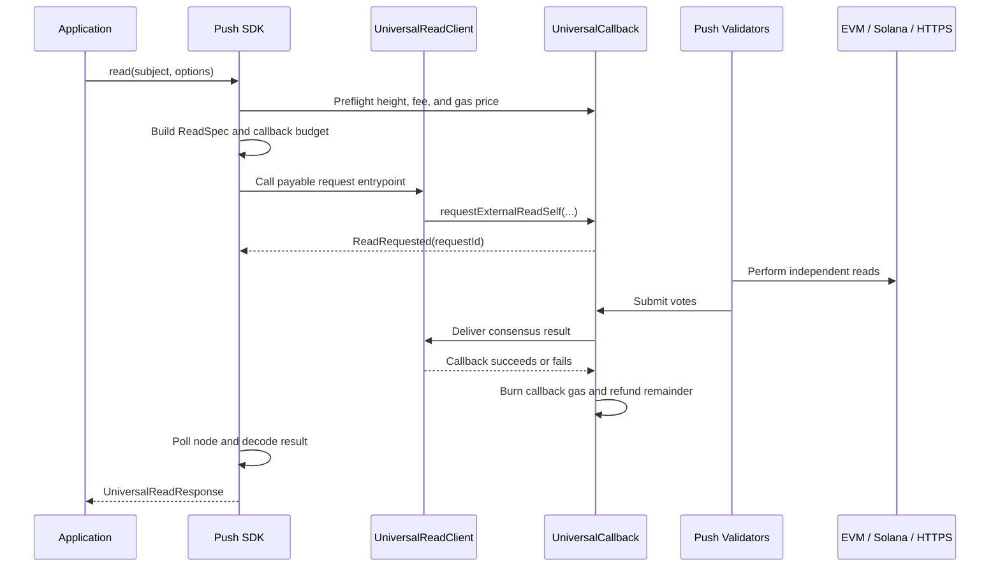

# Universal Read — Step-by-Step Tutorial

This guide explains the Universal Read feature as it exists in the SDK today. For the original API proposal and the remaining deviations from it, see [`read-state-sdk-spec.md`](./read-state-sdk-spec.md).

## 1. What Universal Read does

Universal Read lets an application on Push Chain request state from:

- an EVM chain;
- Solana; or
- an HTTPS API.

Push validators independently perform the read, reach consensus on the result bytes, and deliver the result to a Push Chain smart-contract callback.

This is asynchronous. It behaves like submitting a job and waiting for consensus, not like making a synchronous JSON-RPC call.



## 2. The actors

### Your application

This is the frontend, backend, bot, or script calling the SDK.

### The SDK

The SDK:

- validates the query;
- fetches oracle and fee information;
- encodes the destination-specific query;
- calculates expiry and callback budget;
- sends the request transaction;
- recovers the on-chain `requestId`;
- tracks validator consensus; and
- decodes the result.

### Your `UniversalReadClient` contract

The canonical shared registry is not deployed yet, so executable reads currently need an application contract based on `UniversalReadClient`.

The contract has two responsibilities:

1. Expose a public payable entrypoint that creates the read.
2. Receive the final result callback from `UniversalCallback`.

The SDK's `callback.request` describes the first function, not the result callback.

### `UniversalCallback`

This is the Push Chain genesis predeploy at:

```text
0x00000000000000000000000000000000000000C2
```

It stores requests, fees, callback budgets, lifecycle state, and refunds.

### Push validators

Validators independently read the destination and vote on the resulting bytes. Once quorum is reached, Push Chain attempts to deliver the consensus result to the application callback.

## 3. The four public SDK methods

```ts
client.universal.read(subject, options)
client.universal.prepareRead(subject, options)
client.universal.executeReads(preparedReads, options)
client.universal.trackRead(reference, options)
```

Conceptually:

```ts
read(subject, options)
  ≈ prepareRead(subject, options)
  → executeReads([prepared])
  → wait for completion
```

Use:

- `read()` for one request;
- `prepareRead()` to inspect, compose, or batch requests;
- `executeReads()` to submit one or more prepared reads; and
- `trackRead()` to recover or resume an existing request.

The lower-level `simulateRead` implementation is internal and is not part of this public four-method family.

## 4. Query types

The `subject` is the object being read.

### EVM native balance

```ts
const result = await client.universal.read(userAddress, {
  chain: CHAIN.ETHEREUM_SEPOLIA,
  callback,
});

result.value; // bigint
```

No query-specific key means native balance.

### ERC-20 balance

```ts
const result = await client.universal.read(holderAddress, {
  chain: CHAIN.ETHEREUM_SEPOLIA,
  token: tokenAddress,
  callback,
});

result.value; // bigint
```

Internally, the shorthand becomes a typed `balanceOf(holderAddress)` contract call.

### Typed EVM contract call

```ts
const result = await client.universal.read(contractAddress, {
  chain: CHAIN.ETHEREUM_SEPOLIA,
  abi,
  functionName: 'totalSupply',
  args: [],
  callback,
});
```

Results follow viem conventions:

```ts
// One ABI output
result.value; // bigint, address, boolean, etc.

// Multiple ABI outputs
result.value; // readonly [bigint, boolean, ...]
```

Only `view` and `pure` ABI functions are readable.

### EVM storage slot

```ts
const result = await client.universal.read(contractAddress, {
  chain: CHAIN.ETHEREUM_SEPOLIA,
  storageSlot: 0n,
  callback,
});

result.value; // 32-byte hex value
```

### Solana native balance

```ts
const result = await client.universal.read(solanaPublicKey, {
  chain: CHAIN.SOLANA_DEVNET,
  callback,
});

result.value; // bigint, in lamports
```

### SPL token balance

```ts
const result = await client.universal.read(ownerPublicKey, {
  chain: CHAIN.SOLANA_DEVNET,
  token: mintPublicKey,
  callback,
});

result.value; // bigint
```

The SDK derives the associated token account locally. Token-2022 is also supported:

```ts
{
  chain: CHAIN.SOLANA_DEVNET,
  token: mintPublicKey,
  tokenProgram: 'token-2022',
  callback,
}
```

Solana does not expose `blockNumber` or `minConfirmations` as public options. The SDK selects the finalized slot reference internally.

### Web2 JSON extraction

```ts
const result = await client.universal.read(
  'https://api.example.com/price',
  {
    chain: CHAIN.WEB2,
    web2: {
      extract: [
        {
          path: '$.data.price',
          valueType: 'uint256',
          decimals: 8,
        },
      ],
      timeoutMs: 5_000,
    },
    callback,
  }
);

result.value; // readonly [bigint]
```

Web2 returns an array in extraction order. Supported extraction types are:

```ts
'uint256' | 'int256' | 'bool' | 'string' | 'bytes'
```

Important Web2 behavior:

- Validators vote on identical extracted bytes.
- A volatile API may fail to reach quorum.
- Median or differential aggregation is not supported yet.
- Headers and the body are recorded publicly on-chain.
- Never put API keys, bearer tokens, cookies, or secrets in the request.
- GET requests cannot have a body.
- Web2 is heightless, so its internal `blockNumber` is `0`.

## 5. Callback configuration

A currently executable callback configuration looks like:

```ts
const callback = {
  target: myReadClientAddress,
  gasLimit: 200_000n,
  request: {
    abi: myReadClientAbi,
    functionName: 'request',
  },
};
```

The default request arguments are:

```ts
[prepared.specTuple, prepared.callbackGasLimit]
```

For an entrypoint with extra arguments:

```ts
const callback = {
  target: myReadClientAddress,
  gasLimit: 200_000n,
  request: {
    abi: myReadClientAbi,
    functionName: 'requestWithContext',
    args: (spec, gasLimit) => [
      spec,
      gasLimit,
      applicationContext,
    ],
  },
};
```

The entrypoint must create exactly one read using the supplied spec and gas limit. The SDK verifies the emitted `ReadRequested` log against the prepared request.

The maximum callback gas limit is:

```ts
1_000_000n
```

A larger gas limit creates a larger callback budget.

## 6. What `prepareRead()` does

Consider:

```ts
const prepared = await client.universal.prepareRead(userAddress, {
  chain: CHAIN.ETHEREUM_SEPOLIA,
  callback,
  expiryBlocks: 300n,
});
```

### Step 1: Validate the public query

The SDK verifies:

- query kinds are mutually exclusive;
- EVM addresses are valid;
- Solana keys are valid 32-byte public keys;
- ABI functions are `view` or `pure`;
- Web2 URLs use HTTPS;
- Web2 extraction declarations are valid; and
- callback gas is within bounds.

### Step 2: Resolve the destination

For Sepolia:

```text
chainNamespace = eip155
chainId        = 11155111
CAIP-2         = eip155:11155111
```

For Web2:

```text
chainNamespace = web2
chainId        = https
CAIP-2         = web2:https
```

### Step 3: Fetch preflight information

The SDK reads:

```ts
{
  observedChainHeight,
  pushBlockNumber,
  protocolFee,
  pushGasPrice,
  universalCore,
  universalCallback,
  fetchedAt,
}
```

The destination height comes from Push Chain's oracle, not directly from the destination RPC.

### Step 4: Select the read reference

For EVM, the default is approximately:

```ts
blockNumber =
  observedChainHeight - minConfirmations;
```

The default `minConfirmations` is `1`.

For Solana, the SDK creates an internal finalized-slot floor. For Web2, `blockNumber` is `0`.

### Step 5: Encode the query

Every query is encoded as one ABI tuple:

```ts
encodeAbiParameters(
  [{ type: 'tuple', components }],
  [envelope]
);
```

Encoding the fields as separate ABI arguments creates different bytes and can lead validators to agree on `INVALID_QUERY`. This is why envelope encoding is owned by the SDK.

### Step 6: Calculate expiry

The default is:

```ts
expiryPushChainHeight =
  currentPushHeight + 300n;
```

Expiry is measured in Push Chain blocks.

### Step 7: Calculate payment

The payment has two components:

```text
msg.value = protocolFee + callbackBudget
```

The default callback budget is approximately:

```ts
callback.gasLimit * pushGasPrice * 3n
```

The factor of three is a safety buffer. Unused callback budget is refunded.

### Step 8: Resolve the refund recipient

The deployed seven-field `ReadSpec` requires a non-zero refund recipient.

The public SDK name is `refundTo`; the on-chain field is `revertRecipient`. It defaults to the sending Push account.

If `refundTo` is a contract, it must accept native Push payments. Otherwise the refund can fail.

### Step 9: Assemble `PreparedRead`

Important public fields include:

```ts
prepared.chain
prepared.spec
prepared.value
prepared.fees
prepared.resultShape
prepared.preflight
prepared.callback
```

The SDK retains additional encoding metadata for safe execution and result decoding.

## 7. The deployed `ReadSpec`

The deployed contract requires seven fields:

```solidity
struct ReadSpec {
    UniversalAccountId account;
    bytes query;
    uint16 minConfirmations;
    uint64 blockNumber;
    uint64 expiryPushChainHeight;
    uint256 maxFee;
    address revertRecipient;
}
```

The request function is:

```solidity
requestExternalReadSelf(
    ReadSpec spec,
    bytes4 callbackSelector,
    uint64 callbackGasLimit
) payable returns (uint256 requestId);
```

`callbackGasLimit` is not part of `ReadSpec`.

The deployed fee view is:

```solidity
estimateFee(
    string chainNamespace,
    string chainId
) view returns (uint256);
```

It returns only the protocol fee, not the callback budget.

## 8. Executing one read

```ts
const response = await client.universal.read(userAddress, {
  chain: CHAIN.ETHEREUM_SEPOLIA,
  callback,
});
```

By default, `read()` waits until the request becomes terminal.

Before broadcast, the SDK:

1. Revalidates the oracle height.
2. Revalidates domain availability.
3. Revalidates the protocol fee.
4. Revalidates Push height and expiry.
5. Verifies callback affordability.
6. Checks the funding account's read-value balance.
7. Encodes the application request entrypoint.
8. Sends the transaction.

A signing client is required for `read()`.

## 9. Preparing and executing a batch

```ts
const balance = await client.universal.prepareRead(userAddress, {
  chain: CHAIN.ETHEREUM_SEPOLIA,
  callback,
});

const supply = await client.universal.prepareRead(tokenAddress, {
  chain: CHAIN.ETHEREUM_SEPOLIA,
  abi: tokenAbi,
  functionName: 'totalSupply',
  args: [],
  callback,
});

const batch = await client.universal.executeReads(
  [balance, supply],
  { waitForCompletion: false }
);
```

The response exposes:

```ts
batch.txHash;
batch.count;
batch.atomic;
batch.transactionHashes;
batch.reads;
batch.wait();
```

Wait for every read:

```ts
const [balanceResult, supplyResult] =
  await batch.wait();
```

Batch properties:

- Input order is preserved.
- Each read settles independently.
- Reads are parallel fan-out; they do not depend on one another.
- Nested reads inside callbacks are unsupported.
- An EIP-7702 or UEA batch can be atomic.
- Wallet fallback can use multiple non-atomic transactions.
- `transactionHashes` retains every sequential-fallback hash for recovery.

The SDK matches emitted requests to prepared inputs using the callback target, callback gas limit, exact encoded spec, and log order. Missing or extra request logs produce `READ_REQUEST_MISMATCH`.

## 10. Request identity and tracking

The deployed contract derives `requestId` from values including:

```text
chainid
block.number
address(this)
specHash
nonce
```

The ID cannot be known before broadcast, so initial recovery is transaction-hash-first.

### Track by transaction hash

```ts
const reads = await client.universal.trackRead({
  txHash,
});
```

This returns an array because one transaction can carry multiple read requests.

### Track by request ID

```ts
const read = await client.universal.trackRead({
  requestId,
});
```

This returns one response.

Each response supports:

```ts
const fresh = await read.refresh();
const terminal = await read.wait();
```

`refresh()` makes one status query. `wait()` polls until terminal or until the client timeout expires.

## 11. The three status layers

### Node-level universal status

```ts
PENDING
VOTING
FULFILLED
EXPIRED
FAILED
ABORTED
```

This becomes `UniversalReadResponse.status`.

### Consensus result status

```ts
READ_STATUS.SUCCESS
READ_STATUS.ERROR
```

It is available through:

```ts
response.raw?.status
response.raw?.resultData
response.raw?.errorCode
```

A request can be `FULFILLED` while validators agreed on an error result.

### Callback delivery status

```ts
response.callbackDelivered
```

A read can also be `FULFILLED` while the application callback reverted. Successful value delivery therefore requires:

```ts
const successful =
  response.status === UNIVERSAL_READ_STATUS.FULFILLED &&
  response.raw?.status === READ_STATUS.SUCCESS &&
  response.callbackDelivered === true;
```

Only then should the application trust `response.value`.

## 12. Response anatomy

```ts
type UniversalReadResponse<T> = {
  requestId: `0x${string}`;
  txHash: `0x${string}`;
  chain: ReadChain;
  destination: ResolvedDestination;

  status: UNIVERSAL_READ_STATUS;
  isTerminal: boolean;

  callbackDelivered?: boolean;
  callbackFailReason?: `0x${string}`;

  value?: T;
  decoded?: DecodedReadResult;
  decodeError?: string;

  raw: {
    status: READ_STATUS;
    resultData: `0x${string}`;
    errorCode: READ_ERROR_CODE;
  } | null;

  errorMsg: string;
  fees: ReadFees;
  request: RequestProvenance;
  pcTx: ReadonlyArray<PushTransaction>;
  explorerUrl: string;

  wait(): Promise<UniversalReadResponse<T>>;
  refresh(): Promise<UniversalReadResponse<T>>;
};
```

`value` can be absent because:

- the request is pending;
- validators agreed on an error;
- the callback failed;
- the read expired;
- decoding failed; or
- the request was failed or aborted.

## 13. Fees and refunds

Accounting fields:

```ts
response.fees = {
  paid,
  protocolFee,
  callbackBudget,
  burned,
  refunded,
  refundFailed,
};
```

### Successful callback settlement

```text
paid = protocolFee + callbackBudget
callbackBudget = burned + refunded
```

The protocol fee is never refunded.

### Expiry

The complete callback budget is attempted as a refund. The protocol fee remains consumed.

### Rejected refund

Settlement or expiry still completes. The response can contain:

```ts
refundFailed: true
```

A contract recipient without a payable receiver is a common cause.

## 14. Timeouts

There are three independent timeouts:

```ts
web2.timeoutMs
expiryBlocks
advanced.timeout
```

### Web2 timeout

How long each validator waits for the HTTP server. The default is `5_000` milliseconds.

### Request expiry

How long the Push Chain request remains alive. The default is `300n` Push blocks.

### Client polling timeout

How long this SDK caller waits. The default scales with the remaining expiry and is capped at `180_000` milliseconds.

A client timeout does not cancel the on-chain request. Resume it later with `trackRead`.

Only the client timeout throws `ReadTimeoutError`. Terminal on-chain failures normally resolve as responses.

## 15. Expiry observability

Expiry is executed by the node's EndBlocker. Consequently:

- it may not have a normal EVM transaction;
- `eth_getTransactionReceipt` may return nothing;
- `eth_getLogs` may not show its refund events; and
- an explorer may show no expiry transaction.

The SDK recovers expiry evidence from Cosmos `block_results` and parses EndBlock logs.

If that evidence cannot be obtained, the SDK does not assume that the refund succeeded:

```ts
response.fees.refunded;     // may remain undefined
response.fees.refundFailed; // may remain undefined
```

## 16. Progress events

The broad phases are:

```text
READ-TX-101      Query accepted
READ-TX-102-*    Preflight and spec creation
READ-TX-103-*    Balance and security checks
READ-TX-104-*    Broadcast and request detection
READ-TX-105-*    Pending and voting
READ-TX-106-*    Callback and refund settlement
READ-TX-199-*    Terminal result
READ-TX-0xx/9xx Batch lifecycle
```

Example:

```ts
await client.universal.read(subject, {
  chain: CHAIN.ETHEREUM_SEPOLIA,
  callback,
  progressHook: event => {
    console.log(event.id, event.title, event.response);
  },
});
```

Vote-count events are not emitted because the node does not expose a reliable mid-ballot tally query.

## 17. Failure and recovery patterns

### Client timeout

```ts
try {
  await response.wait();
} catch (error) {
  if (error instanceof ReadTimeoutError) {
    // The request may still finish on-chain.
    const resumed = await client.universal.trackRead({
      requestId: response.requestId,
    });
  }
}
```

### Sequential batch failure

If a non-atomic wallet batch fails after submitting some requests:

```ts
error.code === 'READ_REQUEST_TX_FAILED'
error.transactionHashes
error.pendingTransactionHash
```

Track confirmed hashes individually:

```ts
for (const txHash of error.transactionHashes) {
  const reads = await client.universal.trackRead({ txHash });
}
```

If `pendingTransactionHash` exists, check its receipt before retrying. It may have been broadcast without a confirmed receipt.

### Terminal read failure

These normally resolve rather than throw:

```ts
EXPIRED
FAILED
ABORTED
```

Always inspect the response status.

## 18. Security and correctness checklist

- Use an exact ABI for contract calls.
- Check `status`, `raw.status`, and `callbackDelivered`.
- Give the callback enough gas.
- Ensure `refundTo` can receive native Push tokens.
- Never put secrets in Web2 headers or bodies.
- Prefer stable Web2 endpoints whose extracted values are likely to match across validators.
- Do not reuse stale `PreparedRead` values indefinitely.
- Store both `txHash` and the recovered `requestId`.
- Handle `ReadTimeoutError` as resumable.
- Preserve every `transactionHashes` value from non-atomic batch errors.
- Do not initiate nested reads from inside a callback.
- Avoid CEA-originated reads until chain-side ingestion is fixed.

## 19. Current limitations

The major remaining limitation is the missing canonical `UniversalReadRegistry`.

Until it is deployed:

- the minimal `read(subject, { chain })` shorthand is unavailable;
- executable reads need a custom `UniversalReadClient`; and
- `callback.target`, `callback.gasLimit`, and `callback.request` are needed for `read()` and `executeReads()`.

Other external limitations:

- No median Web2 aggregation.
- No queryable mid-ballot vote counts.
- CEA-originated read ingestion remains unresolved.
- The deployed fee and refund ABI cannot be changed locally by the SDK.

## 20. Recommended integration sequence

1. Implement and deploy a `UniversalReadClient` contract.
2. Define its public payable request entrypoint ABI.
3. Initialize a signing `PushChain` client.
4. Start with an EVM native-balance read.
5. Verify the returned `status`, `raw.status`, and `callbackDelivered` values.
6. Store the request transaction hash and recovered request ID.
7. Test callback reversion and insufficient callback gas.
8. Test client timeout recovery through `trackRead`.
9. Add batch execution and test the non-atomic fallback path.
10. Add Solana or Web2 queries only after the basic callback and recovery path is stable.
